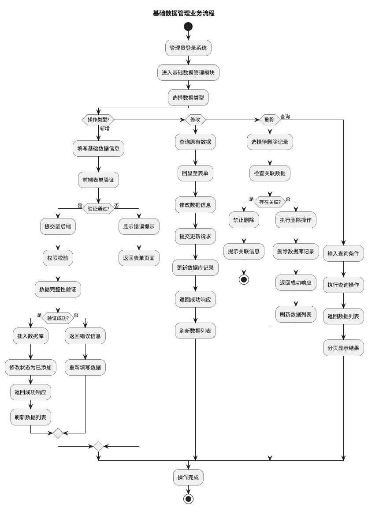
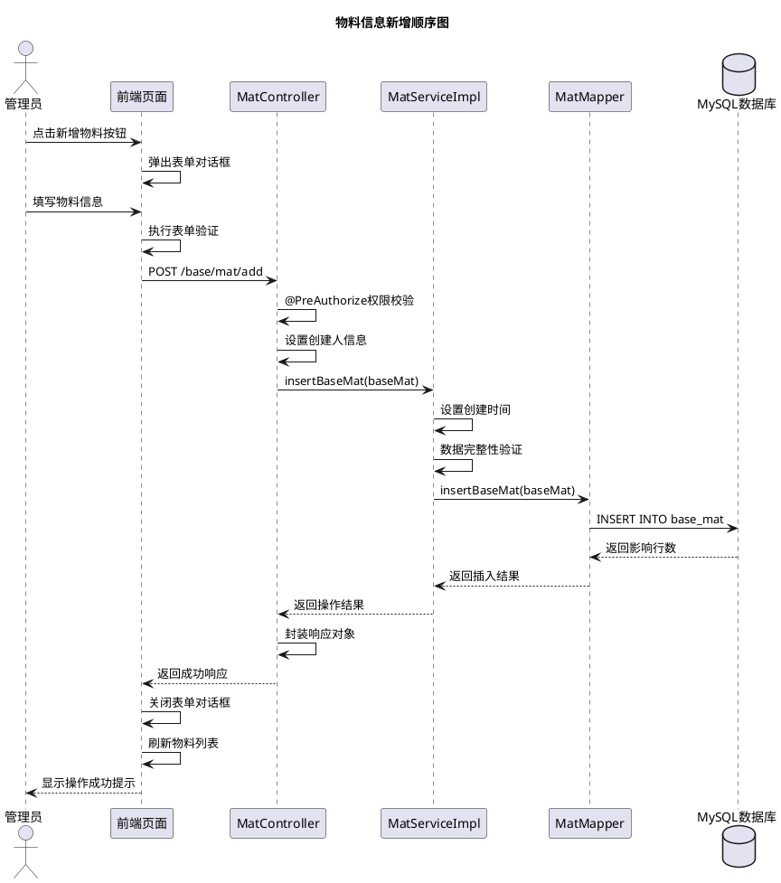
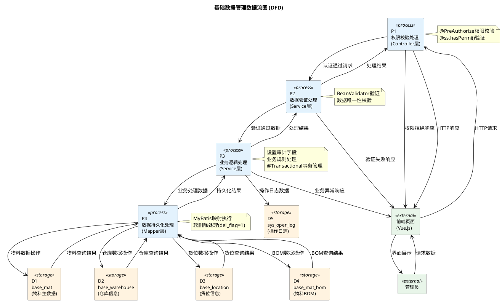

# 5.1 基础数据模块实现（物料、分类、BOM、仓库货位）

## 5.1.1 流程图

管理员登录系统后进入基础数据管理模块，首先选择需要管理的数据类型（物料、分类、BOM、仓库或货位），系统加载对应的数据列表。当执行新增操作时，管理员填写完整的基础数据信息，系统进行前端表单验证，验证通过后提交至后端。后端接收请求后执行权限校验，校验通过则进行数据完整性验证，验证成功后将数据插入数据库，修改数据状态为已添加，最后返回操作结果。若验证失败，则提示错误信息，管理员需重新填写数据。对于修改操作，系统首先查询原有数据并回显至表单，管理员修改后提交，系统更新数据库记录。对于删除操作，系统先检查是否存在关联数据，若存在则禁止删除并提示，若不存在则执行删除操作。流程结束后，系统刷新数据列表显示最新结果。

## 5.1.2 顺序图

管理员点击新增物料按钮，前端页面弹出表单对话框。管理员填写物料编码、名称、规格型号、单位、分类、安全库存等信息后，前端执行表单验证。验证通过后，前端向MatController发送POST请求，携带物料信息数据。Controller首先执行权限校验，确认用户具有物料新增权限，然后设置创建人信息为当前登录用户。随后Controller调用MatServiceImpl的insertBaseMat方法，Service层设置创建时间并进行数据完整性验证，验证通过后调用MatMapper的insertBaseMat方法。Mapper层执行SQL插入操作，将物料数据写入MySQL数据库的base_mat表，数据库返回影响行数。Mapper将结果返回给Service，Service返回给Controller，Controller封装成统一的响应对象返回给前端。前端接收到成功响应后，关闭表单对话框，刷新物料列表，并向管理员显示操作成功提示。

## 5.1.3 数据流图

管理员通过前端页面发起数据操作请求，请求数据流入P1权限校验处理过程，P1通过@PreAuthorize注解验证用户权限，权限校验通过后将请求数据传递至P2数据验证处理过程。P2执行BeanValidator后端验证，检查数据完整性和唯一性，验证通过后将实体对象传递至P3业务逻辑处理过程。P3设置审计字段（createBy、createTime等），处理业务规则，记录操作日志至sys_oper_log表，使用@Transactional管理事务，将数据传递至P4数据持久化处理过程。P4通过MyBatis Mapper执行SQL操作，将数据写入base_mat、base_warehouse、base_location、base_mat_bom等数据存储，对于删除操作设置del_flag=1实现软删除。查询操作时，数据从数据存储逐层返回至前端展示；新增和修改操作时，数据从前端逐层传递至数据存储持久化。整个数据流清晰地展示了基础数据管理模块从权限校验、数据验证、业务处理到数据持久化的完整流转过程，体现了分层架构的设计原则，各层职责明确，数据流向清晰。
