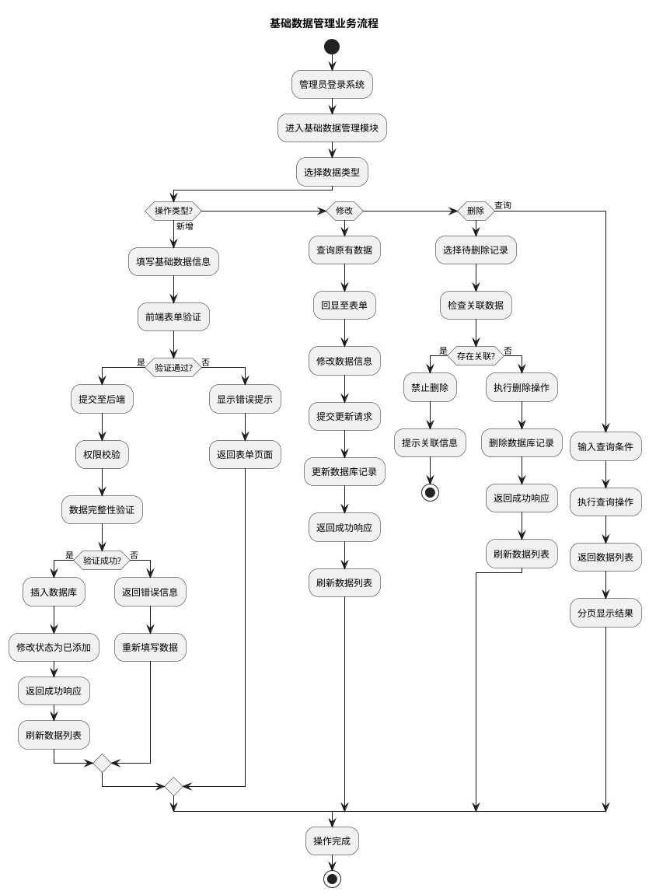
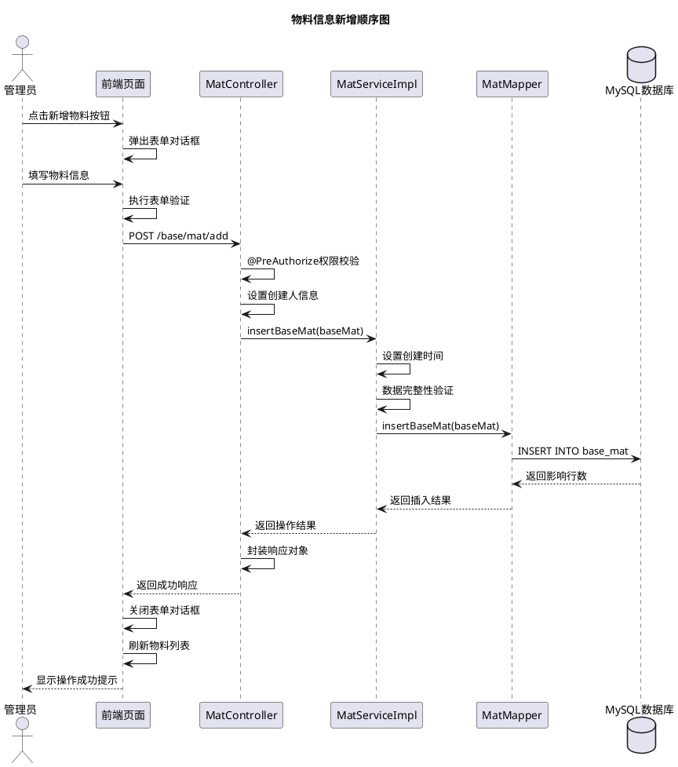
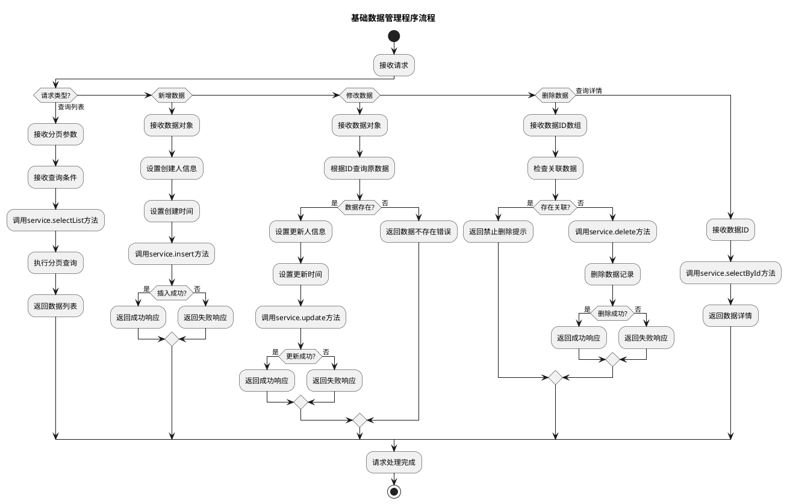
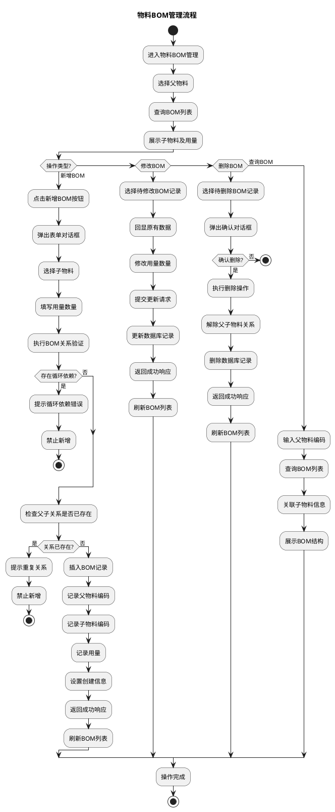
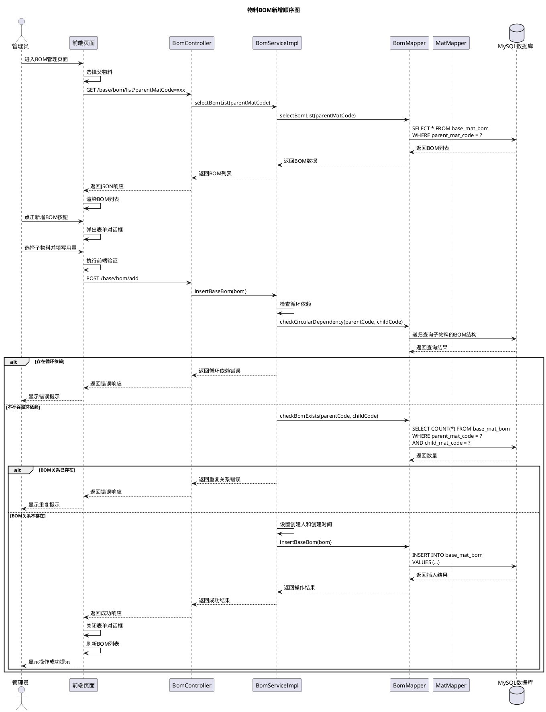
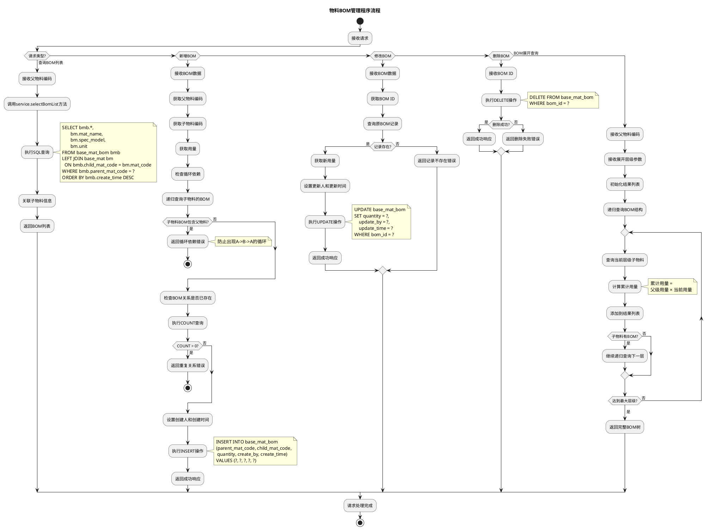
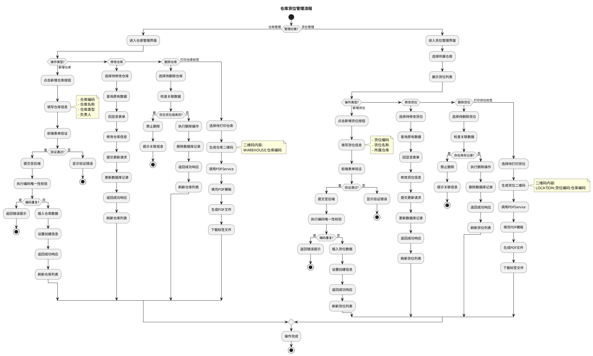
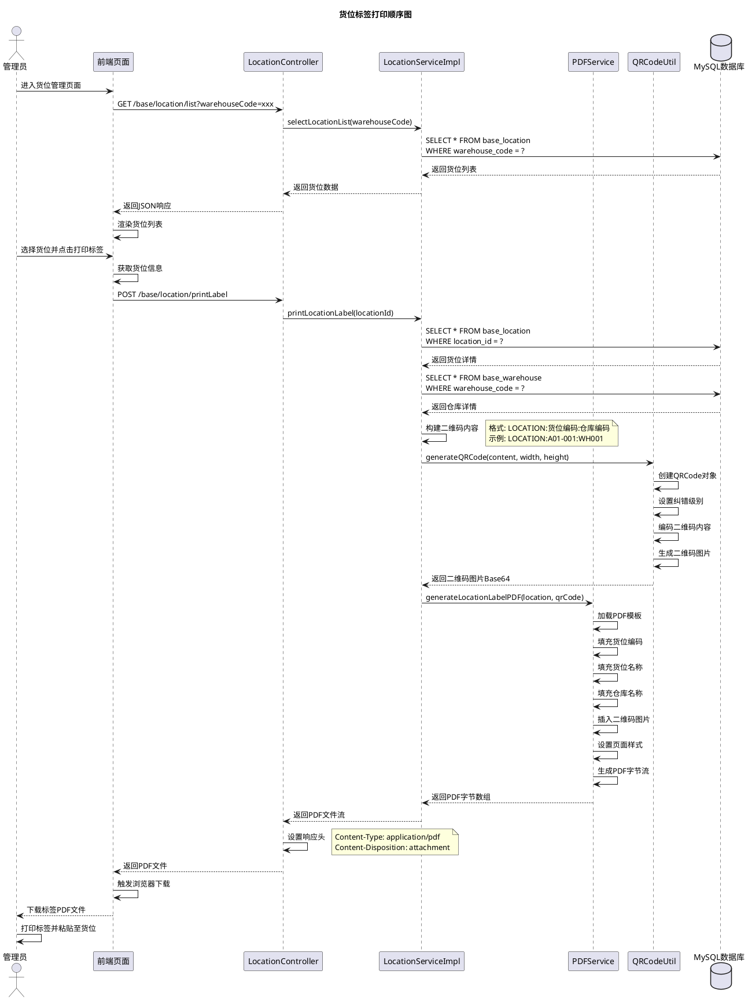
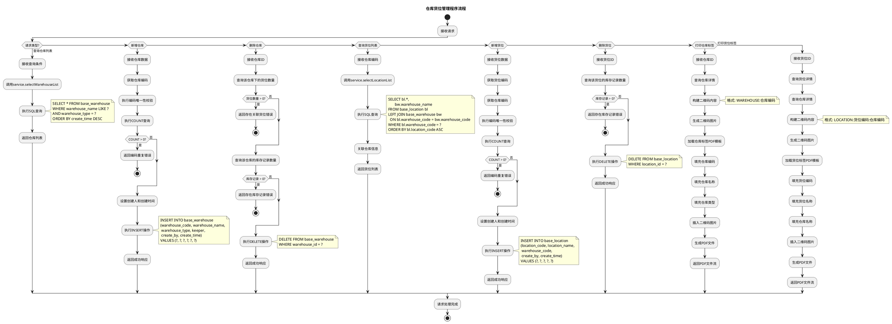

# 5.1 基础数据模块实现（物料、分类、BOM、仓库货位）

## 5.1.1 流程图

管理员登录系统后进入基础数据管理模块，首先选择需要管理的数据类型（物料、分类、BOM、仓库或货位），系统加载对应的数据列表。当执行新增操作时，管理员填写完整的基础数据信息，系统进行前端表单验证，验证通过后提交至后端。后端接收请求后执行权限校验，校验通过则进行数据完整性验证，验证成功后将数据插入数据库，修改数据状态为已添加，最后返回操作结果。若验证失败，则提示错误信息，管理员需重新填写数据。对于修改操作，系统首先查询原有数据并回显至表单，管理员修改后提交，系统更新数据库记录。对于删除操作，系统先检查是否存在关联数据，若存在则禁止删除并提示，若不存在则执行删除操作。流程结束后，系统刷新数据列表显示最新结果。

## 5.1.2 顺序图

管理员点击新增物料按钮，前端页面弹出表单对话框。管理员填写物料编码、名称、规格型号、单位、分类、安全库存等信息后，前端执行表单验证。验证通过后，前端向MatController发送POST请求，携带物料信息数据。Controller首先执行权限校验，确认用户具有物料新增权限，然后设置创建人信息为当前登录用户。随后Controller调用MatServiceImpl的insertBaseMat方法，Service层设置创建时间并进行数据完整性验证，验证通过后调用MatMapper的insertBaseMat方法。Mapper层执行SQL插入操作，将物料数据写入MySQL数据库的base_mat表，数据库返回影响行数。Mapper将结果返回给Service，Service返回给Controller，Controller封装成统一的响应对象返回给前端。前端接收到成功响应后，关闭表单对话框，刷新物料列表，并向管理员显示操作成功提示。

## 5.1.3 程序流程图

该程序流程图描述了基础数据管理模块的核心操作流程，流程从"开始"节点启动，涵盖查询列表、新增数据、修改数据、删除数据及查询详情五大功能。当执行查询列表操作时，系统接收分页参数current、size及查询条件，通过调用service.selectList方法完成分页查询后返回数据列表。当执行新增数据操作时，系统接收数据对象，设置创建人信息和创建时间，调用service.insert方法将数据插入数据库，根据插入结果返回成功或失败响应。当执行修改数据操作时，系统接收数据对象并根据ID查询原数据，若数据存在则设置更新人信息和更新时间，调用service.update方法更新数据库记录，根据更新结果返回相应响应；若数据不存在则返回错误信息。当执行删除数据操作时，系统接收数据ID数组，首先检查是否存在关联数据，若存在则返回禁止删除提示；若不存在则调用service.delete方法删除数据记录，根据删除结果返回相应响应。当执行查询详情操作时，系统接收数据ID，调用service.selectById方法返回数据详情。整个流程清晰呈现了模块对基础数据的全生命周期管理，各操作独立执行且均从"开始"启动，经对应业务处理后至"结束"节点，体现了功能的完整性和流程的规范性。

## 5.1.4 物料BOM管理实现

### 5.1.4.1 流程图

管理员进入物料BOM管理界面，首先选择父物料，系统查询该父物料的BOM列表，展示所有子物料及其用量信息。当执行新增BOM操作时，管理员点击新增按钮，弹出表单对话框，选择子物料并填写用量数量。系统执行BOM关系验证，检查是否存在循环依赖，即子物料的BOM中是否包含当前父物料，若存在循环依赖则提示错误并禁止新增，若不存在循环依赖则继续。系统检查该父子物料关系是否已存在，若已存在则提示重复并禁止新增，若不存在则将BOM关系数据插入base_mat_bom表，记录父物料编码、子物料编码、用量及创建信息，返回成功响应并刷新BOM列表。对于修改BOM操作，管理员选择待修改的BOM记录，系统回显原有数据至表单，管理员修改用量数量后提交，系统更新数据库记录并刷新列表。对于删除BOM操作，管理员选择待删除的BOM记录，系统弹出确认对话框，确认后执行删除操作，解除父子物料的组成关系，删除数据库记录并刷新列表。通过BOM管理功能，系统能够清晰展示产品的物料构成，支持多层级BOM结构，为生产领料提供准确的物料清单依据。

### 5.1.4.2 顺序图

管理员进入物料BOM管理页面，前端页面加载并等待管理员选择父物料。管理员选择父物料后，前端向BomController发送GET请求（/base/bom/list?parentMatCode=xxx）获取该父物料的BOM列表。Controller调用Service层的selectBomList方法，Service调用Mapper的selectBomList方法查询数据库（SELECT * FROM base_mat_bom WHERE parent_mat_code = ?），数据库返回BOM列表数据，Mapper将数据返回给Service，Service返回给Controller，Controller将JSON响应返回给前端，前端渲染BOM列表展示子物料及用量信息。管理员点击新增BOM按钮，前端弹出表单对话框。管理员选择子物料并填写用量数量，前端执行表单验证。验证通过后，前端向Controller发送POST请求（/base/bom/add）携带BOM数据。Controller调用Service层的insertBaseBom方法，Service首先检查循环依赖，调用Mapper的checkCircularDependency方法递归查询子物料的BOM结构，判断子物料的BOM中是否包含当前父物料，数据库返回查询结果。若存在循环依赖，Service返回循环依赖错误给Controller，Controller返回错误响应给前端，前端向管理员显示错误提示。若不存在循环依赖，Service调用Mapper的checkBomExists方法检查该父子物料关系是否已存在（SELECT COUNT(*) FROM base_mat_bom WHERE parent_mat_code = ? AND child_mat_code = ?），数据库返回数量。若BOM关系已存在，Service返回重复关系错误，前端显示重复提示。若BOM关系不存在，Service设置创建人和创建时间，调用Mapper的insertBaseBom方法插入数据库（INSERT INTO base_mat_bom VALUES (...)），数据库返回插入结果，Mapper返回操作结果给Service，Service返回成功结果给Controller，Controller返回成功响应给前端，前端关闭表单对话框，刷新BOM列表，向管理员显示操作成功提示。

### 5.1.4.3 程序流程图

该程序流程图描述了物料BOM管理的核心操作流程。当执行查询BOM列表操作时，系统接收父物料编码，调用Service层的selectBomList方法，执行多表关联SQL查询，从base_mat_bom表查询BOM记录，左关联base_mat表获取子物料的名称、规格型号、单位等信息，WHERE条件筛选指定父物料的BOM记录，按创建时间倒序排列，关联子物料信息后返回BOM列表。当执行新增BOM操作时，系统接收BOM数据，获取父物料编码、子物料编码和用量。系统首先检查循环依赖，递归查询子物料的BOM结构，判断子物料的BOM中是否包含父物料，若包含则返回循环依赖错误并终止操作，防止出现A->B->A的循环依赖情况。若不存在循环依赖，系统检查该父子物料关系是否已存在，执行COUNT查询统计数量，若COUNT大于0则返回重复关系错误并终止操作。若关系不存在，系统设置创建人和创建时间，执行INSERT操作将BOM数据插入base_mat_bom表，返回成功响应。当执行修改BOM操作时，系统接收BOM数据，获取BOM ID，查询原BOM记录，若记录存在则获取新用量，设置更新人和更新时间，执行UPDATE操作更新用量字段，返回成功响应；若记录不存在则返回错误。当执行删除BOM操作时，系统接收BOM ID，执行DELETE操作从base_mat_bom表删除记录，根据删除结果返回相应响应。当执行BOM展开查询操作时，系统接收父物料编码和展开层级参数，初始化结果列表，递归查询BOM结构。系统查询当前层级的子物料，计算累计用量（累计用量 = 父级用量 × 当前用量），将子物料信息添加到结果列表。若子物料本身也有BOM，系统继续递归查询下一层，直到达到最大层级或子物料无BOM为止，最终返回完整的BOM树形结构，展示产品的多层级物料构成。

## 5.1.5 仓库货位管理实现

### 5.1.5.1 流程图

管理员进入仓库货位管理界面，可选择管理仓库或货位。在仓库管理中，管理员点击新增仓库按钮，填写仓库编码、名称、类型及负责人等基本信息，系统执行前端表单验证，验证通过后提交至后端。后端执行仓库编码唯一性校验，若编码重复则返回错误提示，若编码唯一则将仓库数据插入base_warehouse表，设置创建人和创建时间，返回成功响应并刷新仓库列表。对于修改仓库操作，系统查询原有数据并回显，管理员修改后提交，系统更新数据库记录。对于删除仓库操作，系统首先检查该仓库下是否存在货位或库存记录，若存在则禁止删除并提示，若不存在则执行删除操作。在货位管理中，管理员选择所属仓库后，系统展示该仓库下的所有货位列表。管理员点击新增货位按钮，填写货位编码、名称及所属仓库，系统执行货位编码唯一性校验，校验通过后将货位数据插入base_location表，返回成功响应。系统支持打印仓库和货位标签功能，管理员选择待打印的仓库或货位，系统生成包含二维码的标签，仓库二维码内容格式为"WAREHOUSE:仓库编码"，货位二维码内容格式为"LOCATION:货位编码:仓库编码"。系统调用PDFService服务，使用预定义的PDF模板，将仓库或货位信息及二维码填充至模板，生成可打印的PDF文件供用户下载。现场人员可通过扫描二维码快速识别仓库和货位信息，提高入库、出库等操作的效率和准确性。

### 5.1.5.2 顺序图

管理员进入货位管理页面，前端向LocationController发送GET请求（/base/location/list?warehouseCode=xxx）获取指定仓库的货位列表。Controller调用Service层的selectLocationList方法，Service查询数据库（SELECT * FROM base_location WHERE warehouse_code = ?），数据库返回货位列表，Service返回给Controller，Controller将JSON响应返回给前端，前端渲染货位列表展示。管理员选择需要打印标签的货位并点击打印标签按钮，前端获取货位信息并向Controller发送POST请求（/base/location/printLabel）。Controller调用Service层的printLocationLabel方法，Service首先查询货位详情（SELECT * FROM base_location WHERE location_id = ?），数据库返回货位详情；然后查询货位所属仓库的详情（SELECT * FROM base_warehouse WHERE warehouse_code = ?），数据库返回仓库详情。Service构建二维码内容，格式为"LOCATION:货位编码:仓库编码"，例如"LOCATION:A01-001:WH001"。Service调用QRCodeUtil工具类的generateQRCode方法生成二维码，QRCodeUtil创建QRCode对象，设置纠错级别，编码二维码内容，生成二维码图片，将二维码图片转换为Base64编码返回给Service。Service调用PDFService的generateLocationLabelPDF方法生成PDF标签，PDFService加载预定义的PDF模板，依次填充货位编码、货位名称、仓库名称等文本信息，插入二维码图片，设置页面样式（如字体、字号、对齐方式等），生成PDF字节流返回给Service。Service将PDF文件流返回给Controller，Controller设置HTTP响应头（Content-Type: application/pdf, Content-Disposition: attachment），将PDF文件返回给前端。前端触发浏览器下载，管理员获取标签PDF文件，打印标签并粘贴至实际货位位置，完成货位标签的制作和部署。

### 5.1.5.3 程序流程图

该程序流程图描述了仓库货位管理的核心操作流程。当执行查询仓库列表操作时，系统接收查询条件，调用Service层的selectWarehouseList方法，执行SQL查询（SELECT * FROM base_warehouse WHERE warehouse_name LIKE ? AND warehouse_type = ? ORDER BY create_time DESC），返回仓库列表数据。当执行新增仓库操作时，系统接收仓库数据，获取仓库编码，执行编码唯一性校验，通过COUNT查询统计该编码的仓库数量，若COUNT大于0则返回编码重复错误并终止操作。若编码唯一，系统设置创建人和创建时间，执行INSERT操作将仓库数据插入base_warehouse表，返回成功响应。当执行删除仓库操作时，系统接收仓库ID，首先查询该仓库下的货位数量，若货位数量大于0则返回存在关联货位错误并终止操作；然后查询该仓库的库存记录数量，若库存记录大于0则返回存在库存记录错误并终止操作。若无关联数据，系统执行DELETE操作从base_warehouse表删除仓库记录，返回成功响应。当执行查询货位列表操作时，系统接收仓库编码，调用Service层的selectLocationList方法，执行多表关联SQL查询，从base_location表查询货位记录，左关联base_warehouse表获取仓库名称，WHERE条件筛选指定仓库的货位，按货位编码升序排列，关联仓库信息后返回货位列表。当执行新增货位操作时，系统接收货位数据，获取货位编码和仓库编码，执行编码唯一性校验，通过COUNT查询统计该编码的货位数量，若编码重复则返回错误并终止操作。若编码唯一，系统设置创建人和创建时间，执行INSERT操作将货位数据插入base_location表，返回成功响应。当执行删除货位操作时，系统接收货位ID，查询该货位的库存记录数量，若库存记录大于0则返回存在库存记录错误并终止操作，若无库存记录则执行DELETE操作删除货位记录，返回成功响应。当执行打印仓库标签操作时，系统接收仓库ID，查询仓库详情，构建二维码内容（格式为"WAREHOUSE:仓库编码"），生成二维码图片，加载仓库标签PDF模板，依次填充仓库编码、仓库名称、仓库类型等文本信息，插入二维码图片，生成PDF文件并返回PDF文件流。当执行打印货位标签操作时，系统接收货位ID，查询货位详情和仓库详情，构建二维码内容（格式为"LOCATION:货位编码:仓库编码"），生成二维码图片，加载货位标签PDF模板，填充货位编码、货位名称、仓库名称等信息，插入二维码图片，生成PDF文件并返回PDF文件流供用户下载打印。仓库货位管理的规范化实现为后续库存管理提供了清晰的空间定位基础，标签打印功能通过二维码技术实现了仓库货位的快速识别和定位。

