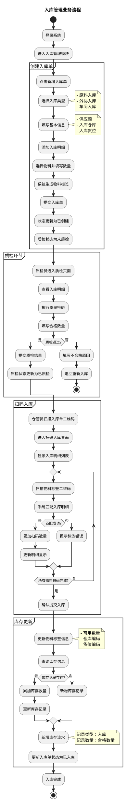
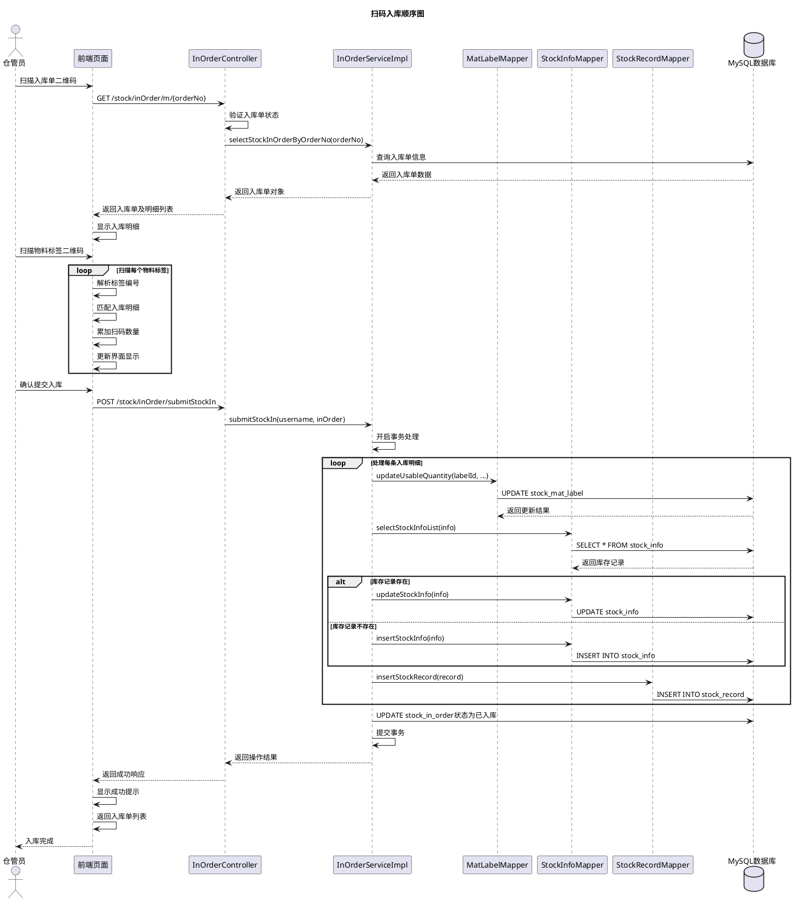
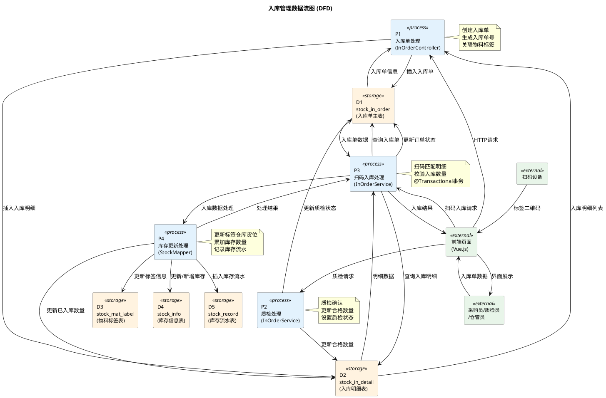

# 5.2 入库管理模块实现（入库单、质检状态、扫码入库）

## 5.2.1 流程图

采购员或仓管员登录系统后进入入库管理模块，首先创建入库单，选择入库类型（原料入库、外协入库或车间入库），填写供应商信息、入库仓库、入库货位等基本信息。随后添加入库明细，选择物料并填写入库数量、批次号等信息，系统自动生成物料标签并关联至入库单。入库单创建完成后，状态更新为"已创建"，质检状态为"未质检"。质检员对入库物料进行质量检验，填写合格数量，系统更新入库单质检状态为"已质检"。质检通过后，仓管员使用扫码设备扫描入库单二维码进入扫码入库界面，依次扫描物料标签二维码，系统自动匹配入库明细并累加扫码数量。确认所有物料扫码完成后，仓管员提交入库操作，系统执行库存更新逻辑：更新物料标签的可用数量、仓库及货位信息；更新或新增库存信息表中的库存记录；新增库存流水记录，记录入库操作的完整信息。最后，系统将入库单状态修改为"已入库"，流程结束。若扫码过程中发现数量不符或物料错误，仓管员可取消操作并重新扫码。

## 5.2.2 顺序图

仓管员使用扫码设备扫描入库单二维码，前端页面向InOrderController发送GET请求获取入库单信息。Controller验证入库单状态，确认质检状态为"已质检"且订单状态不为"已入库"，然后调用Service层的selectStockInOrderByOrderNo方法查询入库单详细信息。Service层从数据库查询入库单及其明细列表，返回给Controller，Controller将数据返回给前端。前端页面显示入库明细列表，包括物料编码、名称、应入库数量等信息。仓管员依次扫描物料标签二维码，前端解析标签编号，在入库明细列表中匹配对应的物料，累加扫码数量并实时更新界面显示。所有物料扫码完成后，仓管员点击确认提交按钮，前端向Controller发送POST请求执行入库操作。Controller调用Service层的submitStockIn方法，Service开启数据库事务处理。对于每条入库明细，Service首先调用MatLabelMapper更新物料标签的可用数量、仓库编码及货位编码；然后调用InfoMapper查询库存信息表，若该物料在指定仓库货位已有库存记录则累加数量并更新，若无记录则新增库存记录；最后调用RecordMapper新增库存流水记录，记录类型为入库，记录数量为合格数量。所有明细处理完成后，Service更新入库单状态为"已入库"，提交事务并返回操作结果。Controller将成功响应返回给前端，前端显示操作成功提示并返回入库单列表页面，入库流程结束。

## 5.2.3 数据流图

采购员或仓管员通过前端页面发起入库单创建请求，请求数据流入P1入库单处理过程，P1生成入库单号，设置订单状态为"已创建"、质检状态为"未质检"，将入库单数据写入stock_in_order表和stock_in_detail表，同时关联物料标签。质检员提交质检结果，质检数据流入P2质检处理过程，P2更新stock_in_detail表的合格数量，更新stock_in_order表的质检状态为"已质检"。仓管员使用扫码设备扫描入库单二维码，前端解析入库单号请求入库单数据，后端从stock_in_order表和stock_in_detail表查询数据返回前端显示。仓管员依次扫描物料标签二维码，前端解析标签编号并在本地匹配入库明细、累加扫码数量。扫码完成后确认提交入库，扫码数据流入P3扫码入库处理过程，P3开启数据库事务，调用P4库存更新处理过程。对于每条入库明细，P4更新stock_mat_label表的可用数量、仓库编码和货位编码；查询stock_info表，若存在库存记录则累加数量，若不存在则新增记录；向stock_record表插入库存流水记录。所有明细处理完成后，P3更新stock_in_order表状态为"已入库"，提交事务返回处理结果。整个数据流清晰地展示了入库业务从单据创建、质检确认到扫码入库、库存更新的完整流转过程。
