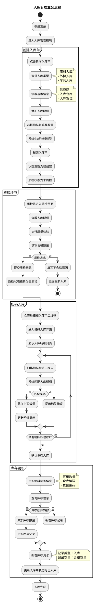
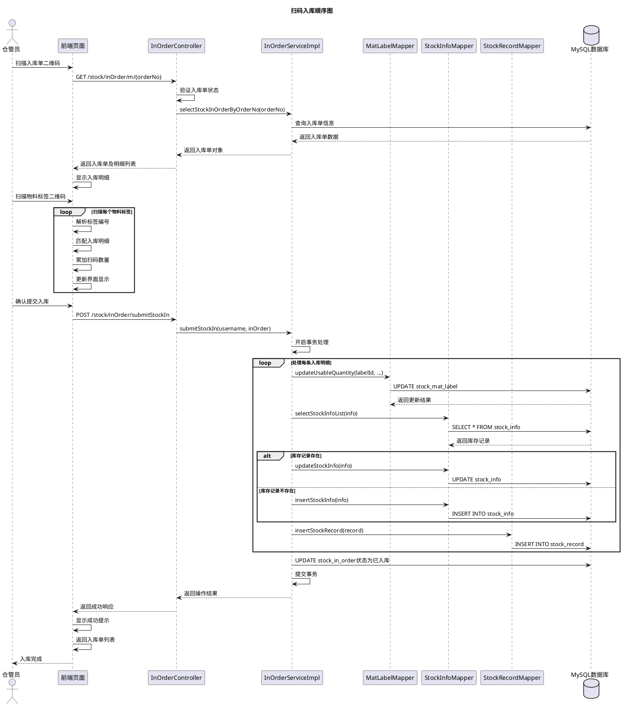
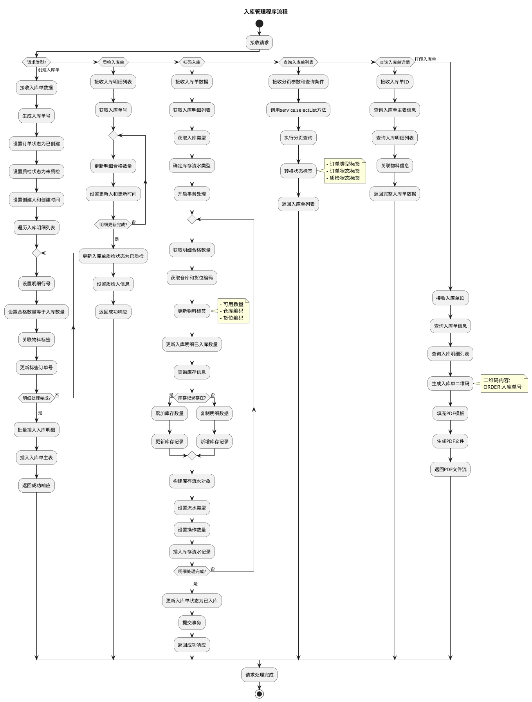
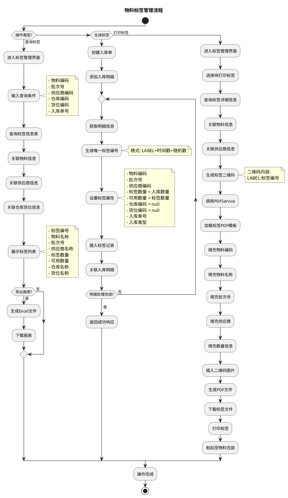
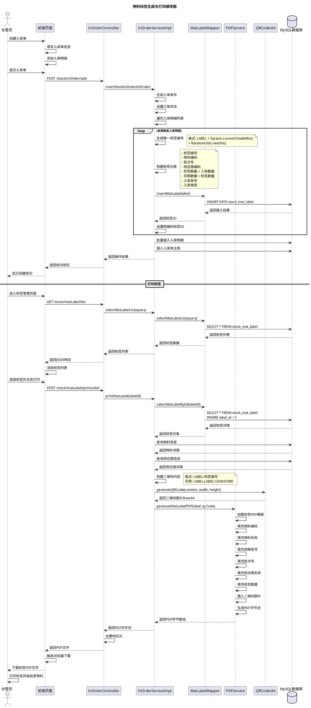
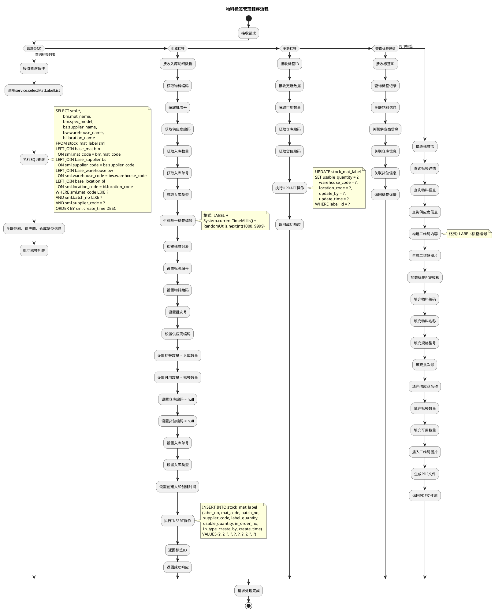
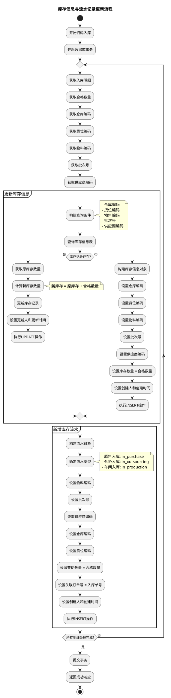
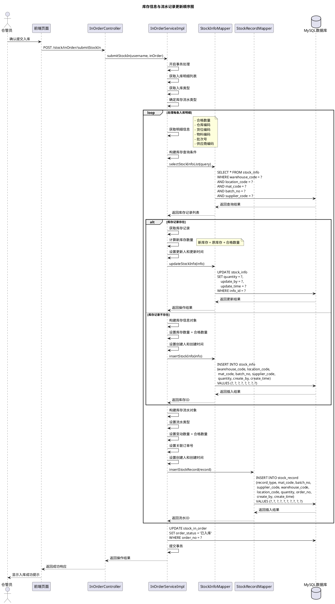
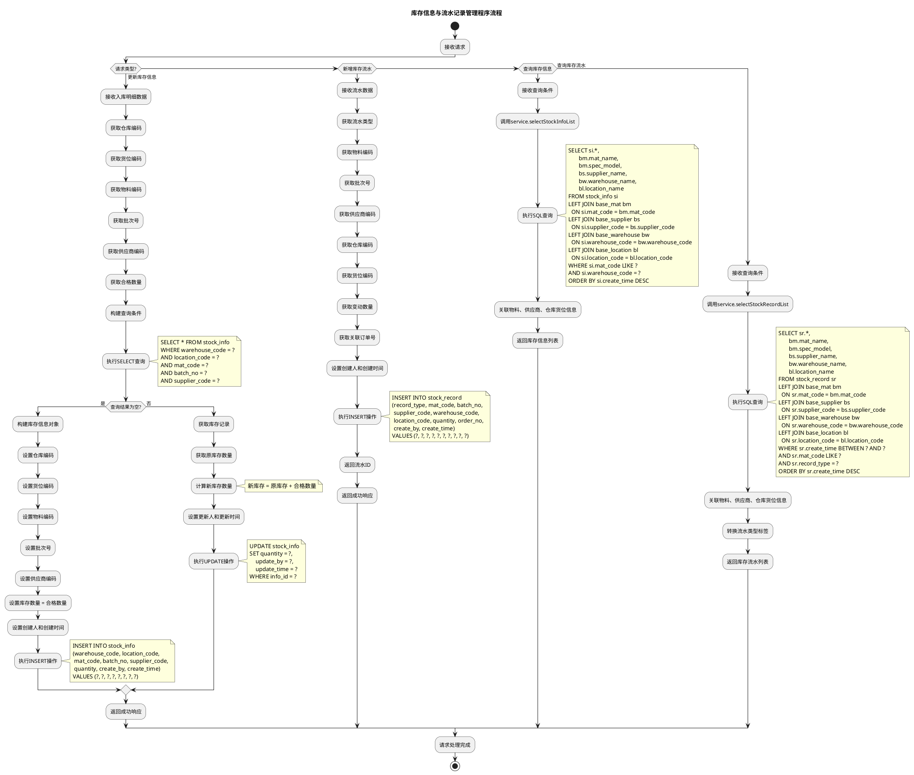

# 5.2 入库管理模块实现（入库单、质检状态、扫码入库）

## 5.2.1 流程图

采购员或仓管员登录系统后进入入库管理模块，首先创建入库单，选择入库类型（原料入库、外协入库或车间入库），填写供应商信息、入库仓库、入库货位等基本信息。随后添加入库明细，选择物料并填写入库数量、批次号等信息，系统自动生成物料标签并关联至入库单。入库单创建完成后，状态更新为"已创建"，质检状态为"未质检"。质检员对入库物料进行质量检验，填写合格数量，系统更新入库单质检状态为"已质检"。质检通过后，仓管员使用扫码设备扫描入库单二维码进入扫码入库界面，依次扫描物料标签二维码，系统自动匹配入库明细并累加扫码数量。确认所有物料扫码完成后，仓管员提交入库操作，系统执行库存更新逻辑：更新物料标签的可用数量、仓库及货位信息；更新或新增库存信息表中的库存记录；新增库存流水记录，记录入库操作的完整信息。最后，系统将入库单状态修改为"已入库"，流程结束。若扫码过程中发现数量不符或物料错误，仓管员可取消操作并重新扫码。

## 5.2.2 顺序图

仓管员使用扫码设备扫描入库单二维码，前端页面向InOrderController发送GET请求获取入库单信息。Controller验证入库单状态，确认质检状态为"已质检"且订单状态不为"已入库"，然后调用Service层的selectStockInOrderByOrderNo方法查询入库单详细信息。Service层从数据库查询入库单及其明细列表，返回给Controller，Controller将数据返回给前端。前端页面显示入库明细列表，包括物料编码、名称、应入库数量等信息。仓管员依次扫描物料标签二维码，前端解析标签编号，在入库明细列表中匹配对应的物料，累加扫码数量并实时更新界面显示。所有物料扫码完成后，仓管员点击确认提交按钮，前端向Controller发送POST请求执行入库操作。Controller调用Service层的submitStockIn方法，Service开启数据库事务处理。对于每条入库明细，Service首先调用MatLabelMapper更新物料标签的可用数量、仓库编码及货位编码；然后调用InfoMapper查询库存信息表，若该物料在指定仓库货位已有库存记录则累加数量并更新，若无记录则新增库存记录；最后调用RecordMapper新增库存流水记录，记录类型为入库，记录数量为合格数量。所有明细处理完成后，Service更新入库单状态为"已入库"，提交事务并返回操作结果。Controller将成功响应返回给前端，前端显示操作成功提示并返回入库单列表页面，入库流程结束。

## 5.2.3 程序流程图

该程序流程图描述了入库管理模块的核心操作流程，流程从"开始"节点启动，涵盖创建入库单、质检入库单、扫码入库、查询入库单列表、查询入库单详情及打印入库单六大功能。当执行创建入库单操作时，系统接收入库单数据，生成唯一的入库单号，设置订单状态为"已创建"，质检状态为"未质检"，设置创建人和创建时间信息。系统遍历入库明细列表，为每条明细设置行号，将合格数量初始化为入库数量，关联物料标签并更新标签的订单号。所有明细处理完成后，系统批量插入入库明细数据，插入入库单主表记录，返回成功响应。当执行质检入库单操作时，系统接收入库明细列表，获取入库单号。系统遍历明细列表，更新每条明细的合格数量，设置更新人和更新时间。所有明细更新完成后，系统更新入库单的质检状态为"已质检"，设置质检人信息，返回成功响应。当执行扫码入库操作时，系统接收入库单数据，获取入库明细列表和入库类型，根据入库类型确定库存流水记录类型，开启数据库事务处理。系统遍历每条入库明细，获取合格数量、仓库编码和货位编码，首先更新物料标签的可用数量、仓库编码和货位编码；然后更新入库明细的已入库数量；接着查询库存信息表，若库存记录存在则累加库存数量并更新记录，若不存在则复制明细数据并新增库存记录；最后构建库存流水对象，设置流水类型和操作数量，插入库存流水记录。所有明细处理完成后，系统更新入库单状态为"已入库"，提交事务，返回成功响应。当执行查询入库单列表操作时，系统接收分页参数和查询条件，调用service层的selectList方法执行分页查询，转换订单类型、订单状态和质检状态的标签显示，返回入库单列表数据。当执行查询入库单详情操作时，系统接收入库单ID，查询入库单主表信息和入库明细列表，关联物料基本信息，返回完整的入库单数据。当执行打印入库单操作时，系统接收入库单ID，查询入库单信息和入库明细列表，生成包含入库单号的二维码（格式为"ORDER:入库单号"），填充PDF模板，生成可打印的PDF文件，返回PDF文件流供用户下载。整个流程清晰呈现了入库管理模块从单据创建、质检确认、扫码入库到库存更新的完整业务链路，各操作独立执行且均从"开始"启动，经对应业务处理后至"结束"节点，体现了功能的完整性和流程的规范性。

## 5.2.4 物料标签管理实现

### 5.2.4.1 流程图

管理员或仓管员进入物料标签管理界面，可执行查询标签、生成标签和打印标签三类操作。在查询标签操作中，用户输入查询条件（物料编码、批次号、供应商、仓库、货位等），系统从stock_mat_label表查询符合条件的标签记录，关联物料基本信息、供应商信息、仓库货位信息，展示标签编号、物料名称、批次号、供应商名称、标签数量、可用数量、仓库名称、货位名称等完整信息。查询结果支持导出Excel报表，便于离线统计分析。在生成标签操作中，当创建入库单并添加入库明细时，系统自动为每条明细生成唯一的物料标签。系统生成标签编号（格式为"LABEL"+时间戳+随机数），获取明细的物料编码、批次号、供应商编码、入库数量等信息，设置标签数量等于入库数量，设置可用数量等于标签数量，仓库和货位信息初始为空，关联入库单号和入库类型，设置创建人和创建时间，将标签数据插入stock_mat_label表。在打印标签操作中，用户选择待打印的标签记录，系统查询标签详细信息，生成包含标签编号的二维码（格式为"LABEL:标签编号"），调用PDFService服务，使用预定义的标签PDF模板，填充物料编码、物料名称、批次号、供应商、数量等文本信息，插入二维码图片，生成可打印的PDF文件供用户下载。现场人员将打印的标签粘贴至物料包装上，入库时扫描标签二维码即可快速识别物料信息，出库时扫描标签扣减可用数量，实现物料的全程追溯管理。

### 5.2.4.2 顺序图

仓管员创建入库单时，在前端页面填写入库单基本信息并添加入库明细。仓管员提交入库单后，前端向InOrderController发送POST请求（/stock/inOrder/add）。Controller调用Service层的insertStockInOrder方法，Service生成唯一的入库单号，设置订单状态为"已创建"。Service遍历入库明细列表，对每条明细执行标签生成逻辑。Service生成唯一的标签编号，格式为"LABEL"+当前时间戳毫秒数+随机整数，确保标签编号的全局唯一性。Service构建标签对象，设置标签编号、物料编码、批次号、供应商编码、标签数量（等于入库数量）、可用数量（等于标签数量）、入库单号、入库类型等属性，仓库编码和货位编码初始为空。Service调用MatLabelMapper的insertMatLabel方法，Mapper向数据库执行INSERT操作（INSERT INTO stock_mat_label），数据库返回插入结果，Mapper返回标签ID给Service。Service将标签ID设置到入库明细对象中，建立明细与标签的关联关系。所有明细处理完成后，Service批量插入入库明细数据，插入入库单主表记录，返回操作结果给Controller。Controller返回成功响应给前端，前端向仓管员显示创建成功提示。在打印标签阶段，仓管员进入标签管理页面，前端向Controller发送GET请求（/stock/matLabel/list）获取标签列表。Controller调用Service的selectMatLabelList方法，Service调用LabelMapper查询数据库，数据库返回标签列表，前端渲染标签列表展示。仓管员选择需要打印的标签并点击打印按钮，前端向Controller发送POST请求（/stock/matLabel/printLabel）。Controller调用Service的printMatLabel方法，Service调用LabelMapper查询标签详情（SELECT * FROM stock_mat_label WHERE label_id = ?），数据库返回标签详情。Service查询物料信息和供应商信息，关联完整的标签数据。Service构建二维码内容，格式为"LABEL:标签编号"，例如"LABEL:LABEL1234567890"。Service调用QRCodeUtil生成二维码图片，QRCodeUtil返回二维码图片的Base64编码。Service调用PDFService的generateMatLabelPDF方法生成PDF标签，PDFService加载预定义的标签PDF模板，依次填充物料编码、物料名称、规格型号、批次号、供应商名称、标签数量等文本信息，插入二维码图片，生成PDF字节流返回给Service。Service将PDF文件流返回给Controller，Controller设置HTTP响应头，将PDF文件返回给前端。前端触发浏览器下载，仓管员获取标签PDF文件，打印标签并粘贴至物料包装上，完成标签的制作和部署。

### 5.2.4.3 程序流程图

该程序流程图描述了物料标签管理的核心操作流程。当执行查询标签列表操作时，系统接收查询条件，调用Service层的selectMatLabelList方法，执行多表关联SQL查询，从stock_mat_label表查询标签记录，左关联base_mat表获取物料名称和规格型号，左关联base_supplier表获取供应商名称，左关联base_warehouse表获取仓库名称，左关联base_location表获取货位名称，WHERE条件支持按物料编码、批次号、供应商编码等条件筛选，按创建时间倒序排列，关联完整信息后返回标签列表。当执行生成标签操作时，系统接收入库明细数据，获取物料编码、批次号、供应商编码、入库数量、入库单号、入库类型等信息。系统生成唯一的标签编号，格式为"LABEL"+当前时间戳毫秒数+1000到9999之间的随机整数，确保标签编号的全局唯一性。系统构建标签对象，设置标签编号、物料编码、批次号、供应商编码，设置标签数量等于入库数量，设置可用数量等于标签数量，设置仓库编码和货位编码为null（入库时更新），设置入库单号、入库类型、创建人和创建时间。系统执行INSERT操作将标签数据插入stock_mat_label表，返回标签ID和成功响应。当执行更新标签操作时（通常在扫码入库时触发），系统接收标签ID和更新数据，获取可用数量、仓库编码、货位编码，执行UPDATE操作更新标签的可用数量、仓库编码、货位编码、更新人和更新时间，返回成功响应。当执行查询标签详情操作时，系统接收标签ID，查询标签记录，关联物料信息、供应商信息、仓库信息、货位信息，返回完整的标签详情数据。当执行打印标签操作时，系统接收标签ID，查询标签详情、物料信息、供应商信息，构建二维码内容（格式为"LABEL:标签编号"），生成二维码图片，加载标签PDF模板，依次填充物料编码、物料名称、规格型号、批次号、供应商名称、标签数量、可用数量等文本信息，插入二维码图片，生成PDF文件并返回PDF文件流供用户下载打印。物料标签管理通过为每批次物料生成唯一标签，实现了物料的全程追溯和精准管理，标签的唯一性确保了每批次物料都有明确的来源和去向记录，为后续的出库操作、退货处理和质量追溯提供了可靠的数据基础。

## 5.2.5 库存信息与流水记录实现

### 5.2.5.1 流程图

入库操作完成后，系统自动更新库存信息表和库存流水表，确保库存数据的实时性和可追溯性。在扫码入库环节，系统遍历每条入库明细，获取明细的仓库编码、货位编码、物料编码、批次号、供应商编码和合格数量。系统首先查询库存信息表（stock_info），按仓库、货位、物料、批次、供应商五个维度精确匹配库存记录。若查询到匹配的库存记录，系统将合格数量累加到原库存数量上，执行UPDATE操作更新库存记录，同时更新更新人和更新时间。若未查询到匹配的库存记录，系统新增一条库存记录，将合格数量作为初始库存数量，设置仓库编码、货位编码、物料编码、批次号、供应商编码等维度信息，设置创建人和创建时间，执行INSERT操作插入库存信息表。库存信息更新完成后，系统构建库存流水对象，设置流水类型（根据入库类型确定：原料入库为in_purchase，外协入库为in_outsourcing，车间入库为in_production），设置物料编码、批次号、供应商编码、仓库编码、货位编码、变动数量（等于合格数量）、关联订单号（入库单号）、创建人和创建时间，执行INSERT操作将流水记录插入库存流水表（stock_record）。所有入库明细处理完成后，系统提交事务，确保库存信息和流水记录的数据一致性。库存流水的完整记录为库存盘点、差异分析和审计追溯提供了可靠的数据支撑，管理员可按时间段、物料、仓库等条件查询历史流水，全面掌握库存变动情况。

### 5.2.5.2 顺序图

仓管员确认提交入库操作后，前端向InOrderController发送POST请求（/stock/inOrder/submitStockIn）。Controller调用Service层的submitStockIn方法，Service开启数据库事务处理，获取入库明细列表和入库类型，根据入库类型确定库存流水记录类型（原料入库为in_purchase，外协入库为in_outsourcing，车间入库为in_production）。Service遍历每条入库明细，获取明细信息包括合格数量、仓库编码、货位编码、物料编码、批次号、供应商编码。Service构建库存查询条件，调用StockInfoMapper的selectStockInfoList方法，Mapper向数据库发送SELECT查询（SELECT * FROM stock_info WHERE warehouse_code = ? AND location_code = ? AND mat_code = ? AND batch_no = ? AND supplier_code = ?），按仓库、货位、物料、批次、供应商五个维度精确匹配库存记录，数据库返回查询结果，Mapper返回库存记录列表给Service。若库存记录存在，Service获取库存记录，计算新库存数量（新库存 = 原库存 + 合格数量），设置更新人和更新时间，调用InfoMapper的updateStockInfo方法，Mapper向数据库执行UPDATE操作（UPDATE stock_info SET quantity = ?, update_by = ?, update_time = ? WHERE info_id = ?），数据库返回更新结果，Mapper返回操作结果给Service。若库存记录不存在，Service构建库存信息对象，设置库存数量等于合格数量，设置创建人和创建时间，调用InfoMapper的insertStockInfo方法，Mapper向数据库执行INSERT操作（INSERT INTO stock_info (warehouse_code, location_code, mat_code, batch_no, supplier_code, quantity, create_by, create_time) VALUES (?, ?, ?, ?, ?, ?, ?, ?)），数据库返回插入结果，Mapper返回库存ID给Service。库存信息更新完成后，Service构建库存流水对象，设置流水类型，设置变动数量等于合格数量，设置关联订单号为入库单号，设置创建人和创建时间。Service调用StockRecordMapper的insertStockRecord方法，Mapper向数据库执行INSERT操作（INSERT INTO stock_record (record_type, mat_code, batch_no, supplier_code, warehouse_code, location_code, quantity, order_no, create_by, create_time) VALUES (?, ?, ?, ?, ?, ?, ?, ?, ?, ?)），数据库返回插入结果，Mapper返回流水ID给Service。所有入库明细处理完成后，Service更新入库单状态为"已入库"（UPDATE stock_in_order SET order_status = '已入库' WHERE order_no = ?），提交事务，返回操作结果给Controller。Controller返回成功响应给前端，前端向仓管员显示入库成功提示。

### 5.2.5.3 程序流程图

该程序流程图描述了库存信息与流水记录管理的核心操作流程。当执行更新库存信息操作时，系统接收入库明细数据，获取仓库编码、货位编码、物料编码、批次号、供应商编码和合格数量。系统构建查询条件，执行SELECT查询（SELECT * FROM stock_info WHERE warehouse_code = ? AND location_code = ? AND mat_code = ? AND batch_no = ? AND supplier_code = ?），按五个维度精确匹配库存记录。若查询结果为空，表示该维度组合的库存记录不存在，系统构建库存信息对象，设置仓库编码、货位编码、物料编码、批次号、供应商编码，设置库存数量等于合格数量，设置创建人和创建时间，执行INSERT操作将新库存记录插入stock_info表。若查询结果不为空，表示库存记录已存在，系统获取库存记录，获取原库存数量，计算新库存数量（新库存 = 原库存 + 合格数量），设置更新人和更新时间，执行UPDATE操作更新库存记录的数量字段，返回成功响应。当执行新增库存流水操作时，系统接收流水数据，获取流水类型、物料编码、批次号、供应商编码、仓库编码、货位编码、变动数量、关联订单号，设置创建人和创建时间。系统执行INSERT操作将流水记录插入stock_record表，记录本次库存变动的完整信息，返回流水ID和成功响应。当执行查询库存信息操作时，系统接收查询条件，调用Service层的selectStockInfoList方法，执行多表关联SQL查询，从stock_info表查询库存记录，左关联base_mat表获取物料名称和规格型号，左关联base_supplier表获取供应商名称，左关联base_warehouse表获取仓库名称，左关联base_location表获取货位名称，WHERE条件支持按物料编码、仓库编码等条件筛选，按创建时间倒序排列，关联完整信息后返回库存信息列表。当执行查询库存流水操作时，系统接收查询条件，调用Service层的selectStockRecordList方法，执行多表关联SQL查询，从stock_record表查询流水记录，左关联base_mat、base_supplier、base_warehouse、base_location等表获取关联信息，WHERE条件支持按时间范围、物料编码、流水类型等条件筛选，按创建时间倒序排列，转换流水类型标签（如in_purchase显示为"原料入库"），返回库存流水列表。库存信息表按五个维度存储库存数量，确保了库存数据的精确性和可追溯性，库存流水表记录每次库存变动的详细信息，为库存盘点、差异分析和审计追溯提供了可靠的数据支撑，管理员可随时查询历史流水，全面掌握库存变动情况。

