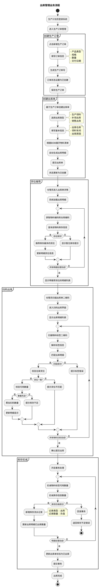
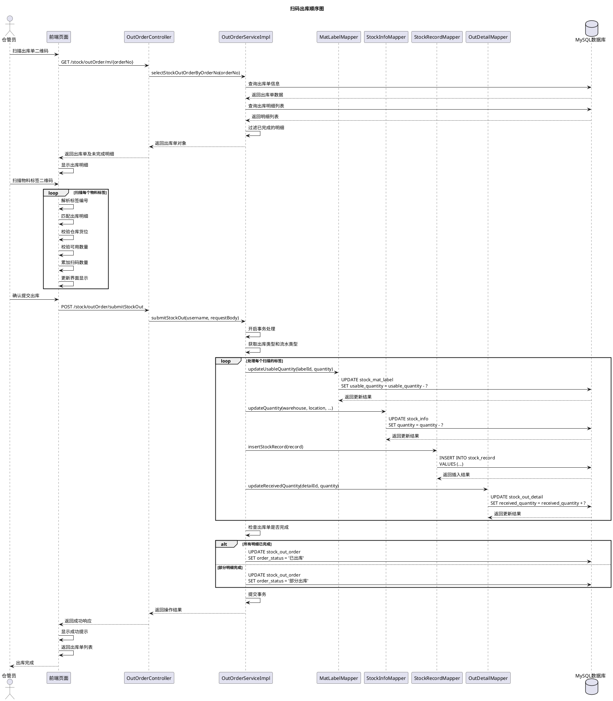
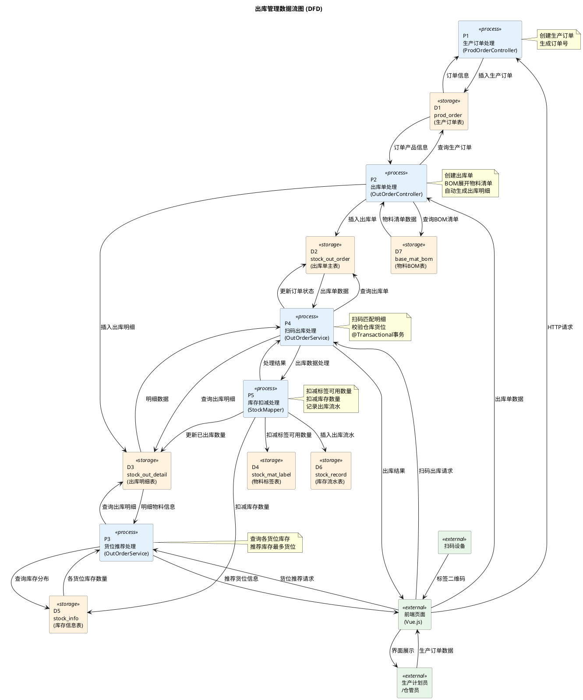

# 5.3 出库管理模块实现（生产订单、货位推荐、扫码出库）

## 5.3.1 流程图

生产计划员登录系统后进入生产订单管理模块，创建生产订单，填写产品类型、规格、数量、交付日期等信息，系统生成唯一的生产订单号并保存至数据库，订单状态设置为"已创建"。基于生产订单，系统自动或手动创建出库单，选择出库类型（生产领料、补领出库或销售出库），填写出库仓库、领料车间等基本信息。系统根据生产订单关联的产品BOM信息展开物料清单，自动生成出库明细，包括所需物料编码、名称、图号及出库数量。出库单创建完成后，状态更新为"已创建"。仓管员进入出库单详情页面，系统为每条出库明细推荐货位，推荐逻辑基于该物料在指定仓库中库存数量最多的货位，若无库存则显示"暂无库存"。仓管员使用扫码设备扫描出库单二维码进入扫码出库界面，依次扫描物料标签二维码，系统自动匹配出库明细并累加扫码数量，同时校验标签的仓库和货位是否与推荐货位一致。确认所有物料扫码完成后，仓管员提交出库操作，系统执行库存扣减逻辑：扣减物料标签的可用数量；扣减库存信息表中对应仓库货位的库存数量；新增库存流水记录，记录类型为出库，记录数量为负值表示库存减少。最后，系统将出库单状态修改为"已出库"，流程结束。若扫码过程中发现标签不匹配或库存不足，系统提示错误信息，仓管员可调整后重新扫码。

## 5.3.2 顺序图

仓管员使用扫码设备扫描出库单二维码，前端页面向OutOrderController发送GET请求获取出库单信息。Controller调用Service层的selectStockOutOrderByOrderNo方法查询出库单详细信息。Service层从数据库查询出库单主表信息和出库明细列表，过滤掉已完成的明细（已出库数量等于应出库数量的明细），只返回未完成或部分完成的明细，Controller将数据返回给前端。前端页面显示出库明细列表，包括物料编码、名称、应出库数量、已出库数量和推荐货位等信息。仓管员依次扫描物料标签二维码，前端解析标签编号，在出库明细列表中匹配对应的物料，校验标签的仓库和货位是否与出库明细一致，校验标签的可用数量是否充足，校验通过后累加扫码数量并实时更新界面显示。所有物料扫码完成后，仓管员点击确认提交按钮，前端向Controller发送POST请求执行出库操作。Controller调用Service层的submitStockOut方法，Service开启数据库事务处理，获取出库类型并根据出库类型确定库存流水记录类型。对于每个扫描的物料标签，Service首先调用MatLabelMapper扣减物料标签的可用数量；然后调用InfoMapper扣减库存信息表中对应仓库货位的库存数量；接着调用RecordMapper新增库存流水记录，记录类型为出库，记录数量为负值表示库存减少；最后调用DetailMapper更新出库明细的已出库数量。所有标签处理完成后，Service检查出库单是否完成，若所有明细的已出库数量都等于应出库数量则更新出库单状态为"已出库"，若仍有未完成的明细则更新状态为"部分出库"。Service提交事务并返回操作结果，Controller将成功响应返回给前端，前端显示操作成功提示并返回出库单列表页面，出库流程结束。

## 5.3.3 数据流图

生产计划员通过前端页面创建生产订单，请求数据流入P1生产订单处理过程，P1生成订单号，设置状态为"已创建"，将订单数据写入prod_order表。计划员基于生产订单创建出库单，出库单数据流入P2出库单处理过程，若关联生产订单则P2从prod_order表查询产品信息，从base_mat_bom表查询BOM清单，展开物料清单自动生成出库明细，将出库单数据写入stock_out_order表和stock_out_detail表。仓管员进入出库单详情页面，货位推荐请求流入P3货位推荐处理过程，P3从stock_out_detail表查询物料信息，从stock_info表查询各货位库存分布，选择库存最多的货位作为推荐货位返回前端显示。仓管员使用扫码设备扫描出库单二维码进入扫码出库界面，依次扫描物料标签二维码，前端解析标签编号并在本地匹配出库明细、校验仓库货位、校验可用数量、累加扫码数量。扫码完成后确认提交出库，扫码数据流入P4扫码出库处理过程，P4开启数据库事务，调用P5库存扣减处理过程执行库存扣减逻辑。对于每个扫描的物料标签，P5从stock_mat_label表扣减可用数量，从stock_info表扣减库存数量，向stock_record表插入出库流水记录，更新stock_out_detail表的已出库数量。所有标签处理完成后，P4检查出库单完成情况，更新stock_out_order表状态为"已出库"或"部分出库"，提交事务返回处理结果。整个数据流清晰地展示了出库业务从生产订单创建、出库单生成、货位推荐到扫码出库、库存扣减的完整流转过程。
