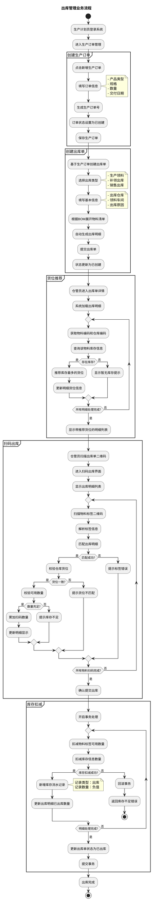
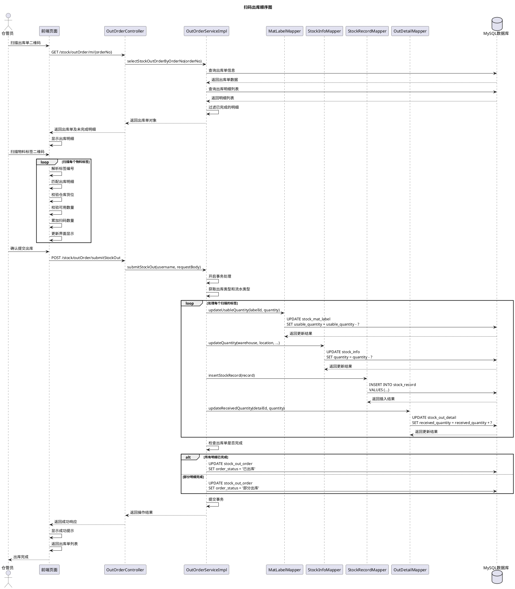
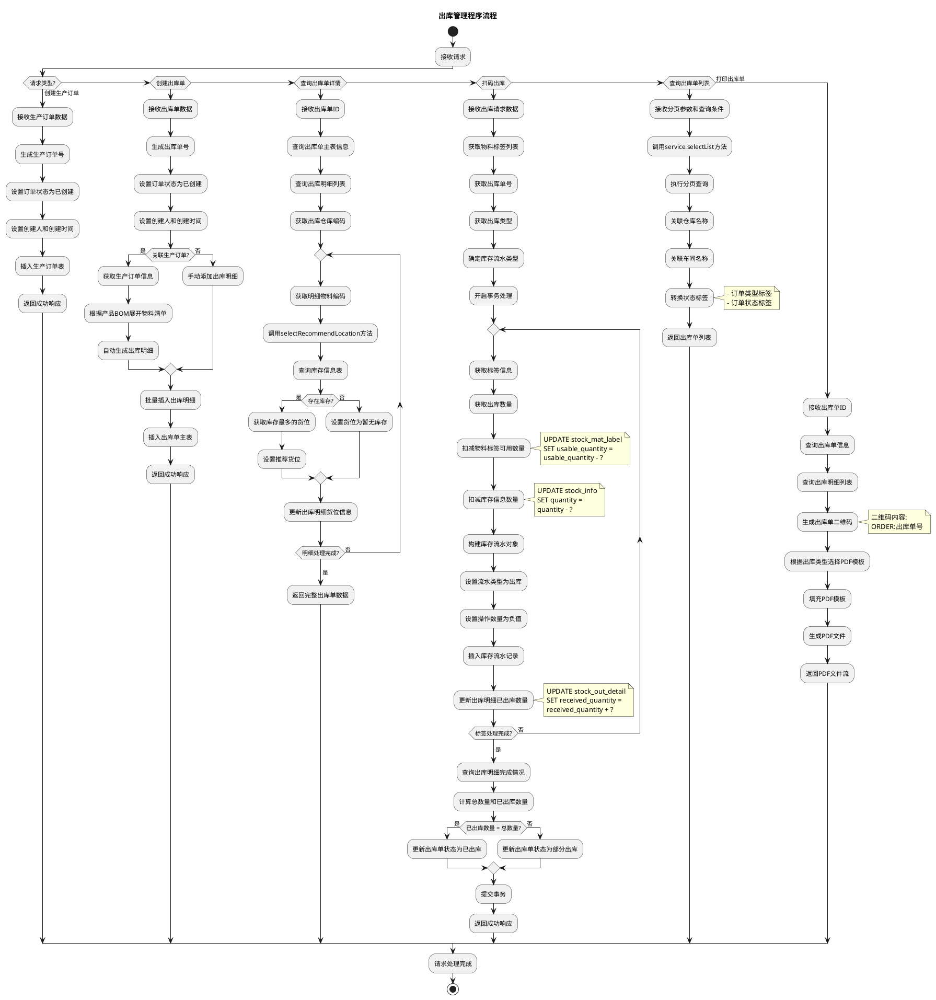
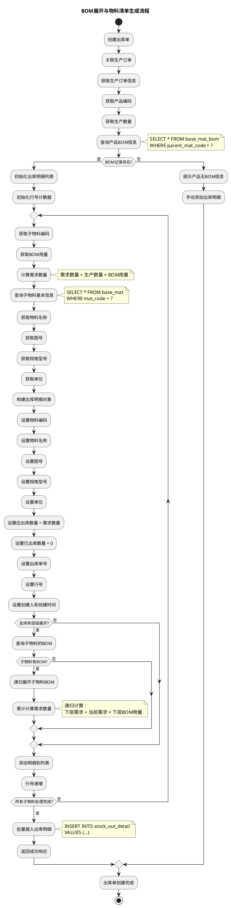
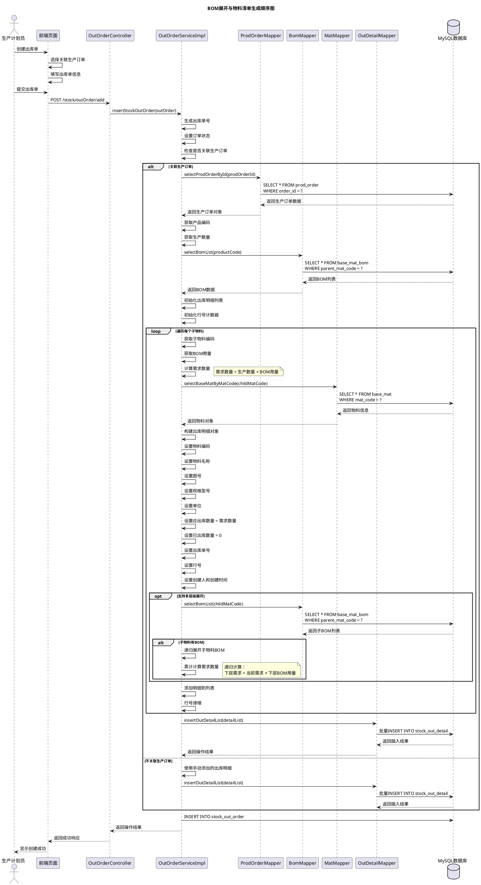
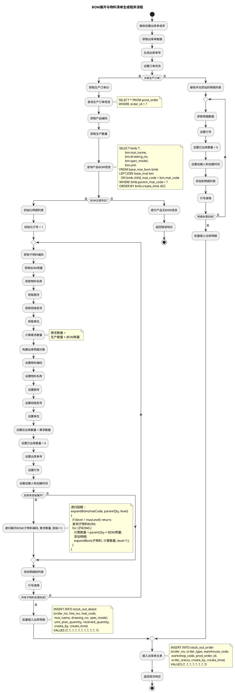
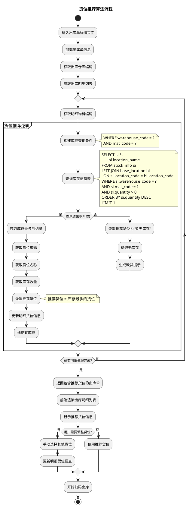
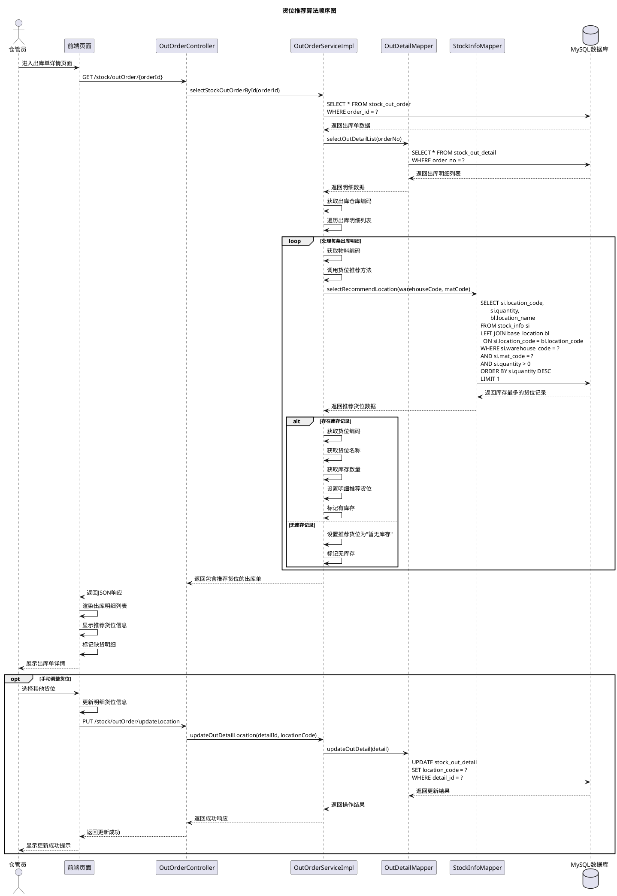
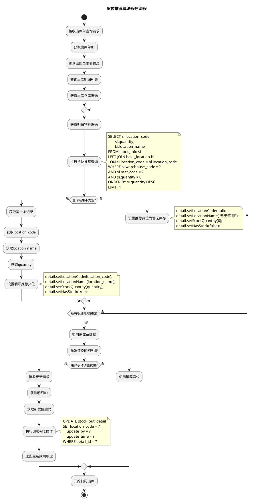

# 5.3 出库管理模块实现（生产订单、货位推荐、扫码出库）

## 5.3.1 流程图

生产计划员登录系统后进入生产订单管理模块，创建生产订单，填写产品类型、规格、数量、交付日期等信息，系统生成唯一的生产订单号并保存至数据库，订单状态设置为"已创建"。基于生产订单，系统自动或手动创建出库单，选择出库类型（生产领料、补领出库或销售出库），填写出库仓库、领料车间等基本信息。系统根据生产订单关联的产品BOM信息展开物料清单，自动生成出库明细，包括所需物料编码、名称、图号及出库数量。出库单创建完成后，状态更新为"已创建"。仓管员进入出库单详情页面，系统为每条出库明细推荐货位，推荐逻辑基于该物料在指定仓库中库存数量最多的货位，若无库存则显示"暂无库存"。仓管员使用扫码设备扫描出库单二维码进入扫码出库界面，依次扫描物料标签二维码，系统自动匹配出库明细并累加扫码数量，同时校验标签的仓库和货位是否与推荐货位一致。确认所有物料扫码完成后，仓管员提交出库操作，系统执行库存扣减逻辑：扣减物料标签的可用数量；扣减库存信息表中对应仓库货位的库存数量；新增库存流水记录，记录类型为出库，记录数量为负值表示库存减少。最后，系统将出库单状态修改为"已出库"，流程结束。若扫码过程中发现标签不匹配或库存不足，系统提示错误信息，仓管员可调整后重新扫码。

## 5.3.2 顺序图

仓管员使用扫码设备扫描出库单二维码，前端页面向OutOrderController发送GET请求获取出库单信息。Controller调用Service层的selectStockOutOrderByOrderNo方法查询出库单详细信息。Service层从数据库查询出库单主表信息和出库明细列表，过滤掉已完成的明细（已出库数量等于应出库数量的明细），只返回未完成或部分完成的明细，Controller将数据返回给前端。前端页面显示出库明细列表，包括物料编码、名称、应出库数量、已出库数量和推荐货位等信息。仓管员依次扫描物料标签二维码，前端解析标签编号，在出库明细列表中匹配对应的物料，校验标签的仓库和货位是否与出库明细一致，校验标签的可用数量是否充足，校验通过后累加扫码数量并实时更新界面显示。所有物料扫码完成后，仓管员点击确认提交按钮，前端向Controller发送POST请求执行出库操作。Controller调用Service层的submitStockOut方法，Service开启数据库事务处理，获取出库类型并根据出库类型确定库存流水记录类型。对于每个扫描的物料标签，Service首先调用MatLabelMapper扣减物料标签的可用数量；然后调用InfoMapper扣减库存信息表中对应仓库货位的库存数量；接着调用RecordMapper新增库存流水记录，记录类型为出库，记录数量为负值表示库存减少；最后调用DetailMapper更新出库明细的已出库数量。所有标签处理完成后，Service检查出库单是否完成，若所有明细的已出库数量都等于应出库数量则更新出库单状态为"已出库"，若仍有未完成的明细则更新状态为"部分出库"。Service提交事务并返回操作结果，Controller将成功响应返回给前端，前端显示操作成功提示并返回出库单列表页面，出库流程结束。

## 5.3.3 程序流程图

该程序流程图描述了出库管理模块的核心操作流程，流程从"开始"节点启动，涵盖创建生产订单、创建出库单、查询出库单详情、扫码出库、查询出库单列表及打印出库单六大功能。当执行创建生产订单操作时，系统接收生产订单数据，生成唯一的生产订单号，设置订单状态为"已创建"，设置创建人和创建时间信息，插入生产订单表，返回成功响应。当执行创建出库单操作时，系统接收出库单数据，生成唯一的出库单号，设置订单状态为"已创建"，设置创建人和创建时间信息。系统判断是否关联生产订单，若关联则获取生产订单信息，根据产品的BOM信息展开物料清单，自动生成出库明细；若不关联则由用户手动添加出库明细。系统批量插入出库明细数据，插入出库单主表记录，返回成功响应。当执行查询出库单详情操作时，系统接收出库单ID，查询出库单主表信息和出库明细列表，获取出库仓库编码。系统遍历每条出库明细，获取明细的物料编码，调用selectRecommendLocation方法查询库存信息表，若存在库存则获取库存数量最多的货位并设置为推荐货位，若不存在库存则设置货位为"暂无库存"，更新出库明细的货位信息。所有明细处理完成后，系统返回包含推荐货位的完整出库单数据。当执行扫码出库操作时，系统接收出库请求数据，获取物料标签列表、出库单号和出库类型，根据出库类型确定库存流水记录类型，开启数据库事务处理。系统遍历每个扫描的物料标签，获取标签信息和出库数量，首先扣减物料标签的可用数量（执行UPDATE stock_mat_label SET usable_quantity = usable_quantity - ?）；然后扣减库存信息表中对应仓库货位的库存数量（执行UPDATE stock_info SET quantity = quantity - ?）；接着构建库存流水对象，设置流水类型为出库，设置操作数量为负值，插入库存流水记录；最后更新出库明细的已出库数量（执行UPDATE stock_out_detail SET received_quantity = received_quantity + ?）。所有标签处理完成后，系统查询出库明细的完成情况，计算总数量和已出库数量，若已出库数量等于总数量则更新出库单状态为"已出库"，否则更新状态为"部分出库"，提交事务，返回成功响应。当执行查询出库单列表操作时，系统接收分页参数和查询条件，调用service层的selectList方法执行分页查询，关联仓库名称和车间名称，转换订单类型和订单状态的标签显示，返回出库单列表数据。当执行打印出库单操作时，系统接收出库单ID，查询出库单信息和出库明细列表，生成包含出库单号的二维码（格式为"ORDER:出库单号"），根据出库类型选择对应的PDF模板（生产领料使用production_out_order.pdf，销售出库使用common_out_order.pdf），填充PDF模板，生成可打印的PDF文件，返回PDF文件流供用户下载。整个流程清晰呈现了出库管理模块从生产订单创建、出库单生成、货位推荐、扫码出库到库存扣减的完整业务链路，各操作独立执行且均从"开始"启动，经对应业务处理后至"结束"节点，体现了功能的完整性和流程的规范性。

## 5.3.4 BOM展开与物料清单生成实现

### 5.3.4.1 流程图

出库管理模块的重要功能是基于生产订单自动生成出库明细，该功能依赖于物料BOM信息的展开。当创建出库单并关联生产订单时，系统首先从生产订单中获取产品编码和生产数量。系统查询该产品的BOM信息，从base_mat_bom表中查询以该产品为父物料的所有子物料记录，获取子物料编码和BOM用量。系统遍历每个子物料，计算实际需求数量，计算公式为：需求数量 = 生产数量 × BOM用量。系统查询子物料的基本信息，获取物料名称、图号、规格型号、单位等属性。系统构建出库明细对象，设置物料编码、物料名称、图号、规格型号、单位、应出库数量（等于需求数量），设置已出库数量为0，设置出库单号，设置行号（按顺序递增），设置创建人和创建时间。若系统配置支持多层级BOM展开，系统检查子物料是否本身也有BOM，若有则递归调用BOM展开方法，继续查询子物料的下一层子物料，累计计算需求数量，直到达到最大展开层级或子物料无BOM为止。所有子物料处理完成后，系统批量插入出库明细记录至stock_out_detail表，返回成功响应。BOM展开功能大幅提升了出库单创建的效率和准确性，避免了手工计算和录入可能产生的错误，确保生产领料的物料清单与产品配方完全一致。

### 5.3.4.2 顺序图

生产计划员创建出库单时，在前端页面选择关联的生产订单并填写出库单基本信息。生产计划员提交出库单后，前端向OutOrderController发送POST请求（/stock/outOrder/add）。Controller调用Service层的insertStockOutOrder方法，Service生成唯一的出库单号，设置订单状态为"已创建"。Service检查出库单是否关联生产订单。若关联生产订单，Service调用ProdOrderMapper的selectProdOrderById方法，Mapper向数据库查询生产订单信息（SELECT * FROM prod_order WHERE order_id = ?），数据库返回生产订单数据，Mapper返回生产订单对象给Service。Service获取生产订单的产品编码和生产数量。Service调用BomMapper的selectBomList方法查询产品的BOM信息，Mapper向数据库查询（SELECT * FROM base_mat_bom WHERE parent_mat_code = ?），数据库返回BOM列表，Mapper返回BOM数据给Service。Service初始化出库明细列表和行号计数器。Service遍历每个子物料，获取子物料编码和BOM用量，计算需求数量（需求数量 = 生产数量 × BOM用量）。Service调用MatMapper的selectBaseMatByMatCode方法查询子物料的基本信息（SELECT * FROM base_mat WHERE mat_code = ?），数据库返回物料信息，Mapper返回物料对象给Service。Service构建出库明细对象，设置物料编码、物料名称、图号、规格型号、单位，设置应出库数量等于需求数量，设置已出库数量为0，设置出库单号、行号、创建人和创建时间。若系统支持多层级BOM展开，Service调用BomMapper查询子物料的BOM（SELECT * FROM base_mat_bom WHERE parent_mat_code = ?），数据库返回子BOM列表。若子物料有BOM，Service递归展开子物料BOM，累计计算需求数量（递归计算：下层需求 = 当前需求 × 下层BOM用量）。Service将明细添加到列表，行号递增。所有子物料处理完成后，Service调用DetailMapper的insertOutDetailList方法批量插入出库明细数据（批量INSERT INTO stock_out_detail），数据库返回插入结果，Mapper返回操作结果给Service。若不关联生产订单，Service使用手动添加的出库明细，调用DetailMapper批量插入。Service插入出库单主表记录（INSERT INTO stock_out_order），返回操作结果给Controller。Controller返回成功响应给前端，前端向生产计划员显示创建成功提示。

### 5.3.4.3 程序流程图

该程序流程图描述了BOM展开与物料清单生成的核心操作流程。系统接收创建出库单请求，获取出库单数据，生成唯一的出库单号，设置订单状态为"已创建"。系统判断是否关联生产订单。若关联生产订单，系统获取生产订单ID，查询生产订单信息（SELECT * FROM prod_order WHERE order_id = ?），获取产品编码和生产数量。系统查询产品的BOM信息，执行多表关联SQL查询（SELECT bmb.*, bm.mat_name, bm.drawing_no, bm.spec_model, bm.unit FROM base_mat_bom bmb LEFT JOIN base_mat bm ON bmb.child_mat_code = bm.mat_code WHERE bmb.parent_mat_code = ? ORDER BY bmb.create_time ASC），从base_mat_bom表查询BOM记录，左关联base_mat表获取子物料的名称、图号、规格型号、单位等信息，按创建时间升序排列。若BOM记录存在，系统初始化明细列表，初始化行号为1。系统遍历每个子物料，获取子物料编码、BOM用量、物料名称、图号、规格型号、单位，计算需求数量（需求数量 = 生产数量 × BOM用量）。系统构建出库明细对象，设置物料编码、物料名称、图号、规格型号、单位，设置应出库数量等于需求数量，设置已出库数量为0，设置出库单号、行号、创建人和创建时间。若系统启用多层级BOM展开功能，系统递归展开子物料的BOM，递归函数expandBom接收物料编码、父级数量和当前层级作为参数，若层级超过最大层级则返回，否则查询子物料的BOM，遍历每个子BOM，计算数量（计算数量 = 父级数量 × BOM用量），添加明细，递归调用expandBom处理下一层。系统将明细添加到列表，行号递增。所有子物料处理完成后，系统批量插入出库明细数据（INSERT INTO stock_out_detail (order_no, line_no, mat_code, mat_name, drawing_no, spec_model, unit, plan_quantity, received_quantity, create_by, create_time) VALUES (?, ?, ?, ?, ?, ?, ?, ?, ?, ?, ?)）。若BOM记录不存在，系统提示产品无BOM信息，返回错误响应并终止操作。若不关联生产订单，系统接收手动添加的明细列表，遍历每条明细，获取明细数据，设置行号，设置已出库数量为0，设置创建人和创建时间，添加到明细列表，行号递增。所有明细处理完成后，系统批量插入出库明细。系统插入出库单主表记录（INSERT INTO stock_out_order (order_no, order_type, warehouse_code, workshop_code, prod_order_id, order_status, create_by, create_time) VALUES (?, ?, ?, ?, ?, ?, ?, ?)），返回成功响应。BOM展开功能通过自动计算物料需求数量，大幅提升了出库单创建的效率和准确性，避免了手工计算和录入可能产生的错误，确保生产领料的物料清单与产品配方完全一致，支持多层级BOM结构的递归展开，满足复杂产品的物料管理需求。

## 5.3.5 货位推荐算法实现

### 5.3.5.1 流程图

货位推荐是出库管理模块的智能化功能，旨在提高仓管员拣货效率。当仓管员查看出库单详情时，系统为每条出库明细自动推荐货位。系统遍历每条出库明细，获取明细的物料编码和出库单的仓库编码。系统查询库存信息表（stock_info），构建查询条件WHERE warehouse_code = ? AND mat_code = ?，筛选出该物料在该仓库中所有货位的库存记录。系统按库存数量（quantity字段）降序排序，取库存数量最多的货位作为推荐货位。若查询结果不为空，系统获取库存最多的记录，获取货位编码和货位名称，将推荐货位信息更新至出库明细对象，在前端界面显示推荐货位，引导仓管员优先从库存充足的货位拣货。若查询结果为空，表示该物料在该仓库中无库存记录，系统将推荐货位设置为"暂无库存"，在前端界面显示缺货提示，提醒仓管员该物料需要补货或从其他仓库调拨。所有出库明细处理完成后，系统返回包含推荐货位的完整出库单数据。货位推荐算法基于"先进先出"和"库存均衡"的原则，既保证了物料的周转效率，又避免了某些货位长期积压或空置。系统支持手动调整推荐货位，仓管员可根据实际情况选择其他货位进行拣货，灵活性与智能化相结合，满足不同场景的出库需求。

### 5.3.5.2 顺序图

仓管员进入出库单详情页面，前端向OutOrderController发送GET请求（/stock/outOrder/{orderId}）。Controller调用Service层的selectStockOutOrderById方法，Service查询数据库获取出库单主表信息（SELECT * FROM stock_out_order WHERE order_id = ?），数据库返回出库单数据。Service调用OutDetailMapper的selectOutDetailList方法查询出库明细列表（SELECT * FROM stock_out_detail WHERE order_no = ?），数据库返回出库明细列表，Mapper返回明细数据给Service。Service获取出库单的仓库编码，遍历出库明细列表。对每条出库明细，Service获取物料编码，调用货位推荐方法。Service调用StockInfoMapper的selectRecommendLocation方法，Mapper向数据库发送查询（SELECT si.location_code, si.quantity, bl.location_name FROM stock_info si LEFT JOIN base_location bl ON si.location_code = bl.location_code WHERE si.warehouse_code = ? AND si.mat_code = ? AND si.quantity > 0 ORDER BY si.quantity DESC LIMIT 1），查询该物料在该仓库中库存数量最多的货位，数据库返回库存最多的货位记录，Mapper返回推荐货位数据给Service。若存在库存记录，Service获取货位编码、货位名称和库存数量，设置明细的推荐货位，标记有库存。若无库存记录，Service设置推荐货位为"暂无库存"，标记无库存。所有明细处理完成后，Service返回包含推荐货位的出库单数据给Controller，Controller返回JSON响应给前端。前端渲染出库明细列表，显示推荐货位信息，标记缺货明细，向仓管员展示出库单详情。若仓管员需要手动调整货位，仓管员在前端选择其他货位，前端更新明细货位信息，向Controller发送PUT请求（/stock/outOrder/updateLocation）。Controller调用Service的updateOutDetailLocation方法，Service调用DetailMapper的updateOutDetail方法更新明细的货位编码（UPDATE stock_out_detail SET location_code = ? WHERE detail_id = ?），数据库返回更新结果，Mapper返回操作结果给Service，Service返回成功响应给Controller，Controller返回更新成功给前端，前端向仓管员显示更新成功提示。

### 5.3.5.3 程序流程图

该程序流程图描述了货位推荐算法的核心操作流程。系统接收出库单查询请求，获取出库单ID，查询出库单主表信息，查询出库明细列表，获取出库仓库编码。系统遍历每条出库明细，获取明细的物料编码。系统执行货位推荐查询，执行SQL语句（SELECT si.location_code, si.quantity, bl.location_name FROM stock_info si LEFT JOIN base_location bl ON si.location_code = bl.location_code WHERE si.warehouse_code = ? AND si.mat_code = ? AND si.quantity > 0 ORDER BY si.quantity DESC LIMIT 1），从stock_info表查询库存记录，左关联base_location表获取货位名称，WHERE条件筛选指定仓库和物料的库存，AND条件要求库存数量大于0，按库存数量降序排序，LIMIT 1只取库存最多的一条记录。若查询结果不为空，系统获取第一条记录，获取location_code、location_name和quantity，设置明细的推荐货位信息（detail.setLocationCode(location_code)、detail.setLocationName(location_name)、detail.setStockQuantity(quantity)、detail.setHasStock(true)），标记该明细有库存。若查询结果为空，表示该物料在该仓库无库存，系统设置推荐货位为"暂无库存"（detail.setLocationCode(null)、detail.setLocationName("暂无库存")、detail.setStockQuantity(0)、detail.setHasStock(false)），标记该明细无库存。所有明细处理完成后，系统返回包含推荐货位的出库单数据，前端渲染明细列表，显示推荐货位信息，对于无库存的明细标红显示"暂无库存"提示。若用户需要手动调整货位，系统接收更新请求，获取明细ID和新货位编码，执行UPDATE操作（UPDATE stock_out_detail SET location_code = ?, update_by = ?, update_time = ? WHERE detail_id = ?），更新明细的货位编码、更新人和更新时间，返回更新成功响应。若用户不调整，系统使用推荐货位，开始扫码出库操作。货位推荐算法通过智能推荐库存最多的货位，提高了仓管员的拣货效率，减少了查找货位的时间，优化了库存周转，避免了部分货位长期积压或空置的问题，同时支持手动调整货位，灵活性与智能化相结合，满足不同场景的出库需求。

