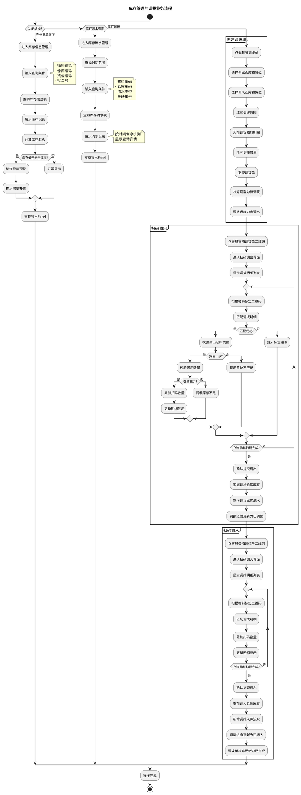
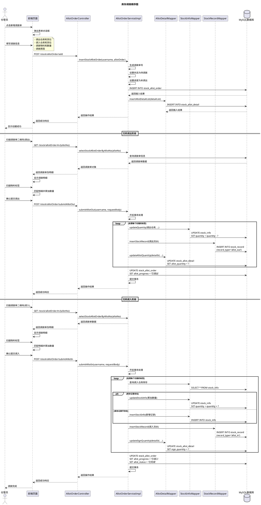
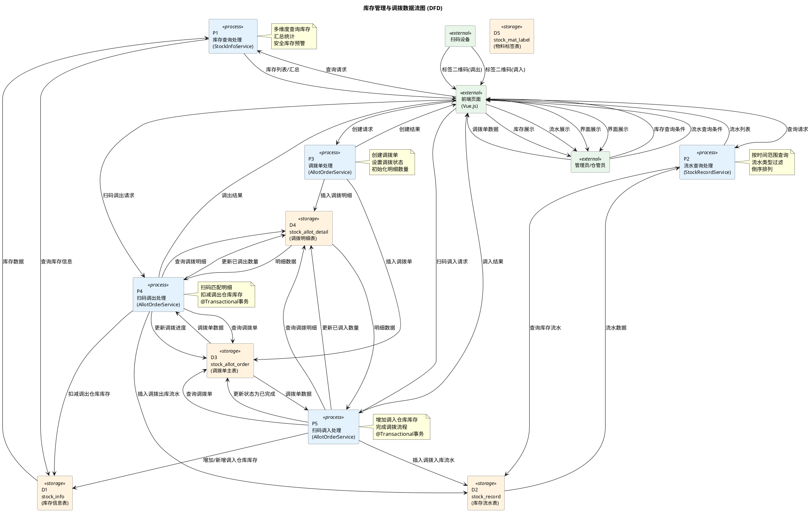

# 5.4 库存管理与调拨模块实现

## 5.4.1 流程图

管理员或仓管员登录系统后进入库存管理模块，可选择查看库存信息或库存流水。在库存信息查询功能中，用户输入查询条件（物料编码、仓库编码、货位编码等），系统从库存信息表（stock_info）中查询符合条件的库存记录，支持按物料、仓库、货位等多维度统计汇总。系统展示每个库存记录的详细信息，包括物料编码、名称、批次号、供应商、仓库、货位、库存数量等。用户可设置安全库存预警阈值，当物料库存低于阈值时系统自动标红提示，便于及时补货。在库存流水查询功能中，用户选择时间范围和查询条件，系统从库存流水表（stock_record）中查询历史流水记录，展示每次库存变动的详细信息，包括流水类型、物料信息、仓库货位、变动数量、关联单号、操作人和操作时间等。流水记录按时间倒序排列，支持导出Excel报表。

对于库存调拨功能，仓管员创建调拨单，选择调出仓库、调出货位、调入仓库、调入货位，添加调拨物料及数量。调拨单创建完成后，状态设置为"待调拨"，调拨进度为"未调出"。仓管员扫描调拨单二维码进入扫码调出界面，扫描物料标签完成调出操作，系统扣减调出仓库货位的库存，新增调拨出库流水记录，调拨进度更新为"已调出"。随后仓管员扫描调拨单二维码进入扫码调入界面，扫描物料标签完成调入操作，系统增加调入仓库货位的库存，新增调拨入库流水记录，调拨进度更新为"已调入"，调拨单状态更新为"已完成"，流程结束。

## 5.4.2 顺序图

仓管员点击新增调拨单按钮，前端页面弹出表单对话框。仓管员填写调拨信息，包括调出仓库和货位、调入仓库和货位、调拨物料和数量、调拨原因等。前端向AllotOrderController发送POST请求（/stock/allotOrder/add），Controller调用Service层的insertStockAllotOrder方法处理业务逻辑。Service生成唯一的调拨单号，设置调拨状态为"待调拨"，设置调拨进度为"未调出"，向数据库插入调拨单主表记录（INSERT INTO stock_allot_order），数据库返回插入结果。随后Service调用DetailMapper的insertAllotDetailList方法批量插入调拨明细数据（INSERT INTO stock_allot_detail），数据库返回插入结果。Service将操作结果返回给Controller，Controller将成功响应返回给前端，前端显示创建成功提示。

在扫码调出阶段，仓管员扫描调拨单二维码进入调出界面，前端向Controller发送GET请求（/stock/allotOrder/m/{allotNo}）获取调拨单信息。Controller调用Service的selectStockAllotOrderByAllotNo方法查询调拨单信息，Service从数据库查询调拨单数据，数据库返回调拨单数据，Service将调拨单对象返回给Controller，Controller将调拨单及明细信息返回给前端。前端显示调拨明细列表，仓管员依次扫描物料标签，前端在本地匹配调拨明细并累加扫码数量。仓管员确认提交调出操作，前端向Controller发送POST请求（/stock/allotOrder/submitAllotOut）。Controller调用Service的submitAllotOut方法，Service开启数据库事务处理。Service遍历每个扫描的物料标签，调用InfoMapper的updateQuantity方法扣减调出仓库的库存数量（UPDATE stock_info SET quantity = quantity - ? WHERE warehouse_code = ? AND location_code = ?），调用RecordMapper的insertStockRecord方法新增调拨出库流水记录（INSERT INTO stock_record，流水类型为allot_out），调用DetailMapper的updateAllotQuantity方法更新调拨明细的已调出数量（UPDATE stock_allot_detail SET allot_quantity = ?）。所有标签处理完成后，Service更新调拨单的调拨进度为"已调出"（UPDATE stock_allot_order SET allot_progress = '已调出'），提交事务，将操作结果返回给Controller，Controller将成功响应返回给前端。

在扫码调入阶段，仓管员再次扫描调拨单二维码进入调入界面，前端向Controller发送GET请求获取调拨单信息。Controller调用Service查询调拨单及明细数据并返回给前端显示。前端显示调拨明细列表，仓管员依次扫描物料标签，前端在本地匹配调拨明细并累加扫码数量。仓管员确认提交调入操作，前端向Controller发送POST请求（/stock/allotOrder/submitAllotIn）。Controller调用Service的submitAllotIn方法，Service开启数据库事务处理。Service遍历每个扫描的物料标签，首先调用InfoMapper查询调入仓库货位的库存记录（SELECT * FROM stock_info），若库存记录存在则调用InfoMapper的updateStockInfo方法累加库存数量（UPDATE stock_info SET quantity = quantity + ?），若库存记录不存在则调用InfoMapper的insertStockInfo方法新增库存记录（INSERT INTO stock_info）。随后调用RecordMapper的insertStockRecord方法新增调拨入库流水记录（INSERT INTO stock_record，流水类型为allot_in），调用DetailMapper的updateSignQuantity方法更新调拨明细的已调入数量（UPDATE stock_allot_detail SET sign_quantity = ?）。所有标签处理完成后，Service更新调拨单的调拨进度为"已调入"，调拨状态为"已完成"（UPDATE stock_allot_order SET allot_progress = '已调入', allot_status = '已完成'），提交事务，将操作结果返回给Controller，Controller将成功响应返回给前端，前端显示调拨完成提示，整个调拨流程结束。

## 5.4.3 数据流图

管理员或仓管员通过前端页面发起库存查询请求，请求数据流入P1库存查询处理过程，P1从stock_info表查询库存数据，支持按物料、仓库、货位等多维度查询和汇总统计，查询结果返回前端展示，库存低于安全库存阈值时系统标红预警。管理员发起流水查询请求，请求数据流入P2流水查询处理过程，P2从stock_record表查询库存流水数据，按时间范围和流水类型过滤，按创建时间倒序排列返回流水列表。仓管员创建调拨单，调拨单数据流入P3调拨单处理过程，P3生成调拨单号，设置调拨状态为"待调拨"、调拨进度为"未调出"，将调拨单数据写入stock_allot_order表和stock_allot_detail表。仓管员扫描调拨单二维码进入扫码调出界面，依次扫描物料标签，扫码数据流入P4扫码调出处理过程，P4开启数据库事务，从stock_allot_order表和stock_allot_detail表查询调拨信息，扣减stock_info表中调出仓库的库存数量，向stock_record表插入调拨出库流水记录，更新stock_allot_detail表的已调出数量，更新stock_allot_order表的调拨进度为"已调出"。仓管员再次扫描调拨单二维码进入扫码调入界面，依次扫描物料标签，扫码数据流入P5扫码调入处理过程，P5开启数据库事务，增加或新增stock_info表中调入仓库的库存数量，向stock_record表插入调拨入库流水记录，更新stock_allot_detail表的已调入数量，更新stock_allot_order表的调拨进度为"已调入"、调拨状态为"已完成"，提交事务返回处理结果。整个数据流清晰地展示了库存管理与调拨业务从库存查询、流水追溯到跨仓库物料转移的完整流转过程。
