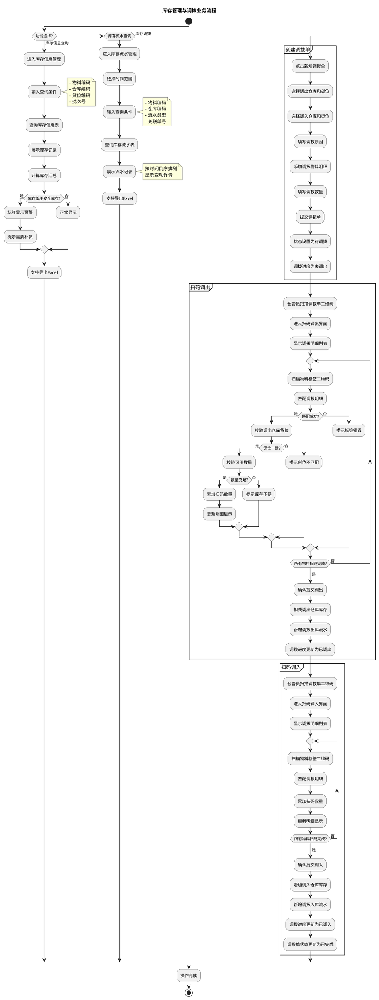
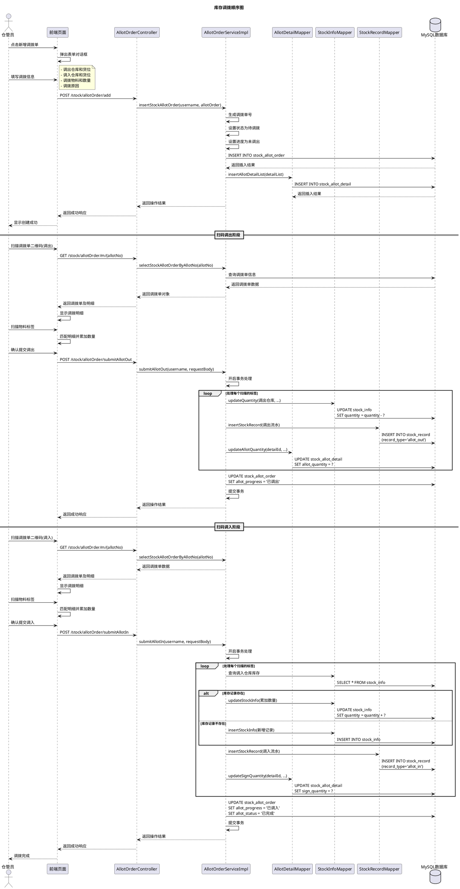
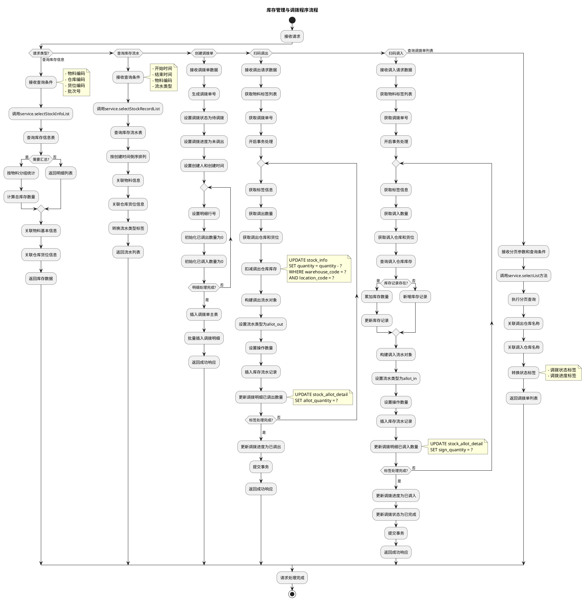
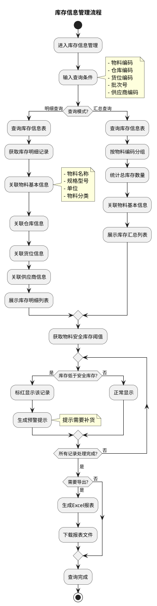
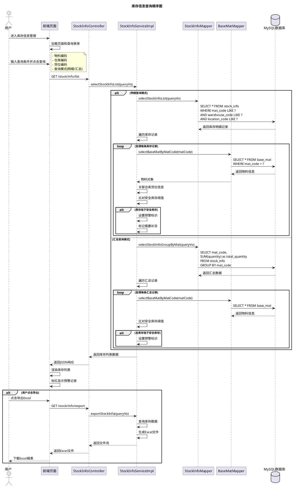
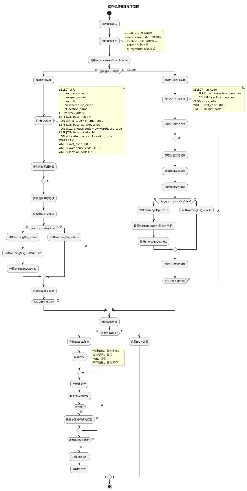
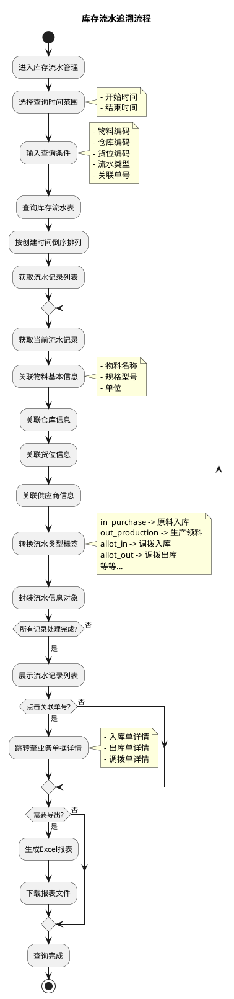
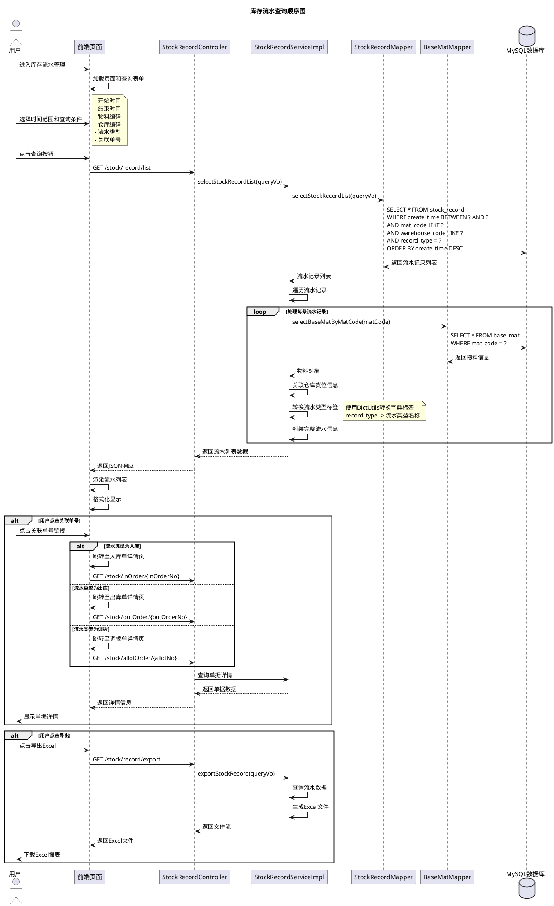
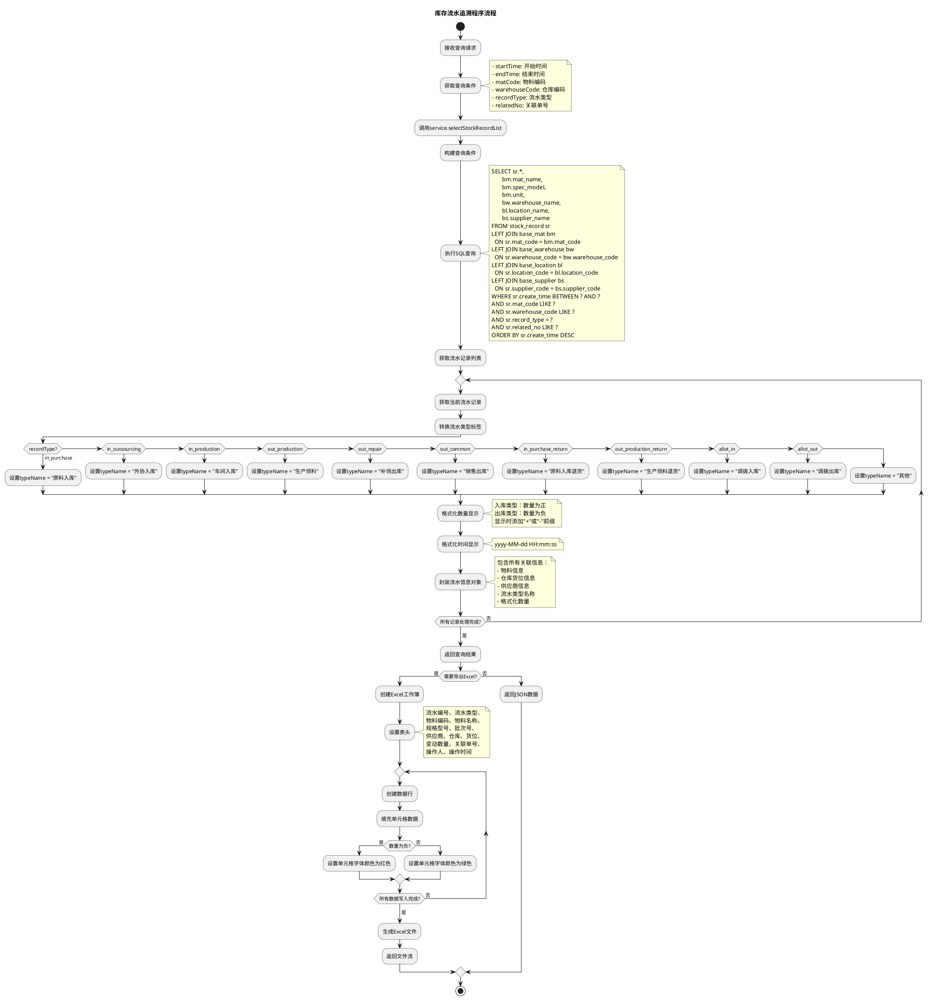

# 5.4 库存管理与调拨模块实现

## 5.4.1 流程图

管理员或仓管员登录系统后进入库存管理模块，可选择查看库存信息或库存流水。在库存信息查询功能中，用户输入查询条件（物料编码、仓库编码、货位编码等），系统从库存信息表（stock_info）中查询符合条件的库存记录，支持按物料、仓库、货位等多维度统计汇总。系统展示每个库存记录的详细信息，包括物料编码、名称、批次号、供应商、仓库、货位、库存数量等。用户可设置安全库存预警阈值，当物料库存低于阈值时系统自动标红提示，便于及时补货。在库存流水查询功能中，用户选择时间范围和查询条件，系统从库存流水表（stock_record）中查询历史流水记录，展示每次库存变动的详细信息，包括流水类型、物料信息、仓库货位、变动数量、关联单号、操作人和操作时间等。流水记录按时间倒序排列，支持导出Excel报表。

对于库存调拨功能，仓管员创建调拨单，选择调出仓库、调出货位、调入仓库、调入货位，添加调拨物料及数量。调拨单创建完成后，状态设置为"待调拨"，调拨进度为"未调出"。仓管员扫描调拨单二维码进入扫码调出界面，扫描物料标签完成调出操作，系统扣减调出仓库货位的库存，新增调拨出库流水记录，调拨进度更新为"已调出"。随后仓管员扫描调拨单二维码进入扫码调入界面，扫描物料标签完成调入操作，系统增加调入仓库货位的库存，新增调拨入库流水记录，调拨进度更新为"已调入"，调拨单状态更新为"已完成"，流程结束。

## 5.4.2 顺序图

仓管员点击新增调拨单按钮，前端页面弹出表单对话框。仓管员填写调拨信息，包括调出仓库和货位、调入仓库和货位、调拨物料和数量、调拨原因等。前端向AllotOrderController发送POST请求（/stock/allotOrder/add），Controller调用Service层的insertStockAllotOrder方法处理业务逻辑。Service生成唯一的调拨单号，设置调拨状态为"待调拨"，设置调拨进度为"未调出"，向数据库插入调拨单主表记录（INSERT INTO stock_allot_order），数据库返回插入结果。随后Service调用DetailMapper的insertAllotDetailList方法批量插入调拨明细数据（INSERT INTO stock_allot_detail），数据库返回插入结果。Service将操作结果返回给Controller，Controller将成功响应返回给前端，前端显示创建成功提示。

在扫码调出阶段，仓管员扫描调拨单二维码进入调出界面，前端向Controller发送GET请求（/stock/allotOrder/m/{allotNo}）获取调拨单信息。Controller调用Service的selectStockAllotOrderByAllotNo方法查询调拨单信息，Service从数据库查询调拨单数据，数据库返回调拨单数据，Service将调拨单对象返回给Controller，Controller将调拨单及明细信息返回给前端。前端显示调拨明细列表，仓管员依次扫描物料标签，前端在本地匹配调拨明细并累加扫码数量。仓管员确认提交调出操作，前端向Controller发送POST请求（/stock/allotOrder/submitAllotOut）。Controller调用Service的submitAllotOut方法，Service开启数据库事务处理。Service遍历每个扫描的物料标签，调用InfoMapper的updateQuantity方法扣减调出仓库的库存数量（UPDATE stock_info SET quantity = quantity - ? WHERE warehouse_code = ? AND location_code = ?），调用RecordMapper的insertStockRecord方法新增调拨出库流水记录（INSERT INTO stock_record，流水类型为allot_out），调用DetailMapper的updateAllotQuantity方法更新调拨明细的已调出数量（UPDATE stock_allot_detail SET allot_quantity = ?）。所有标签处理完成后，Service更新调拨单的调拨进度为"已调出"（UPDATE stock_allot_order SET allot_progress = '已调出'），提交事务，将操作结果返回给Controller，Controller将成功响应返回给前端。

在扫码调入阶段，仓管员再次扫描调拨单二维码进入调入界面，前端向Controller发送GET请求获取调拨单信息。Controller调用Service查询调拨单及明细数据并返回给前端显示。前端显示调拨明细列表，仓管员依次扫描物料标签，前端在本地匹配调拨明细并累加扫码数量。仓管员确认提交调入操作，前端向Controller发送POST请求（/stock/allotOrder/submitAllotIn）。Controller调用Service的submitAllotIn方法，Service开启数据库事务处理。Service遍历每个扫描的物料标签，首先调用InfoMapper查询调入仓库货位的库存记录（SELECT * FROM stock_info），若库存记录存在则调用InfoMapper的updateStockInfo方法累加库存数量（UPDATE stock_info SET quantity = quantity + ?），若库存记录不存在则调用InfoMapper的insertStockInfo方法新增库存记录（INSERT INTO stock_info）。随后调用RecordMapper的insertStockRecord方法新增调拨入库流水记录（INSERT INTO stock_record，流水类型为allot_in），调用DetailMapper的updateSignQuantity方法更新调拨明细的已调入数量（UPDATE stock_allot_detail SET sign_quantity = ?）。所有标签处理完成后，Service更新调拨单的调拨进度为"已调入"，调拨状态为"已完成"（UPDATE stock_allot_order SET allot_progress = '已调入', allot_status = '已完成'），提交事务，将操作结果返回给Controller，Controller将成功响应返回给前端，前端显示调拨完成提示，整个调拨流程结束。

## 5.4.3 程序流程图

该程序流程图描述了库存管理与调拨模块的核心操作流程，流程从"开始"节点启动，涵盖查询库存信息、查询库存流水、创建调拨单、扫码调出、扫码调入及查询调拨单列表六大功能。当执行查询库存信息操作时，系统接收查询条件（物料编码、仓库编码、货位编码、批次号等），调用service层的selectStockInfoList方法查询库存信息表。系统判断是否需要汇总，若需要则按物料分组统计并计算总库存数量，若不需要则返回明细列表。系统关联物料基本信息和仓库货位信息，返回完整的库存数据。当执行查询库存流水操作时，系统接收查询条件（开始时间、结束时间、物料编码、流水类型等），调用service层的selectStockRecordList方法查询库存流水表，按创建时间倒序排列，关联物料信息和仓库货位信息，转换流水类型标签显示，返回流水列表数据。当执行创建调拨单操作时，系统接收调拨单数据，生成唯一的调拨单号，设置调拨状态为"待调拨"，设置调拨进度为"未调出"，设置创建人和创建时间信息。系统遍历调拨明细列表，为每条明细设置行号，初始化已调出数量和已调入数量为0。所有明细处理完成后，系统插入调拨单主表记录，批量插入调拨明细数据，返回成功响应。当执行扫码调出操作时，系统接收调出请求数据，获取物料标签列表和调拨单号，开启数据库事务处理。系统遍历每个扫描的物料标签，获取标签信息、调出数量、调出仓库和货位，执行扣减调出仓库库存的SQL操作（UPDATE stock_info SET quantity = quantity - ? WHERE warehouse_code = ? AND location_code = ?），构建调出流水对象，设置流水类型为allot_out，设置操作数量，插入库存流水记录，更新调拨明细的已调出数量（UPDATE stock_allot_detail SET allot_quantity = ?）。所有标签处理完成后，系统更新调拨单的调拨进度为"已调出"，提交事务，返回成功响应。当执行扫码调入操作时，系统接收调入请求数据，获取物料标签列表和调拨单号，开启数据库事务处理。系统遍历每个扫描的物料标签，获取标签信息、调入数量、调入仓库和货位，查询调入仓库的库存记录，若库存记录存在则累加库存数量并更新记录，若不存在则新增库存记录，构建调入流水对象，设置流水类型为allot_in，设置操作数量，插入库存流水记录，更新调拨明细的已调入数量（UPDATE stock_allot_detail SET sign_quantity = ?）。所有标签处理完成后，系统更新调拨单的调拨进度为"已调入"，调拨状态为"已完成"，提交事务，返回成功响应。当执行查询调拨单列表操作时，系统接收分页参数和查询条件，调用service层的selectList方法执行分页查询，关联调出仓库名称和调入仓库名称，转换调拨状态和调拨进度的标签显示，返回调拨单列表数据。整个流程清晰呈现了库存管理与调拨模块从库存查询、流水追溯到跨仓库物料转移的完整业务链路，各操作独立执行且均从"开始"启动，经对应业务处理后至"结束"节点，体现了功能的完整性和流程的规范性。

## 5.4.4 库存信息管理实现

### 5.4.4.1 流程图

管理员或仓管员进入库存信息管理界面，输入查询条件（物料编码、仓库编码、货位编码、批次号等），系统从库存信息表（stock_info）中查询符合条件的库存记录。系统支持两种查询模式：明细查询和汇总查询。在明细查询模式下，系统展示每个库存单元的详细信息，包括物料编码、名称、规格型号、批次号、供应商、仓库、货位、库存数量等，关联物料基本信息和仓库货位信息，完整展示库存分布情况。在汇总查询模式下，系统按物料维度分组统计，忽略仓库货位的差异，计算每种物料的总库存数量，便于管理者快速掌握物料的总体库存水平。系统获取物料的安全库存阈值，将实际库存与阈值进行比对，当物料库存低于安全库存时，在查询结果中标红显示并生成预警提示，提醒采购部门及时补货。查询结果支持导出为Excel报表，便于离线分析和存档。流程结束后，用户可继续查询或退出界面。

### 5.4.4.2 顺序图

用户进入库存信息管理界面，前端加载页面和查询表单。用户输入查询条件（物料编码、仓库编码、货位编码、查询模式等）并点击查询按钮，前端向StockInfoController发送GET请求（/stock/info/list）。Controller调用Service层的selectStockInfoList方法处理查询逻辑。在明细查询模式下，Service调用Mapper的selectStockInfoList方法，Mapper向数据库发送SQL查询（SELECT * FROM stock_info WHERE mat_code LIKE ? AND warehouse_code LIKE ? AND location_code LIKE ?），数据库返回库存明细记录。Service遍历库存记录，对每条记录调用MatMapper的selectBaseMatByMatCode方法查询物料信息（SELECT * FROM base_mat WHERE mat_code = ?），数据库返回物料信息，Service关联仓库货位信息，比对物料的安全库存阈值，若库存低于安全库存则设置预警标识并标记需要补货。在汇总查询模式下，Service调用Mapper的selectStockInfoGroupByMat方法，Mapper向数据库发送分组查询SQL（SELECT mat_code, SUM(quantity) as total_quantity FROM stock_info GROUP BY mat_code），数据库返回汇总数据。Service遍历汇总记录，对每条记录查询物料基本信息，比对安全库存阈值，若总库存低于安全库存则设置预警标识。Service将库存列表数据返回给Controller，Controller将JSON响应返回给前端。前端渲染库存列表，对预警记录标红显示。若用户点击导出Excel按钮，前端向Controller发送GET请求（/stock/info/export），Controller调用Service的exportStockInfo方法查询库存数据并生成Excel文件，Controller将文件流返回给前端，前端触发用户下载Excel报表。

### 5.4.4.3 程序流程图

该程序流程图描述了库存信息管理的核心操作流程。系统接收查询请求后，首先获取查询条件，包括物料编码、仓库编码、货位编码、批次号和查询模式等参数。系统调用Service层的selectStockInfoList方法，根据查询模式执行不同的查询逻辑。在明细查询模式下，系统构建查询条件，执行多表关联SQL查询，从stock_info表获取库存明细记录，左关联base_mat表获取物料名称、规格型号、单位等信息，左关联base_warehouse表获取仓库名称，左关联base_location表获取货位名称，WHERE条件支持模糊匹配。系统遍历查询结果，对每条库存记录获取物料的安全库存阈值，比对实际库存数量，若quantity小于safetyStock则设置预警标识warningFlag为true，设置预警消息warningMsg为"库存不足"，计算缺货数量shortageQuantity，否则设置warningFlag为false。系统封装库存信息对象并添加到结果列表。在汇总查询模式下，系统构建分组查询条件，执行SQL分组查询，按物料编码分组，统计总库存数量total_quantity和货位数量location_count。系统遍历汇总结果，对每条记录查询物料基本信息，获取物料安全库存，比对总库存数量，若total_quantity小于safetyStock则设置预警标识，计算缺货数量，封装汇总信息对象。查询完成后，系统返回查询结果。若用户需要导出Excel报表，系统创建Excel工作簿，设置表头包括物料编码、物料名称、规格型号、单位、仓库、货位、库存数量、安全库存等列，遍历查询结果创建数据行，填充单元格数据，对有预警的记录设置单元格样式为红色以突出显示，所有数据写入完成后生成Excel文件并返回文件流供用户下载。若不需要导出，系统直接返回JSON格式的查询数据供前端渲染展示。

## 5.4.5 库存流水追溯实现

### 5.4.5.1 流程图

管理员或仓管员进入库存流水管理界面，选择查询时间范围（开始时间和结束时间），输入查询条件（物料编码、仓库编码、流水类型、关联单号等）。系统从库存流水表（stock_record）中查询符合条件的流水记录，按创建时间倒序排列，确保最新的变动记录优先显示。系统关联物料基本信息，获取物料名称、规格型号、单位等详细信息；关联仓库信息，获取仓库名称；关联货位信息，获取货位名称。系统根据流水类型代码转换为中文标签显示，入库类型包括"原料入库"、"外协入库"、"车间入库"；出库类型包括"生产领料"、"补领出库"、"销售出库"；退货类型包括"原料入库退货"、"生产领料退货"等；调拨类型包括"调拨入库"、"调拨出库"。系统展示流水记录列表，每条记录包含流水编号、流水类型、物料信息、批次号、供应商、仓库货位、变动数量、关联单号、操作人和操作时间等完整信息。用户可点击关联单号跳转至对应的业务单据详情页面，实现业务追溯。查询结果支持导出为Excel报表，便于离线分析和审计存档。流程结束后，用户可继续查询或退出界面。

### 5.4.5.2 顺序图

用户进入库存流水管理界面，前端加载页面和查询表单。用户选择时间范围和查询条件（开始时间、结束时间、物料编码、仓库编码、流水类型、关联单号等），点击查询按钮，前端向StockRecordController发送GET请求（/stock/record/list）。Controller调用Service层的selectStockRecordList方法处理查询逻辑。Service调用Mapper的selectStockRecordList方法，Mapper向数据库发送SQL查询（SELECT * FROM stock_record WHERE create_time BETWEEN ? AND ? AND mat_code LIKE ? AND warehouse_code LIKE ? AND record_type = ? ORDER BY create_time DESC），数据库返回流水记录列表，Mapper将流水记录列表返回给Service。Service遍历流水记录，对每条流水记录调用MatMapper的selectBaseMatByMatCode方法查询物料信息（SELECT * FROM base_mat WHERE mat_code = ?），数据库返回物料信息，Service关联仓库货位信息，使用DictUtils转换流水类型标签（将record_type代码转换为流水类型名称），封装完整的流水信息对象。Service将流水列表数据返回给Controller，Controller将JSON响应返回给前端。前端渲染流水列表并格式化显示。若用户点击关联单号链接，根据流水类型判断：若流水类型为入库，前端跳转至入库单详情页并向Controller发送GET请求（/stock/inOrder/{inOrderNo}）；若流水类型为出库，前端跳转至出库单详情页并向Controller发送GET请求（/stock/outOrder/{outOrderNo}）；若流水类型为调拨，前端跳转至调拨单详情页并向Controller发送GET请求（/stock/allotOrder/{allotNo}）。Controller调用Service查询单据详情，Service将单据数据返回给Controller，Controller将详情信息返回给前端，前端显示单据详情。若用户点击导出Excel按钮，前端向Controller发送GET请求（/stock/record/export），Controller调用Service的exportStockRecord方法查询流水数据并生成Excel文件，Controller将文件流返回给前端，前端触发用户下载Excel报表。

### 5.4.5.3 程序流程图

该程序流程图描述了库存流水追溯的核心操作流程。系统接收查询请求后，首先获取查询条件，包括开始时间startTime、结束时间endTime、物料编码matCode、仓库编码warehouseCode、流水类型recordType和关联单号relatedNo等参数。系统调用Service层的selectStockRecordList方法，构建查询条件，执行多表关联SQL查询。SQL语句从stock_record表获取流水记录，左关联base_mat表获取物料名称、规格型号、单位，左关联base_warehouse表获取仓库名称，左关联base_location表获取货位名称，左关联base_supplier表获取供应商名称。WHERE条件限定创建时间在指定范围内，支持物料编码、仓库编码、流水类型和关联单号的模糊或精确匹配，查询结果按创建时间倒序排列。系统遍历查询结果，对每条流水记录进行处理。首先转换流水类型标签，根据recordType的值设置对应的中文名称：in_purchase对应"原料入库"，in_outsourcing对应"外协入库"，in_production对应"车间入库"，out_production对应"生产领料"，out_repair对应"补领出库"，out_common对应"销售出库"，in_purchase_return对应"原料入库退货"，out_production_return对应"生产领料退货"，allot_in对应"调拨入库"，allot_out对应"调拨出库"，其他类型对应"其他"。系统格式化数量显示，入库类型的数量为正值，出库类型的数量为负值，显示时为正值添加"+"前缀，为负值添加"-"前缀，直观反映库存增减情况。系统格式化时间显示为"yyyy-MM-dd HH:mm:ss"格式，封装流水信息对象，包含所有关联信息如物料信息、仓库货位信息、供应商信息、流水类型名称和格式化数量。所有记录处理完成后，系统返回查询结果。若用户需要导出Excel报表，系统创建Excel工作簿，设置表头包括流水编号、流水类型、物料编码、物料名称、规格型号、批次号、供应商、仓库、货位、变动数量、关联单号、操作人、操作时间等列，遍历查询结果创建数据行，填充单元格数据，对数量为负的记录设置单元格字体颜色为红色表示出库，对数量为正的记录设置字体颜色为绿色表示入库，所有数据写入完成后生成Excel文件并返回文件流供用户下载。若不需要导出，系统直接返回JSON格式的查询数据供前端渲染展示。库存流水追溯功能通过完整记录每次库存变动的详细信息，实现了库存变动的全程可追溯，为库存盘点、差异分析和审计提供了可靠的数据支撑。