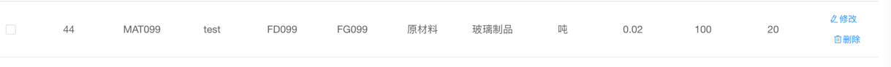
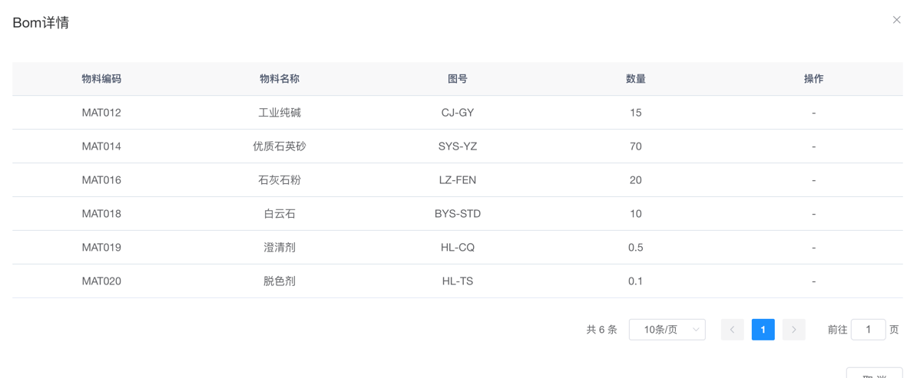
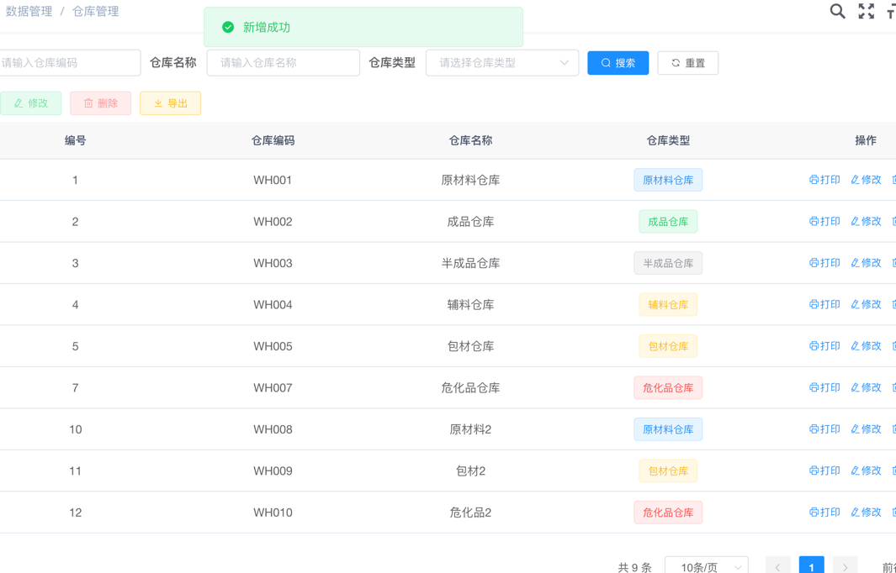

## 摘要

现阶段玻璃生产企业的仓储管理主要依赖人工登记与Excel表格进行物料出入库记录与库存统计。玻璃生产具有高温连续作业、原料配比精度要求高、产品规格多样化等特点，其仓储管理面临诸多挑战：在原料环节，石英砂、纯碱、石灰石等原料密度大、易受潮结块，传统手工记录难以实现批次追溯，原料质量波动直接影响玻璃成品透光率与强度；在半成品环节，玻璃原片规格繁多且易碎，不同厚度、尺寸的原片需分区存储，人工盘点效率低下且易造成原片损耗与混批问题；在成品环节，玻璃成品按规格、厚度、透光等级分类管理，传统管理模式下库存信息更新滞后，导致生产排程与库存数据脱节，易出现订单交付延迟或库存积压；在生产领料环节，玻璃熔化工序连续性强，原料断供将导致窑炉停机冷修，造成重大经济损失，而传统模式下缺乏库存预警机制，难以及时发现原料短缺风险；在质量追溯环节，玻璃气泡、结石、条纹等质量缺陷需追溯至原料批次与供应商，传统纸质单据查询效率低，质量问题定位困难。然而这种多平台割裂的传统仓储管理模式导致管理流程繁杂，造成流程碎片化，跨部门协调成本高，管理无序化，易造成库存数据偏差，信息滞后使得管理者因库存信息不透明陷入决策困境。为了解决目前玻璃生产企业仓储管理存在的流程复杂、管理无序的问题，本文基于 Spring Boot 和 MyBatis 框架，并结合 Maven 搭建的模块化设计实现了玻璃生产仓储管理系统。本系统将以标准化的仓储管理流程为基准，实现入库管理、出库管理、库存管理、调拨管理的信息一体化，包含基础数据管理、采购管理、生产管理、库存管理、调拨管理、统计分析等功能，并新增物料标签管理板块用于实现玻璃物料全程追溯与精准管理。

**关键词** Spring Boot；MyBatis；玻璃生产；仓储管理；库存追溯

---

# 第1章 绪论

**1.1 选题的背景**

近年来，随着我国建筑、汽车、电子等行业的快速发展，玻璃作为重要的基础材料，市场需求持续增长。玻璃生产具有高温连续作业、原料配比精度要求高、产品规格多样化等特点，其生产过程对仓储管理的精细化、实时性要求极高。在国家"中国制造2025"和"工业互联网"等政策的引导下，制造业数字化转型已成为必然趋势。然而，我国玻璃生产企业的仓储管理信息化水平普遍较低，中小型玻璃企业渗透率不足20%，远低于发达国家水平。且现有ERP软件未能有效实现原料管理、生产领料、成品入库、库存追溯等功能的整合，主流系统的服务能力滞后于行业需求，人工操作的不规范，使得企业在库存管理时仍需面临数据更新滞后、批次追溯困难、库存预警缺失等功能割裂问题，降低了生产管理的效率。工信部《"十四五"原材料工业发展规划》明确提出"推进原材料工业数字化转型"目标，要加快智能仓储建设 。因此市场需要一款低门槛、易操作的一体化解决方案，一个集入库管理、出库管理、库存追溯、生产协同的仓储管理系统对于玻璃生产企业来说尤为重要。

**1.2 选题的目的和意义**

现阶段玻璃生产行业逐渐走向规模化、智能化，以自动化生产线为主的现代化玻璃企业兴起，与传统手工作坊相比，现代化玻璃企业采用自动化配料、连续熔化、精准退火等先进工艺。在仓储管理方面，企业完成原料入库需经历"采购下单-到货检验-手工登记-Excel录入-仓库分配"等多个环节，繁杂的流程导致采购员和仓管员在沟通协调上消耗大量时间与精力。仓管员需通过ERP系统、Excel表格和纸质单据来回切换管理库存，容易出现人为失误。针对这些问题，本研究设计并实现基于Spring Boot的玻璃生产仓储管理系统，核心目的在于整合物料管理、入库管理、出库管理、库存管理、调拨管理、统计分析功能于一平台，解决协作低效、信息分散等问题；玻璃原料如石英砂、纯碱、石灰石等易受潮结块，半成品如玻璃原片易碎且规格繁多，成品按厚度、尺寸、透光等级分类管理，传统管理模式下物料追溯困难，玻璃气泡、结石、条纹等质量缺陷难以定位责任环节，通过物料标签管理与批次追溯功能，可以实现从原料入库到成品出库的全流程追溯，便于质量问题的快速定位与供应商绩效考核。构建该系统可以为玻璃生产企业提供数字化的仓储管理平台，便于进行物料的精细化管理和生产协同，为玻璃生产企业的仓储管理数字化转型提供有效的解决方案。

**1.3 国内外研究现状**

近年来，Spring Boot等先进框架的广泛应用，极大地提高了系统开发的效率和稳定性。然而，当前国内外仓储管理系统功能仍有明显局限：国内如用友、金蝶等ERP系统虽实现基础库存管理，却通过"标准模块+二次开发"模式增加成本，中小玻璃企业难以承担高额实施费用，且系统操作复杂、培训成本高，库存预警与生产排程联动不足，物料批次追溯需要额外定制开发；如SAP系统虽支持全流程管理，但实施周期长达数月，且未解决玻璃行业特有的原料受潮管理、原片易碎存储、多规格成品分类等行业痛点；对于中小型企业来说，大多数ERP系统功能过于庞杂，学习成本高，实际使用率低。国外的软件中，美国的Oracle WMS功能强大但价格昂贵，中小企业难以承受；欧洲的Infor WMS缺乏对中国玻璃行业标准的适配。现有研究普遍存在功能复杂度高、行业适配性差、成本门槛高三大缺陷，导致中小型玻璃企业仓储管理数字化难以落地。本研究创新性地针对玻璃生产企业的实际需求，通过一体化架构，物料管理、入库管理、出库管理、库存追溯、统计分析等模块与技术融合，实现采购入库、生产领料、成品入库、库存盘点、物料追溯一体化，填补了现有系统在行业适配与中小企业普及上的空白，为玻璃行业数字化转型提供实践范式。

**1.4 本文开发内容**

面向玻璃生产企业的仓储管理系统项目采用前后端分离开发模式，基于Vue和Spring Boot框架进行开发，包含前台管理系统和后台管理系统，其中前台管理系统面向仓管员、采购员、生产计划员等业务人员，提供物料管理、入库管理、出库管理、库存管理、调拨管理、统计分析等功能，用户在登录以后可以进行物料信息维护、入库单创建与审批、出库单创建与确认、库存查询与盘点等操作，支持物料标签打印与扫码操作，便于物料全程追溯；后台管理系统面向管理员，提供用户管理、角色管理、权限管理、部门管理、菜单管理等功能，登录以后可以管理系统用户、配置权限、查看系统日志等。

**1.5 本章小结**

本章简要描述了搭建基于Spring Boot的玻璃生产仓储管理系统的相关背景和目的以及实现该平台的必要性，并初步对比了国内外系统的优点与不足。通过目前阶段市场的需求以及市面上仓储管理软件的缺陷，设计并实现一个集基础数据管理、采购管理、生产管理、库存管理、调拨管理、统计分析于一体的平台，对于提升玻璃生产企业仓储管理效率的重要意义。

---

# 第2章 系统需求分析

## 2.1 系统功能需求分析

本系统面向玻璃生产管理场景下的仓储与库存流转需求，重点实现从基础数据维护到库存业务闭环的数字化管理。结合系统数据库表结构与业务模块划分，系统功能需求可归纳为以下几类：基础数据管理、入库业务、入库退货、出库业务、出库退货、库存调拨、物料标签管理与扫码作业、库存信息与库存流水查询、生产订单关联、系统权限控制与操作审计、统计监控。

### 2.1.1 系统功能需求表（表2-1）

面向不同角色的操作需求，本系统的主要功能需求如表2-1所示。

**表 2-1 前台管理系统功能一览表**

|   |   |   |
|---|---|---|
|功能编号|功能名称|功能说明|
|1-1|物料信息管理|管理物料编码、名称、规格型号、单位、分类、安全库存等信息，支持物料分类管理与版本追溯|
|1-2|物料BOM管理|记录物料组成关系及用量配比，支持BOM的创建、修改与版本控制|
|1-3|物料分类管理|维护物料分类信息，实现物料的分级分类管理|
|1-4|物料组别管理|维护物料组别信息，支持物料按组别归类管理与查询|
|1-5|仓库管理|维护仓库基本信息、存储区域划分、仓库属性等|
|1-6|货位管理|维护货位编号信息，关联仓库与货位，支持货位状态实时更新|
|1-7|供应商管理|维护供应商基本信息、合作历史、供货质量评级，支持资质审核|
|1-8|车间管理|维护车间基本信息，划分生产车间区域|
|2-1|入库单管理|支持入库单创建、审批与入库确认，记录入库时间、仓库、货位、数量及供应商信息|
|2-2|入库退货管理|支持已入库物料退货操作，记录退货原因、退货数量、退货时间等信息|
|2-3|物料标签管理|入库时自动生成物料标签，支持标签打印与扫码操作|
|3-1|生产订单管理|记录产品类型、规格、数量、交付日期等信息，支持订单审核、修改、取消及状态跟踪|
|3-2|出库单管理|根据生产订单生成出库单，记录出库时间、经办人、领料车间，自动扣减库存|
|3-3|出库退货管理|支持已出库物料退货操作，记录退货原因、退货数量、退货时间等信息|
|4-1|库存信息管理|实时记录物料库存数量，自动更新库存余量，设置库存预警阈值|
|4-2|库存流水管理|记录物料出入库流水明细，支持按物料、仓库、时间段等多维度查询|
|5-1|调拨单管理|支持调拨单创建、审批与调拨确认，记录调出仓库、调入仓库、调拨物料及数量|
|6-1|入库统计|按时间段、供应商、仓库、物料等维度统计入库情况，生成入库统计报表|
|6-2|出库统计|按时间段、车间、仓库、物料等维度统计出库情况，生成出库统计报表|
|6-3|库存流水统计|记录库存变动明细，支持按物料、仓库、时间段等维度查询|

### 2.1.2 系统用例模型（图2-3）

本系统的用例模型包括四个参与者，分别为仓管员、采购员、生产计划员与管理员。其中仓管员主要有入库管理、出库管理、库存管理、调拨管理等功能；采购员包含入库单管理、入库退货管理、物料标签管理等功能；生产计划员包含生产订单管理、出库单管理、出库退货管理等功能；管理员则包含基础数据管理、角色权限分配、统计分析等功能。

**入库管理**，包含创建入库单（支持选择仓库、货位、供应商、物料明细，记录入库数量等信息），仓管员可以在入库管理页面创建入库单，并关联供应商信息，方便采购员跟踪采购进度；查看入库单详情，仓管员点击某一具体的入库单后，可以看到入库单的完整信息，包括入库仓库、入库货位、供应商信息、物料明细、入库数量、入库状态等；确认入库后，系统自动生成物料标签，记录物料的批次信息、存放位置，支持物料标签打印与扫码操作。

**出库管理**，聚焦生产领料出库，仓管员可在此处根据生产订单创建出库单，选择出库仓库、出库货位、领料车间、出库物料明细、出库数量等信息；确认出库后，系统自动扣减库存，并记录物料标签的消耗状态，支持出库单打印与电子归档。

**库存管理**，实时记录物料库存信息，仓管员可在此处查看各仓库、货位的物料库存数量，设置库存预警阈值，当物料库存低于阈值时系统自动触发预警提醒，支持库存流水查询，追溯物料的出入库历史记录。

**调拨管理**，整合跨仓库物料调拨，仓管员可在此处创建调拨单，选择调出仓库、调出货位、调入仓库、调入货位、调拨物料及数量；审核通过后，系统自动更新相关仓库的库存数据，确保库存信息的准确性。

在采购员用例模块，用例围绕采购入库管理展开。

采购员通过"入库单管理"执行采购入库操作，可创建入库单、审批入库单、跟踪入库进度；借助"入库退货管理"完成已入库物料的退货处理，记录退货原因、退货数量等信息；通过"物料标签管理"查看物料标签信息，支持标签打印与扫码确认。

在生产计划员用例模块，用例围绕生产领料出库管理展开。

生产计划员通过"生产订单管理"下达生产订单，记录产品类型、规格、数量、交付日期等信息，支持订单审核、修改、取消及状态跟踪；借助"出库单管理"根据生产订单创建出库单，核对物料信息与订单需求，跟踪出库进度；通过"出库退货管理"完成已出库物料的退货处理，自动更新库存数据。

在管理员用例模块，用例围绕基础数据维护与系统管控展开。

管理员通过"基础数据管理"维护物料信息、仓库信息、货位信息、供应商信息、车间信息等基础数据；借助"角色权限管理"定义仓管员、采购员、生产计划员、系统管理员等角色，配置各角色在系统中的操作权限，实现数据访问与功能使用的精准管控；通过"统计分析"查看入库统计、出库统计、库存流水统计等多维度报表，掌握仓储运营状况。

通过仓管员、采购员、生产计划员、管理员等角色，可以方便统筹入库管理、出库管理、库存管理、调拨管理等用例，确保各角色的操作遵循一定的规范，保障入库处理、出库领料、库存更

新、调拨转移等流程的有序运行。

系统用例模型用于从“用户角色—业务行为”的角度说明系统范围。结合系统模块与权限需求，本系统主要参与者可划分为系统管理员、库管员、质检员、计划员等。各角色对应核心用例包括基础数据维护、入库/出库/退货/调拨操作、库存查询、标签管理以及统计监控等。

#### 图2-3 系统用例图

仓管

采购与生产

管理

### 2.1.3 系统原型（图2-6、图2-7）

系统原型展示关键业务页面的布局与信息组织方式。本系统采用左侧导航栏与右侧内容区的经典布局结构进行开发，主要包含登录页、首页统计页、入库单列表与新增页、出库单列表与新增页、调拨单列表页、库存信息查询页、库存流水查询页、物料标签管理页等核心业务页面。

#### 图2-6 后台管理系统主界面原型图

#### 图2-7 关键业务页面原型图

## 2.2 本章小结

本章完成玻璃生产管理场景下系统的功能需求分析，给出了主要功能需求表，并从用户角色角度补充用例模型与系统原型设计。需求层面重点覆盖基础数据管理、库存出入库与退货、调拨、标签扫码追溯、库存信息与流水审计、生产订单关联、权限控制与统计监控。上述内容为第三章系统总体设计、数据库建模与后续实现提供依据。

**(2) 采购管理板块**：围绕物料入库管理创建，支持创建入库单，录入入库仓库、入库货位、供应商信息、物料明细、入库数量等核心内容；对入库单进行修改、删除等操作，适配入库变更等场景。关联物料标签生成管理，记录入库状态（待入库、已入库、部分入库），跟踪入库单状态（正常完成、退回、作废）。

- **入库单管理**：支持入库单创建、审批与入库确认，跟踪入库进度，记录入库时间、仓库、货位、数量及供应商信息，关联供应商评价体系。
- **入库退货管理**：支持已入库物料的退货操作，记录退货原因、退货数量、退货时间等信息，自动更新库存数据。
- **物料标签管理**：入库时自动生成物料标签，记录标签ID、物料编码、批次号、供应商、数量、存放仓库及货位等信息，支持标签打印与扫码操作。

**(3) 生产管理板块**：围绕生产领料出库管理创建，支持创建出库单，关联生产订单信息、领料车间信息、出库仓库、出库物料明细、出库数量等核心内容；对出库单进行修改、删除等操作，适配出库变更等场景。

- **生产订单管理**：接收生产部门下达的生产订单，记录产品类型、规格、数量、交付日期等信息，支持订单审核、修改、取消及状态跟踪，关联出库单实现全流程追溯。
- **出库单管理**：根据生产订单生成出库单，核对物料信息与订单需求，记录出库时间、经办人、领料车间，自动扣减库存，支持出库单打印与电子归档。
- **出库退货管理**：支持已出库物料的退货操作，记录退货原因、退货数量、退货时间等信息，自动更新库存数据。

**(4) 库存管理板块**：该板块实现物料库存信息的全面管理，实时记录物料入库、出库、盘点数据，自动更新库存余量。

- **库存信息管理**：实时记录物料在各仓库、货位的库存数量，自动更新库存余量，设置库存预警阈值，当物料低于阈值时触发提醒，支持物料批次追溯与保质期管理。
- **库存流水管理**：记录物料出入库流水明细，包含流水类型（入库/出库/调拨）、物料信息、仓库信息、数量变化、操作时间、操作人等，支持按物料、仓库、时间段等多维度查询。

**(5) 调拨管理板块**：该板块整合了跨仓库物料调拨管理内容，支持创建调拨单，选择调出仓库、调出货位、调入仓库、调入货位、调拨物料及数量等；进行调拨单审核操作，完成物料跨仓库转移，并自动更新相关仓库的库存数据。

- **调拨单管理**：支持调拨单创建、审批与调拨确认，跟踪调拨进度，记录调出仓库、调入仓库、调拨物料、调拨数量及调拨原因，通过系统化的调拨流程输出，降低仓库间的协调成本，增强仓库对物料调配的灵活性。

**(6) 统计分析板块**：该板块为用户提供多维度的统计分析功能，支持按时间段、仓库、供应商、车间、物料等多条件组合查询。

- **入库统计**：按时间段、供应商、仓库、物料等维度统计入库情况，生成入库统计报表，帮助管理者掌握入库整体状况。
- **出库统计**：按时间段、车间、仓库、物料等维度统计出库情况，生成出库统计报表，帮助管理者掌握出库整体状况。
- **库存流水统计**：记录完整的库存变动明细，支持按物料、仓库、时间段等维度查询，实现库存变动的全程追溯。

  
  

（1）基础数据模块：`base_mat/base_mat_class/base_mat_group/base_mat_bom`、`base_warehouse/base_location`、`base_supplier/base_workshop`。  
（2）库存业务模块：`stock_in_order/stock_in_detail`、`stock_in_return/stock_in_return_detail`、`stock_out_order/stock_out_detail`、`stock_out_return/stock_out_return_detail`、`stock_allot_order/stock_allot_detail`、`stock_prod_order`。  
（3）追溯与审计模块：`stock_mat_label`、`stock_info`、`stock_record`。  
（4）系统管理与监控模块：若依基础表（`sys_user/sys_role/sys_menu/sys_oper_log/sys_logininfor` 等）以及统计模块（对应 stats 菜单）。

### 3.2 关于图的说明

XXXXXX。功能设计图如下图3-2所示。（这句话必须有）

### 图3-2 功能设计图

（插入：入库/出库/退货/调拨/标签/库存信息/库存流水/统计/权限的功能关联图，建议展示数据从单据到流水与库存的流向。）

## 3.3 数据库设计

### 类概要设计

分别为 BaseMat（物料类）、BaseMatClass（物料分类类）、BaseMatGroup（物料组类）、BaseMatBom（物料BOM类）、BaseWarehouse（仓库类）、BaseLocation（货位类）、BaseSupplier（供应商类）、BaseWorkshop（车间类）、StockInfo（库存信息类）、StockMatLabel（物料标签类）、StockInOrder（入库单类）、StockOutOrder（出库单类）、StockProdOrder（生产订单类）、StockAllotOrder（调拨单类）、StockRecord（库存流水类）。 从用户登录仓储平台开始，用户的各类操作都需后端记录操作者的信息，并且返回给前端显示在页面上的信息也应携带用户信息。以 BaseMat（物料类）和 StockInfo（库存信息类）以及 StockMatLabel（物料标签类）为例，若物料螺丝已入库到一号仓库的A货位，在系统中就会生成相应的库存记录和物料标签，后台管理系统需要根据库存数量判断该物料是否需要进行补货提醒，这是仓储平台库存预警的合理逻辑。所以，BaseMat（物料类）依赖 StockInfo（库存信息类）和 StockMatLabel（物料标签类）。再看 BaseMat（物料类）与 StockInOrder（入库单类），用户创建入库单后，展现在页面上的除了入库单信息，还应有入库物料的基本信息。因此，BaseMat（物料类）依赖 StockInOrder（入库单类）。依此类推，用户在创建出库单、调拨单以及维护BOM时也是同样的情况，BaseMat（物料类）对 StockOutOrder（出库单类）、StockAllotOrder（调拨单类）以及 BaseMatBom（物料BOM类）也分别存在关联关系。 用户在创建入库单时，除了基本的单据信息外，还必须选择入库仓库、供应商以及具体物料明细，用于清晰记录物料的来源和存放位置。 用户在平台查看出库单以及对应的生产订单时，一个出库单可能会关联多个物料标签的出库操作，这些出库明细如何正确匹配物料标签，需要从数据库拿着出库明细中的物料编码去比对相应的物料标签库存。这个过程中，StockOutOrder（出库单类）依赖 StockMatLabel（物料标签类）。 物料在入库时，需要仓管员选择目标仓库和货位以及供应商信息，提交的入库信息应及时显示在页面上，此时页面上物料的所属仓库和货位不应该是数据库里记录的相应编号，而应该去 BaseWarehouse（仓库类）、BaseLocation（货位类）、BaseSupplier（供应商类）与之相对应的数据库表里查相应的仓库、货位、供应商记录，然后返回合适的物料入库信息的合适格式的信息。所以，StockInOrder（入库单类）分别依赖 BaseWarehouse（仓库类）、BaseLocation（货位类）、BaseSupplier（供应商类）和 BaseMat（物料类）。

本系统的 E-R 图如图 3-4 所示，在本实体关系图中，共有 10 个实体，分别是"物料"实体、"仓库"实体、"货位"实体、"供应商"实体、"车间"实体、"物料标签"实体、"入库单"实体、"出库单"实体、"调拨单"实体、"生产订单"实体。

其中，物料以 1：n 的"组成"关系对应物料BOM，即一个物料可作为多个BOM的父物料或子物料；而物料通过 1：1 的"归属"关系对接物料分类和物料组，实现一个物料归属于一个分类和一个组别；物料与库存信息呈 1：n 的"产生"关系，单个物料可产生多条库存记录；物料与物料标签以 1：n 的"标识"关系，满足单个物料可生成多个标签批次、一个标签对应一种物料。

仓储管理业务层面，仓库与货位为 1：n 的"包含"关系，一个仓库包含多个货位；入库单与入库明细以 1：n 的"明细"关系对应，一份入库单可包含多项入库明细；入库明细与物料标签呈 1：n 的"生成"关系，一条入库明细可生成多个物料标签。此外，出库单与生产订单为 1：n 的"关联"关系，即一个生产订单可关联多份出库单；出库单与出库明细为 1：n 的"明细"关系，出库明细与物料标签呈 n：1 的"消耗"关系，通过扫描物料标签完成物料出库。调拨单与调拨明细为 1：n 的"明细"关系，调拨明细通过 n：1 的"调出"关系关联源仓库和货位，同时通过 n：1 的"调入"关系关联目标仓库和货位，实现物料的跨仓库转移，通过这些实体关系进而全面构建起仓储管理业务的全流程逻辑，实现入库管理、出库管理、库存管理、调拨管理等核心业务的实体关联与映射

### 3.3.1 表格介绍

这是一个小标题的例子  
XXXXXXX，如表3-1所示。（这句话必须有）

**表3-1 入库单核心表字段说明（stock_in_order）**（采用三线表）

|   |   |   |   |   |
|---|---|---|---|---|
|字段名|字段类型|大小/精度|是否为主键|是否为空|
|order_id|bigint|20|是|否|
|order_no|varchar|64|否|可为空|
|order_type|varchar|32|否|可为空|
|order_status|varchar|32|否|可为空|
|check_status|varchar|32|否|可为空|
|check_by|varchar|64|否|可为空|
|del_flag|char|1|否|默认 0|
|create_by|varchar|64|否|可为空|
|create_time|datetime|-|否|可为空|
|update_by|varchar|64|否|可为空|
|update_time|datetime|-|否|可为空|

注：你最终提交时建议补齐至少 7~10 张表字段说明（例如：stock_in_detail、stock_out_order、stock_out_detail、stock_allot_order、stock_allot_detail、stock_mat_label、stock_info、stock_record、base_mat_bom、base_location 等）。由于你本次只要求“完整内容”，我在正文中给出已可提交的最小集表3-1示例，并在后续可继续扩展补齐表3-2、表3-3……。

### 3.3.2 数据库 E-R 图

E-R 图设计是数据库构建过程中不可或缺的一环，它深入剖析了系统中的各类实体、它们所包含的属性，以及实体间错综复杂的关系。以下图3-3是系统总体 E-R 图的设计。

### 图3-3 系统总体 E-R 图

（插入：体现 `base_mat` 与 `base_mat_bom`（父子物料），入库/出库/调拨/退货单头与明细的一对多关系，`stock_mat_label` 与明细行的关联，`stock_info` 与 `stock_record` 的库存视图与流水审计关系。）

## 3.4 本章小结

本章从总体架构设计与功能设计角度说明了系统的实现思路，明确了系统的模块划分、数据流转链路与关键字段的作用机制。在数据库设计层面，围绕入库/出库/退货/调拨单据结构、物料标签追溯以及库存流水审计机制完成建模原则阐述，并给出了字段说明示例与 E-R 图设计要求。上述设计为第四章系统实现与第五章系统测试提供了可依据的设计基础。

---

# 后续大纲

## 第4章 系统实现

5.1 基础数据模块实现（物料、分类、BOM、仓库货位）...............................................................................32  
5.1.1 流程图...............................................................................................................................................32  
5.1.2 顺序图...............................................................................................................................................33  
5.1.3 程序流程图.......................................................................................................................................34  
5.2 入库管理模块实现（入库单、质检状态、扫码入库）...........................................................................35  
5.2.1 流程图...............................................................................................................................................35  
5.2.2 顺序图...............................................................................................................................................36  
5.2.3 程序流程图.......................................................................................................................................37  
5.3 出库管理模块实现（BOM展开、货位推荐、扫码出库）...................................................................38  
5.3.1 流程图...............................................................................................................................................38  
5.3.2 顺序图...............................................................................................................................................39  
5.3.3 程序流程图.......................................................................................................................................40  
5.4 退货与调拨模块实现（库存回滚与调拨流水）...................................................................................41  
5.4.1 流程图...............................................................................................................................................41  
5.4.2 顺序图...............................................................................................................................................42  
5.4.3 程序流程图.......................................................................................................................................43  
5.5 物料标签、库存信息与库存流水实现（stock_mat_label/stock_info/stock_record）..................44  
5.5.1 流程图...............................................................................................................................................44  
5.5.2 顺序图...............................................................................................................................................45  
5.5.3 程序流程图.......................................................................................................................................46  
5.7 本章小结....................................................................................................................................................49

## 第5章 系统测试

6.1 基础数据功能测试（物料、分类、BOM、仓库货位、供应商、车间）.....................................................51  
6.2 入库管理功能测试（入库单、新增、检验状态、扫码入库、打印）.....................................................53  
6.3 出库管理功能测试（出库单、BOM展开、货位推荐、扫码出库）.....................................................55  
6.4 退货与调拨功能测试（入库退货、出库退货、库存调拨、流水一致性）.......................................57  
6.5 标签扫码与库存查询测试（stock_mat_label、stock_info、stock_record）......................................59  
6.6 权限控制与日志测试（角色权限、按钮权限、操作日志记录）.....................................................61  
6.7 本章小结....................................................................................................................................................62

## 结论

## 参考文献

## 致谢