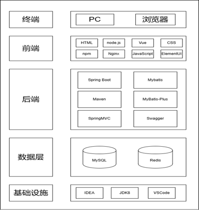

# 第3章 系统设计

## 3.1 总体架构设计

　　系统整体采用前后端分离架构。前端用 Vue 配合 Element UI 搭建业务界面，涵盖生产工单管理、出入库与退货单据录入、调拨操作、标签管理、扫码交互、库存查询和统计展示等页面。后端基于 Spring Boot 和 MyBatis-Plus 处理业务逻辑与数据持久化，库存变动涉及多表写入的场景统一走 Spring 声明式事务来保证数据一致性。数据库选用 MySQL，表结构按基础数据、生产业务、库存业务和系统管理四个域来划分，Redis 用于缓存字典数据和用户会话信息，减轻数据库的重复查询压力。权限采用 RBAC 模型，菜单支持动态配置，登录日志和操作日志由框架统一记录。总体架构如图3-1所示。
图3-1 总体架构图

## 3.2 软件结构设计

　　图3-2给出了系统的功能模块划分。整个系统拆成六个板块，分别是基础数据管理、生产管理、仓储管理、库存管理、调拨管理和统计分析，其中前四个是核心板块，后两个相对独立。下面分别介绍。

　　（1）基础数据管理：负责维护系统运转所依赖的各类主数据，包括物料档案与BOM、工艺路线与工序参数、设备台账与维护周期、质量检验标准、仓库货位配置，以及供应商和客户信息。这些数据是上层业务模块的基础，一旦缺失或不准确，后续的排产、领料、质检都会受到影响。

　　（2）生产管理：覆盖从接单到交付的完整链路。客户订单进来后可以一键生成生产计划，计划确认后自动创建工单。工单开工时系统根据BOM递归展开生成领料出库单，完工时自动写入成品入库单。交付管理跟踪发货进度并回写订单状态。质检任务在入库确认时自动触发，不合格品支持返工、报废和让步接收三种处置方式。质量追溯则基于批次和标签做正反双向查询。

　　（3）仓储管理：处理物料的出入库业务。入库单支持采购入库、生产入库、调拨入库等多种类型，扫码确认后库存自动增加。出库单可以根据物料组智能推荐仓库和货位，扫码确认后库存自动扣减。另外还有出入库退货功能，用于处理已完成出入库的物料退回。

　　（4）库存管理：关注库存数据本身。一方面提供多维度的库存查询和安全库存预警，另一方面支持全盘、循环盘、抽盘等盘点方式，创建盘点单时自动快照当前库存，录入实盘数量后系统计算差异并支持一键调整。

　　（5）调拨管理：用于物料的跨仓库转移。创建调拨单后系统自动生成一张调拨出库单和一张调拨入库单，出库和入库分别确认完成后自动回写调拨进度。

　　（6）统计分析：提供入库统计、出库统计和库存流水统计三个报表，支持按物料、仓库、时间段等维度做数据汇总和导出。

图3-2 功能模块图
## 3.4 类概要设计

图3-3 类概要设计图

　　图3-3展示了系统核心的17个类，按业务层级分成五层。最底层是基础数据层，包含 BaseMat、BaseMatBom、BaseWarehouse、BaseLocation 四个类，提供物料档案、BOM配方、仓库和货位信息。往上一层是生产计划与调度层，StockCustomerOrder、StockProdPlan、StockProdOrder 三个类构成"订单→计划→工单"的驱动链。再往上是生产执行与质量层，StockOutOrder（领料出库）、StockInOrder（完工入库）、QualityTask（质检任务）、QualityDefectHandle（不合格品处理）四个类负责工单开工后的执行和质量管控。交付与标签层包含 StockDeliveryRecord 和 StockMatLabel，前者跟踪订单交付，后者绑定入库物料和货位。最上面是仓储与库存层，StockInfo、StockRecord、StockCheckOrder、StockAllotOrder 四个类分别对应库存快照、变动流水、盘点和调拨。

　　类之间的关联关系比较密。举几个关键的，StockProdOrder 是整个生产线的枢纽，它向上依赖 BaseMat 和 BaseMatBom 来获取产品和配方信息，向下通过开工动作关联 StockOutOrder 生成领料单，通过完工动作关联 StockInOrder 生成入库单。StockInOrder 确认后会触发 QualityTask，质检不合格则进一步创建 QualityDefectHandle 记录。仓储这边，入库确认后 StockInfo 的数量字段被更新，同时生成一条 StockRecord 流水。StockCheckOrder 通过快照 StockInfo 来做盘点差异计算，StockAllotOrder 则自动生成一对出入库单完成跨仓调拨。
## 3.5 数据库概要设计

　　图3-4是系统的E-R图，共涉及17个实体。层级划分和类概要设计保持一致，基础数据层放物料、物料BOM、仓库、货位四个实体，生产计划与调度层放客户订单、生产计划、生产工单，生产执行与质量层放出库单、入库单、质检任务、不合格品处理，交付与标签层放交付记录和物料标签，仓储与库存层放库存信息、库存流水、盘点单、调拨单。

　　实体间的关联关系沿着业务流展开。基础数据层内部，物料BOM通过父子物料编码关联物料实体，一个成品对应多条BOM记录，仓库与货位是一对多的包含关系。生产计划与调度层，客户订单、生产计划、生产工单三者形成一对多的级联驱动，工单同时通过物料编码关联物料和BOM，把产品与配方绑在一起。到了生产执行层，工单向下驱动领料出库单和完工入库单，入库单触发质检任务，质检不合格时再创建不合格品处理记录。交付与标签层中，客户订单关联交付记录，交付记录关联出库单，形成订单到发货的闭环。入库单生成物料标签并绑定货位，标签是后续扫码出入库和质量追溯的数据载体。仓储与库存层中，库存信息关联物料与仓库，每次变动产生一条库存流水。盘点单快照库存数据用于差异调整，调拨单自动生成配套的出库单和入库单来完成跨仓转移。

图3-4 数据库总体E-R图

## 3.6 核心模块详细设计

　　前面几节从整体架构、技术选型、功能模块、类概要和数据库概要五个角度把系统的轮廓画了出来。这一节往下钻，对基础数据管理、生产计划与调度、生产执行与质量、仓储与库存管理四个核心模块逐一展开，每个模块分类设计和数据库设计两部分来写。

### 3.6.1 基础数据管理模块详细设计

**（1）类详细设计**

图3-5 基础数据管理模块类图

　　图3-5是基础数据管理模块的类图，整体仍然是 Controller→Service→Entity 的三层结构，但涉及的业务线有三条，分别是物料管理、仓库管理和质量标准管理。

　　Controller层有三个控制器。BaseMatController 比较特殊，它额外提供了一个 importData 方法，支持通过 Excel 批量导入物料数据，这在初始化阶段或者大批量物料维护时用得比较多。BaseWarehouseController 和 QualityStandardController 则是常规的增删改查接口。

　　Service层对应三个服务接口。值得一提的是 IBaseWarehouseService 中的 getRecommendWarehouseList 方法，它根据物料组返回推荐仓库列表，后续的入库和出库业务都会调用这个方法来做仓库推荐。IBaseMatService 提供 selectBaseMatByMatCode（按编码查物料）和 importMat（批量导入）两个方法。

　　Entity层包含六个实体类。BaseMat 记录物料档案，核心属性有 matCode、matName、safetyStock 等。BaseMatBom 通过 fatherMatCode 和 childMatCode 两个字段关联 BaseMat，表达父子物料的BOM关系，childMatNum 记录子项用量。BaseLocation 通过 warehouseCode 多对一关联 BaseWarehouse，形成仓库到货位的层级。QualityStandard 通过 matCode 依赖 BaseMat，实现按物料定义检验标准，它和 QualityStandardItem 之间是组合关系，一条标准下面挂多个检验项。

**（2）数据库详细设计**

　　基础数据管理模块涉及15张数据表，覆盖物料、仓库货位、设备、工艺路线、质量标准、供应商和客户等主数据。下面选3张有代表性的来说明。

表3-2 base_mat物料信息表

| 字段名 | 数据类型 | 说明 |
|--------|---------|------|
| mat_id | bigint(20) | 主键 |
| mat_code | varchar(64) | 物料编码 |
| mat_name | varchar(128) | 物料描述 |
| fd_code | varchar(64) | 财务编码 |
| fig_num | varchar(64) | 图号 |
| mat_group | varchar(32) | 物料组 |
| mat_class | varchar(32) | 分类 |
| unit_code | varchar(32) | 基本单位 |
| gross_weight | decimal(24,6) | 毛重 |
| safety_stock | decimal(24,6) | 安全库存 |
| max_stock | decimal(24,6) | 库存上限 |
| standard_price | decimal(24,6) | 标准价 |
| del_flag | char(1) | 删除标识 |
| create_by | varchar(64) | 创建人 |
| create_time | datetime | 创建时间 |
| update_by | varchar(64) | 修改人 |
| update_time | datetime | 修改时间 |

表3-3 base_equipment设备台账表

| 字段名 | 数据类型 | 说明 |
|--------|---------|------|
| equipment_id | bigint(20) | 主键 |
| equipment_code | varchar(64) | 设备编码 |
| equipment_name | varchar(128) | 设备名称 |
| equipment_type | varchar(32) | 设备类型 |
| workshop_code | varchar(64) | 所属车间编码 |
| capacity | decimal(24,6) | 日产能 |
| capacity_unit | varchar(32) | 产能单位 |
| equipment_status | char(1) | 状态（0正常 1维护中 2故障 3停用） |
| purchase_date | date | 购置日期 |
| last_maintain_date | date | 上次维护日期 |
| next_maintain_date | date | 下次计划维护日期 |
| maintain_cycle | int(11) | 维护周期（天） |
| del_flag | char(1) | 删除标识 |
| create_by | varchar(64) | 创建人 |
| create_time | datetime | 创建时间 |
| update_by | varchar(64) | 修改人 |
| update_time | datetime | 修改时间 |

表3-4 base_process_route工艺路线表

| 字段名 | 数据类型 | 说明 |
|--------|---------|------|
| route_id | bigint(20) | 主键 |
| route_code | varchar(64) | 工艺路线编码 |
| route_name | varchar(128) | 工艺路线名称 |
| mat_code | varchar(64) | 关联产品物料编码 |
| route_version | varchar(32) | 版本号 |
| route_status | char(1) | 状态（0正常 1停用） |
| del_flag | char(1) | 删除标识 |
| create_by | varchar(64) | 创建人 |
| create_time | datetime | 创建时间 |
| update_by | varchar(64) | 修改人 |
| update_time | datetime | 修改时间 |

　　**base_mat 是物料信息表，存放系统中所有物料的基本档案。mat_code 和 mat_name 是物料编码和描述，fd_code 是财务编码，fig_num 是图号，这四个字段构成物料的基本标识。mat_group 和 mat_class 分别对应物料组和分类，系统通过这两个字段关联物料组表和分类表来做分类管理。unit_code 记录基本单位，gross_weight 记录毛重。由于玻璃生产涉及重量（吨）、面积（平方米）和数量（片）等多种计量维度，系统在物料档案中维护基本单位与业务单位的换算比例（如 1 片 = X 平方米），排产和发料时按此比例自动换算，确保 BOM 展开和仓库发料的单位一致。safety_stock 和 max_stock 两个字段用于库存预警，当某物料的实际库存低于 safety_stock 或超过 max_stock 时，系统的定时任务会自动生成预警通知。standard_price 记录标准价，供成本核算参考。**

　　base_equipment 是设备台账表，用于记录玻璃生产线上窑炉、成型机、退火窑、切割机等各类设备的基本信息。equipment_type 区分设备类型，workshop_code 标记设备所属车间，capacity 和 capacity_unit 记录日产能及其单位（如"吨/天"或"片/天"）。设备维护方面，maintain_cycle 记录维护周期（天），last_maintain_date 和 next_maintain_date 分别记录上次和下次计划维护日期。系统通过定时任务比对这几个字段，到期后自动提醒维护。equipment_status 有四个状态值，分别是0正常、1维护中、2故障、3停用，设备维护记录的新增和完成会联动更新这个字段。

　　base_process_route 是工艺路线表，用来记录产品的标准生产工艺流程。route_code 是工艺路线编码，mat_code 关联到具体的产品物料，一个产品对应一条标准工艺路线。route_version 支持版本管理，默认值为"V1.0"。这张表只是工艺路线的主表，它下面还挂着两级子表，base_process_step（工序表）记录各工序步骤，比如熔制、成型、退火、切割等，base_process_param（工艺参数表）记录每道工序的标准参数，比如温度区间和成型速度。三张表构成路线→工序→参数的级联结构。

### 3.6.2 生产计划与调度模块详细设计

**（1）类详细设计**

图3-6 生产计划与调度模块类图

　　图3-6对应的是生产计划与调度模块，同样是三层架构。这个模块的业务主线很清晰，从客户订单出发，经过生产计划，最终落到生产工单上。

　　Controller层三个控制器各管一段。StockCustomerOrderController 提供 generatePlan 方法，把客户订单一键转成生产计划。StockProdPlanController 提供 generateOrder 方法，把计划再往下推成工单。StockProdOrderController 的接口最多，schedule（排产）、start（开工）、complete（报工完工）、close（关闭）四个方法覆盖了工单从创建到关闭的完整生命周期。

　　Service层的核心是 IStockProdOrderService。这个接口的 start 方法做的事情比较重，调用时会自动递归展开BOM，根据物料组匹配推荐仓库和货位，然后生成领料出库单。complete 方法也类似，报工完工时自动生成成品入库单。generateWorkNo 方法负责生成工令号，格式为前缀加日期加流水号。IStockCustomerOrderService 和 IStockProdPlanService 相对简单，主要处理增删改查和级联生成逻辑。

　　Entity层有四个实体类。StockCustomerOrder 记录客户订单头信息，orderNo、customerCode、deliveryDate、orderStatus 是核心字段，它和 StockCustomerOrderDetail（订单明细）是一对多的组合关系，明细里记录每个产品的 matCode、quantity 和 deliveredQty（已交付数量）。StockProdPlan 通过 customerOrderNo 多对一关联客户订单，planQuantity 记录计划数量，completionRate 记录完成率。StockProdOrder 是这条链路的末端，通过 planNo 多对一关联生产计划，orderNo、workNo、matCode、quantity、actualQuantity、orderStatus 等字段记录工单的核心信息。三个实体串起来就是"订单→计划→工单"的驱动链。

**（2）数据库详细设计**

　　该模块涉及客户订单表、订单明细表、生产计划表和生产工单表，下面选3张来说明。

表3-5 stock_customer_order客户订单表

| 字段名 | 数据类型 | 说明 |
|--------|---------|------|
| order_id | bigint(20) | 主键 |
| order_no | varchar(64) | 客户订单号 |
| customer_code | varchar(64) | 客户编码 |
| customer_name | varchar(128) | 客户名称 |
| order_date | date | 下单日期 |
| delivery_date | date | 要求交付日期 |
| order_status | varchar(32) | 状态 |
| total_amount | decimal(24,6) | 订单总金额 |
| del_flag | char(1) | 删除标识 |
| create_by | varchar(64) | 创建人 |
| create_time | datetime | 创建时间 |
| update_by | varchar(64) | 修改人 |
| update_time | datetime | 修改时间 |

表3-6 stock_prod_plan生产计划表

| 字段名 | 数据类型 | 说明 |
|--------|---------|------|
| plan_id | bigint(20) | 主键 |
| plan_no | varchar(64) | 计划编号 |
| plan_name | varchar(128) | 计划名称 |
| plan_type | varchar(32) | 计划类型（monthly/weekly） |
| plan_start_date | date | 计划开始日期 |
| plan_end_date | date | 计划结束日期 |
| mat_code | varchar(64) | 产品物料编码 |
| mat_name | varchar(128) | 产品名称 |
| plan_quantity | decimal(24,6) | 计划生产数量 |
| actual_quantity | decimal(24,6) | 实际完成数量 |
| customer_order_no | varchar(64) | 关联客户订单号 |
| workshop_code | varchar(64) | 生产车间编码 |
| plan_status | varchar(32) | 状态（draft/confirmed/executing/completed） |
| completion_rate | decimal(5,2) | 完成率 |
| del_flag | char(1) | 删除标识 |
| create_by | varchar(64) | 创建人 |
| create_time | datetime | 创建时间 |
| update_by | varchar(64) | 修改人 |
| update_time | datetime | 修改时间 |

表3-7 stock_prod_order生产工单表

| 字段名 | 数据类型 | 说明 |
|--------|---------|------|
| order_id | bigint(20) | 主键 |
| order_no | varchar(64) | 单据号 |
| work_no | varchar(64) | 工令号 |
| mat_code | varchar(64) | 物料编码 |
| mat_name | varchar(128) | 物料名称 |
| workshop_code | varchar(64) | 车间编码 |
| route_code | varchar(64) | 工艺路线编码 |
| equipment_code | varchar(64) | 设备编码 |
| station_code | varchar(64) | 工位编码 |
| quantity | decimal(24,6) | 计划数量 |
| actual_quantity | decimal(24,6) | 实际完成数量 |
| priority | tinyint | 优先级（0普通 1紧急 2特急） |
| plan_start_date | datetime | 计划开始时间 |
| plan_end_date | datetime | 计划完成时间 |
| actual_start_date | datetime | 实际开始时间 |
| actual_end_date | datetime | 实际完成时间 |
| customer_order_no | varchar(64) | 关联客户订单号 |
| plan_no | varchar(64) | 关联生产计划编号 |
| order_status | varchar(32) | 状态（planned/ongoing/completed/closed） |
| del_flag | char(1) | 删除标识 |
| create_by | varchar(64) | 创建人 |
| create_time | datetime | 创建时间 |
| update_by | varchar(64) | 修改人 |
| update_time | datetime | 修改时间 |

　　stock_customer_order 是客户订单表。order_no 是订单号，customer_code 和 customer_name 记录客户信息，order_date 是下单日期，delivery_date 是要求交付日期。order_status 的取值有 created（已创建）、confirmed（已确认）、producing（生产中）、completed（已完成）、delivered（已交付）、closed（已关闭）六种，覆盖了订单从接入到结束的全部状态。total_amount 记录订单总金额。系统支持从订单一键生成生产计划，生成后会在订单明细表的 prod_order_no 字段回写关联的工单号，方便追踪。

　　stock_prod_plan 是生产计划表，记录月度或周度的生产安排。plan_type 区分计划类型，mat_code 关联产品物料，plan_quantity 是计划数量，actual_quantity 是实际完成数量，completion_rate 自动计算完成百分比。customer_order_no 字段把计划和客户订单关联起来，workshop_code 指定生产车间。plan_status 有 draft（草稿）、confirmed（已确认）、executing（执行中）、completed（已完成）、cancelled（已取消）五种状态。系统在确认计划并生成工单之前，会递归展开BOM检查物料库存是否够用，不够的话会给出预警。

　　stock_prod_order 是生产工单表，也是整个生产管理的核心驱动表。除了基本的 order_no（单据号）和 mat_code（物料编码）外，work_no 是工令号，用于现场标识。route_code 关联工艺路线，equipment_code 和 station_code 分别记录设备和工位。priority 区分优先级（0普通、1紧急、2特急），plan_start_date 和 plan_end_date 记录计划时间，actual_start_date 和 actual_end_date 记录实际时间。order_status 的状态流转是 planned→ongoing→completed→closed。开工时系统自动递归展开BOM（碰到虚拟件会跳过，继续展开其子项），根据物料组匹配推荐仓库和货位，生成领料出库单。完工时自动生成成品入库单并更新库存。customer_order_no 和 plan_no 两个字段把工单和上游的订单、计划串在一起。

### 3.6.3 生产执行与质量模块详细设计

**（1）类详细设计**

图3-7 生产执行与质量模块类图

　　图3-7是生产执行与质量模块的类图，这个模块的业务线有两条，一条是领料出库，一条是质量检验。完工入库（StockInOrder）虽然在业务流上紧接工单完工，但它的入库确认逻辑和库存更新与仓储模块耦合更紧，因此放在 3.6.4 一并设计。

　　Controller层有三个控制器。StockOutOrderController 提供 matBomList 和 submitStockOut 两个方法，前者查询出库单关联的BOM物料清单，后者提交出库确认，支持扫码操作。QualityTaskController 和 QualityDefectHandleController 分别处理质检任务和不合格品的增删改查。

　　Service层同样三个接口。IStockOutOrderService 的 submitStockOut 方法是出库的核心逻辑，确认出库时会自动扣减 stock_info 表的库存数量，同时往 stock_record 表写一条出库流水。IQualityTaskService 和 IQualityDefectHandleService 处理质检和不合格品业务。

　　Entity层有四个实体类。StockOutOrder 记录出库单头信息，orderNo 是出库单号，orderType 区分出库类型（生产领料、销售出库、调拨出库等），prodOrderNo 关联生产工单。它和 StockOutDetail（出库明细）是一对多的组合关系，明细里记录具体的 matCode、quantity 和 locationCode。QualityTask 记录质检任务，taskNo 是任务编号，checkType 区分检验类型，sourceNo 关联来源单据。质检不合格时，系统会创建 QualityDefectHandle 记录，通过 taskNo 关联质检任务，handleType 记录处理方式（返工、报废或让步接收），handleQty 记录处理数量。

**（2）数据库详细设计**

　　该模块涉及出库单表、出库明细表、质检任务表、检验结果表和不合格品处理表。入库单的详细设计放在 3.6.4 仓储与库存管理模块中一并说明。下面选质检相关的3张表来展开。

表3-8 quality_task检验任务表

| 字段名 | 数据类型 | 说明 |
|--------|---------|------|
| task_id | bigint(20) | 主键 |
| task_no | varchar(64) | 检验任务编号 |
| check_type | varchar(32) | 检验类型（incoming/process/final） |
| source_type | varchar(32) | 来源类型（in_order/prod_order） |
| source_no | varchar(64) | 来源单号 |
| mat_code | varchar(64) | 物料编码 |
| mat_name | varchar(128) | 物料名称 |
| batch | varchar(128) | 批次 |
| quantity | decimal(24,6) | 送检数量 |
| standard_code | varchar(64) | 检验标准编码 |
| standard_name | varchar(128) | 检验标准名称 |
| inspector_id | bigint(20) | 质检员ID |
| inspector_name | varchar(64) | 质检员姓名 |
| task_status | varchar(32) | 状态（pending/checking/passed/failed） |
| qualified_qty | decimal(24,6) | 合格数量 |
| unqualified_qty | decimal(24,6) | 不合格数量 |
| check_time | datetime | 检验完成时间 |
| del_flag | char(1) | 删除标识 |
| create_by | varchar(64) | 创建人 |
| create_time | datetime | 创建时间 |
| update_by | varchar(64) | 修改人 |
| update_time | datetime | 修改时间 |

表3-9 quality_task_result检验结果明细表

| 字段名 | 数据类型 | 说明 |
|--------|---------|------|
| result_id | bigint(20) | 主键 |
| task_no | varchar(64) | 所属任务编号 |
| item_no | int(11) | 检验项序号 |
| item_name | varchar(128) | 检验项名称 |
| standard_value | varchar(64) | 标准值 |
| actual_value | varchar(64) | 实测值 |
| min_value | decimal(24,6) | 下限 |
| max_value | decimal(24,6) | 上限 |
| judge_result | char(1) | 判定（0合格 1不合格） |
| defect_type | varchar(64) | 缺陷类型 |
| defect_level | varchar(32) | 缺陷等级（minor/major/critical） |
| del_flag | char(1) | 删除标识 |
| create_by | varchar(64) | 创建人 |
| create_time | datetime | 创建时间 |

表3-10 quality_defect_handle不合格品处理表

| 字段名 | 数据类型 | 说明 |
|--------|---------|------|
| handle_id | bigint(20) | 主键 |
| task_no | varchar(64) | 关联检验任务编号 |
| handle_type | varchar(32) | 处理方式（rework/scrap/concession） |
| handle_qty | decimal(24,6) | 处理数量 |
| handle_desc | varchar(512) | 处理说明 |
| handle_by | varchar(64) | 处理人 |
| handle_date | date | 处理日期 |
| handle_status | varchar(32) | 状态（pending/processing/completed） |
| del_flag | char(1) | 删除标识 |
| create_by | varchar(64) | 创建人 |
| create_time | datetime | 创建时间 |
| update_by | varchar(64) | 修改人 |
| update_time | datetime | 修改时间 |

　　quality_task 是检验任务表。task_no 是任务编号，自动生成，格式为 QT 加日期加流水号。check_type 区分检验类型，其中 incoming 是来料检验，process 是过程检验，final 是成品检验。source_type 和 source_no 两个字段记录任务来源，比如 source_type 为 in_order 时，source_no 就是入库单号。standard_code 关联检验标准表，系统据此自动拉取检验项。inspector_id 和 inspector_name 记录分配的质检员。task_status 有四个值，分别是 pending（待检验）、checking（检验中）、passed（合格）、failed（不合格）。检验完成后，qualified_qty 和 unqualified_qty 分别记录合格和不合格数量，check_time 记录检验完成时间。

　　quality_task_result 是检验结果明细表，和 quality_task 通过 task_no 关联。每条记录对应一个检验项，item_no 是序号，item_name 是检验项名称（比如透光率、平整度、厚度偏差等）。standard_value 记录标准值，actual_value 记录实测值，min_value 和 max_value 界定合格范围。judge_result 字段记录判定结果，0表示合格，1表示不合格。对于数值型检验项，系统自动拿 actual_value 和上下限比对来判定，不需要人工操作。defect_type 和 defect_level 在不合格时记录缺陷类型（气泡、划痕、尺寸偏差等）和缺陷等级（minor 轻微、major 严重、critical 致命）。

　　quality_defect_handle 是不合格品处理表，通过 task_no 关联检验任务。handle_type 有三种取值，分别是 rework（返工）、scrap（报废）、concession（让步接收）。handle_qty 记录处理数量，handle_desc 记录处理说明，handle_by 和 handle_date 记录处理人和处理日期。handle_status 有 pending（待处理）、processing（处理中）、completed（已完成）三种状态，支持处理过程的跟踪。

### 3.6.4 仓储与库存管理模块详细设计

**（1）类详细设计**

图3-8 仓储与库存管理模块类图

　　图3-8对应仓储与库存管理模块，业务线有四条，分别是入库确认、库存管理、库存盘点和调拨管理。这个模块的类数量在四个核心模块中是最多的。

　　Controller层四个控制器。StockInOrderController 提供 check（入库检验确认）和 submitStockIn（提交入库确认）两个方法，分别对应检验环节和最终入库环节。StockAllotOrderController 提供 submitAllotOut 和 submitAllotIn 两个方法，调拨业务的出库和入库是分步确认的，不是一次性完成。StockInfoController 和 StockCheckOrderController 处理库存查询和盘点业务。

　　Service层四个接口。IStockInOrderService 有两个关键方法，inOrderCheck 负责入库检验确认，submitStockIn 负责最终入库确认。submitStockIn 调用时会自动更新 stock_info 的库存数量，同时生成一条 stock_record 流水，整个过程在一个事务里完成。IStockInfoService 提供 selectRecommendLocation 方法，根据仓库编码和物料组推荐货位，入库时会调用它来做智能分配。IStockCheckOrderService 和 IStockAllotOrderService 分别处理盘点和调拨逻辑。

　　 
**（2）数据库详细设计**

　　仓储与库存管理模块涉及入库单、出库单、库存信息、库存流水、盘点单、调拨单及其各自的明细表，是四个模块中表数量最多的。下面选3张来说明。

表3-11 stock_info库存信息表

| 字段名 | 数据类型 | 说明 |
|--------|---------|------|
| info_id | bigint(20) | 主键 |
| warehouse_code | varchar(64) | 仓库编码 |
| location_code | varchar(64) | 货位编码 |
| mat_code | varchar(64) | 物料编码 |
| mat_name | varchar(128) | 物料名称 |
| fd_code | varchar(64) | 财务编码 |
| fig_num | varchar(64) | 图号 |
| mat_group | varchar(64) | 物料组 |
| mat_class | varchar(64) | 物料分类 |
| unit_code | varchar(32) | 单位 |
| batch | varchar(128) | 批次 |
| quantity | decimal(24,6) | 数量 |
| supplier_code | varchar(64) | 供应商编码 |
| supplier_name | varchar(128) | 供应商名称 |
| create_by | varchar(64) | 创建人 |
| create_time | datetime | 创建时间 |
| update_by | varchar(64) | 修改人 |
| update_time | datetime | 修改时间 |

表3-12 stock_record库存流水表

| 字段名 | 数据类型 | 说明 |
|--------|---------|------|
| record_id | bigint(20) | 主键 |
| warehouse_code | varchar(64) | 仓库编码 |
| location_code | varchar(64) | 货位编码 |
| label_id | bigint(20) | 物料标签ID |
| record_type | varchar(32) | 流水类型 |
| mat_code | varchar(64) | 物料编码 |
| mat_name | varchar(128) | 物料名称 |
| fd_code | varchar(64) | 财务编码 |
| fig_num | varchar(64) | 图号 |
| mat_group | varchar(64) | 物料组 |
| mat_class | varchar(64) | 物料分类 |
| unit_code | varchar(32) | 单位 |
| batch | varchar(128) | 批次 |
| quantity | decimal(24,6) | 数量 |
| order_no | varchar(64) | 单据号 |
| workshop_code | varchar(64) | 车间编码 |
| supplier_code | varchar(64) | 供应商编码 |
| supplier_name | varchar(128) | 供应商名称 |
| del_flag | char(1) | 删除标识 |
| create_by | varchar(64) | 创建人 |
| create_time | datetime | 创建时间 |
| update_by | varchar(64) | 修改人 |
| update_time | datetime | 修改时间 |

表3-13 stock_check_order盘点单表

| 字段名 | 数据类型 | 说明 |
|--------|---------|------|
| check_id | bigint(20) | 主键 |
| check_no | varchar(64) | 盘点单号 |
| check_type | varchar(32) | 盘点类型（full/cycle/spot） |
| warehouse_code | varchar(64) | 盘点仓库编码 |
| warehouse_name | varchar(128) | 仓库名称 |
| check_status | varchar(32) | 状态（created/counting/completed/adjusted） |
| plan_date | date | 计划盘点日期 |
| actual_date | date | 实际盘点日期 |
| checker_id | bigint(20) | 盘点人ID |
| checker_name | varchar(64) | 盘点人 |
| total_items | int(11) | 盘点物料总数 |
| diff_items | int(11) | 差异物料数 |
| del_flag | char(1) | 删除标识 |
| create_by | varchar(64) | 创建人 |
| create_time | datetime | 创建时间 |
| update_by | varchar(64) | 修改人 |
| update_time | datetime | 修改时间 |

　　stock_info 是库存信息表，粒度到仓库+货位+物料+批次。warehouse_code、location_code、mat_code、batch 四个字段联合定位一条库存记录，quantity 记录当前数量。其中 batch 在生产入库时由系统按"工单号+生产日期"规则自动生成（如 PO20250410-0414），采购入库时则取供应商送货批次，以便后续通过质检任务做批次级质量追溯。这张表不存安全库存和库存上限（这两个值存在 base_mat 表上），但库存预警功能会拿 stock_info 的 quantity 和 base_mat 的 safety_stock、max_stock 做比对，低于下限或超过上限时通过定时任务自动发出通知。supplier_code 和 supplier_name 记录供应商信息，主要用于采购入库场景下的供应商追溯。每次入库、出库、调拨、盘点操作都会更新这张表的 quantity 字段。

　　stock_record 是库存流水表，每一笔库存变动都会留下一条记录。record_type 区分流水类型，取值包括采购入库、生产入库、调拨入库、生产出库、销售出库、调拨出库、盘盈、盘亏等。order_no 记录关联的业务单据号，方便从流水反查到具体是哪张入库单或出库单引起的变动。label_id 关联物料标签，支持通过标签做扫码追溯。这张表的字段和 stock_info 有不少重复（mat_code、mat_name、fd_code、fig_num、batch 等），这是有意为之的冗余设计，目的是让流水记录自包含，查询时不需要再关联 stock_info 和 base_mat。

　　stock_check_order 是盘点单表。check_type 区分盘点方式，full 是全盘（清点仓库所有物料），cycle 是循环盘（按物料分类轮流盘），spot 是抽盘（随机抽取部分物料）。check_status 有四个状态，分别是 created（已创建）、counting（盘点中）、completed（已完成）、adjusted（已调整）。创建盘点单时，系统自动从 stock_info 表快照当前仓库的库存数据，生成盘点明细。仓管员录入实盘数量后，系统用"实盘数量减去系统数量"算出差异，total_items 和 diff_items 两个字段分别记录盘点物料总数和存在差异的物料数。确认调整时，盘盈的自动生成一条入库流水，盘亏的自动生成一条出库流水，同时更新 stock_info 表的 quantity。

## 3.7 本章小结

　　本章将第二章的业务需求落到了具体的技术方案上。先从总体架构和功能模块两个角度画出系统轮廓，再通过类概要设计和E-R图梳理出17个核心类及其关联关系，最后对四个核心模块逐一展开类图和数据库表结构。其中几个关键的联动机制值得强调：工单开工时BOM递归展开自动生成领料单、入库确认时库存更新和流水生成捆绑在同一个事务里、盘点差异的自动计算和调整。下一章将基于这些设计，展示各模块的具体实现过程和运行效果。