# 第6章 系统测试

本章针对基础数据管理、生产计划与工单管理、生产执行与质量管理、仓储库存管理四个模块进行功能测试。测试按照实际业务流程设计用例，模拟用户操作场景，将运行结果与预期效果逐项比对。

## 6.1 基础数据管理模块测试

基础数据管理模块包括物料信息管理、物料BOM管理和工艺路线管理，是其他业务模块运行的前提。

### 6.1.1 物料信息管理功能测试

管理员进入物料管理页面后，可以新增物料，填写编码、名称、规格型号、计量单位、分类、安全库存等字段，提交后系统保存数据并刷新列表。

| 操作步骤 | 操作描述 | 预期现象 | 测试结果 | 是否通过 |
|---------|---------|---------|---------|---------|
| 1 | 管理员点击基础数据-物料管理，点击新增物料按钮 | 弹出物料信息表单对话框 | 与预期一致 | 通过 |
| 2 | 填写物料信息并点击确认： 物料编码：MAT20240101 物料名称：304不锈钢板 规格型号：1000×2000×3mm 计量单位：张 物料分类：原材料-金属材料 安全库存：100 | 系统提示"新增成功"，物料列表刷新并显示新增记录 | 与预期一致 | 通过 |
| 3 | 在列表中查看新增物料 | 物料信息显示完整，包括编码、名称、规格型号、单位、分类等 | 与预期一致 | 通过 |

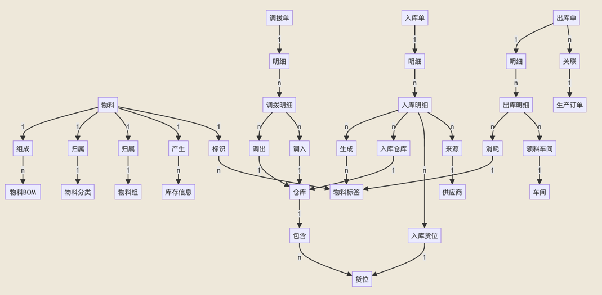
**【图6-1 物料管理列表页面】**
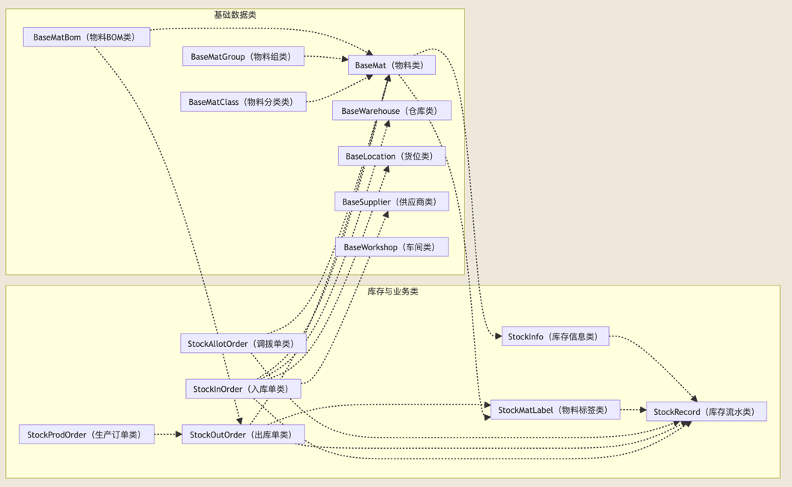
**【图6-2 新增物料信息表单】**

**【图6-3 物料新增成功并显示】**

### 6.1.2 物料BOM管理功能测试

BOM管理页面以父物料为维度展示其子物料组成。新增BOM关系时需要选择子物料并填写用量，系统会检查循环依赖和重复关系，校验通过后保存。

| 操作步骤 | 操作描述 | 预期现象 | 测试结果 | 是否通过 |
|---------|---------|---------|---------|---------|
| 1 | 管理员点击基础数据-物料BOM管理，选择父物料"装配件A" | 系统显示该父物料的BOM列表 | 与预期一致 | 通过 |
| 2 | 点击新增BOM按钮，填写BOM信息并确认： 子物料：MAT20240101（304不锈钢板） 用量：2.5 | 系统执行循环依赖和重复关系检查，验证通过后提示"新增成功"，BOM列表刷新 | 与预期一致 | 通过 |
| 3 | 尝试再次添加相同的子物料 | 系统提示"该BOM关系已存在，请勿重复添加" | 与预期一致 | 通过 |

**【图6-4 物料BOM管理页面】**
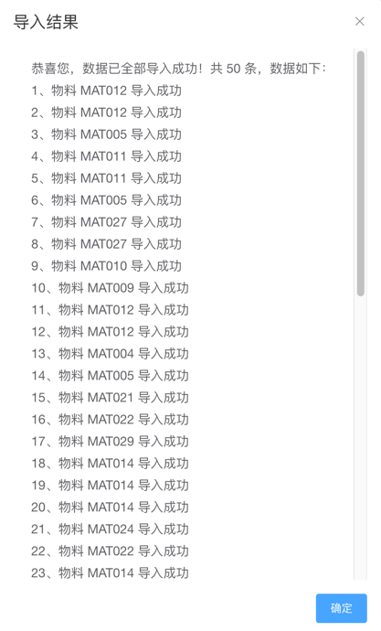
**【图6-5 导入BOM并成功】**
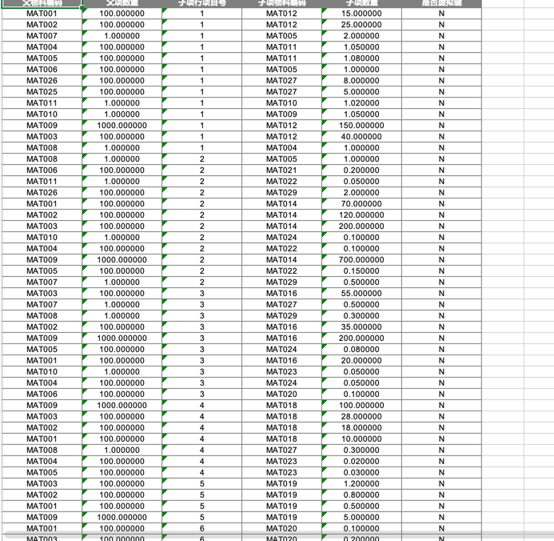
**【图6-6 导出BOM】**

### 6.1.3 工艺路线管理功能测试

工艺路线定义了产品的加工工序流程，每道工序包含编码、名称、类型、标准工时等信息，同时可以配置对应的工艺参数。

| 操作步骤 | 操作描述 | 预期现象 | 测试结果 | 是否通过 |
|---------|---------|---------|---------|---------|
| 1 | 管理员点击基础数据-工艺路线管理，点击新增按钮 | 弹出工艺路线表单对话框 | 与预期一致 | 通过 |
| 2 | 填写工艺路线信息并点击确认： 路线编码：PR001 路线名称：不锈钢板加工路线 关联物料：装配件A 版本号：V1.0 | 系统提示"新增成功"，工艺路线列表刷新 | 与预期一致 | 通过 |
| 3 | 点击工序管理，为该路线添加工序： 工序1：熔制（标准工时2h） 工序2：成型（标准工时1.5h） 工序3：退火（标准工时3h） | 工序列表按序号排列显示，各工序信息完整 | 与预期一致 | 通过 |

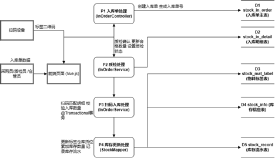
**【图6-7 工艺路线管理页面】**
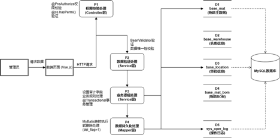
**【图6-8 工序管理页面】**

## 6.2 生产计划与工单管理模块测试

该模块覆盖客户订单、生产计划和生产工单三个环节，订单确认后可生成计划或直接拆分为工单。

### 6.2.1 客户订单管理功能测试

客户订单页面用于录入客户信息、下单日期、交付日期和订单明细。订单确认后可以一键生成生产工单。

| 操作步骤 | 操作描述 | 预期现象 | 测试结果 | 是否通过 |
|---------|---------|---------|---------|---------|
| 1 | 生产主管点击订单管理-客户订单，点击新增按钮 | 弹出客户订单表单对话框 | 与预期一致 | 通过 |
| 2 | 填写订单信息并点击确认： 客户：北京制造公司 下单日期：2024-03-01 交付日期：2024-03-31 订单明细：装配件A×100件 | 系统提示"保存成功"，订单状态为"已创建"，订单金额自动计算 | 与预期一致 | 通过 |
| 3 | 点击确认订单按钮 | 系统提示"确认成功"，订单状态变更为"已确认"，编辑按钮不可用 | 与预期一致 | 通过 |
| 4 | 点击生成工单按钮 | 系统自动生成对应的生产工单，订单状态变更为"生产中" | 与预期一致 | 通过 |

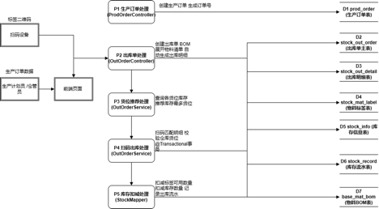
**【图6-9 客户订单列表页面】**
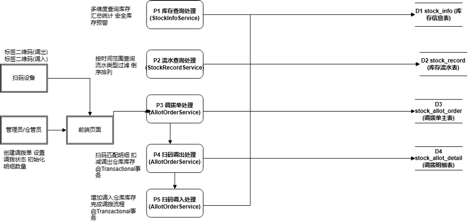
**【图6-10 新增客户订单表单】**

**【图6-11 订单确认并生成工单】**

### 6.2.2 生产计划管理功能测试

生产计划页面支持设置计划类型、关联产品物料、计划数量和时间范围，确认后可一键生成工单，列表实时显示完成率。

| 操作步骤 | 操作描述 | 预期现象 | 测试结果 | 是否通过 |
|---------|---------|---------|---------|---------|
| 1 | 生产主管点击生产管理-生产计划，点击新增按钮 | 弹出生产计划表单对话框 | 与预期一致 | 通过 |
| 2 | 填写计划信息并点击确认： 计划名称：3月装配件生产计划 计划类型：月度计划 产品物料：装配件A 计划数量：500 车间：一车间 计划时间：2024-03-01至2024-03-31 | 系统提示"保存成功"，计划状态为"草稿" | 与预期一致 | 通过 |
| 3 | 点击确认按钮 | 系统提示"确认成功"，计划状态变更为"已确认" | 与预期一致 | 通过 |
| 4 | 点击生成工单按钮 | 系统自动生成生产工单，计划状态变更为"执行中"，列表显示关联工单统计 | 与预期一致 | 通过 |

**【图6-12 生产计划列表页面】**

**【图6-13 新增生产计划表单】**

**【图6-14 生产计划生成工单】**

### 6.2.3 生产工单管理功能测试

工单经历排产、开工、报工、完工几个阶段。开工时系统根据BOM展开自动生成领料出库单，报工时自动生成成品入库单。

| 操作步骤 | 操作描述 | 预期现象 | 测试结果 | 是否通过 |
|---------|---------|---------|---------|---------|
| 1 | 生产主管进入生产管理-生产工单，查看由计划自动生成的工单 | 工单列表显示新工单，状态为"待排产"，关联客户订单号 | 与预期一致 | 通过 |
| 2 | 点击排产按钮，设置： 优先级：紧急 计划开始时间：2024-03-05 计划完成时间：2024-03-15 | 系统提示"排产成功"，优先级标签显示为橙色"紧急" | 与预期一致 | 通过 |
| 3 | 点击开工按钮 | 系统提示"开工成功"，工单状态变更为"生产中"，**自动根据BOM展开生成领料出库单** | 与预期一致 | 通过 |
| 4 | 点击报工按钮，填写实际完成数量：100 | 系统提示"报工成功"，工单状态变更为"已完工"，**自动生成成品入库单** | 与预期一致 | 通过 |
| 5 | 点击详情查看关联单据 | 详情页展示关联的领料出库单和成品入库单信息 | 与预期一致 | 通过 |

**【图6-15 生产工单列表页面】**

**【图6-16 工单排产设置】**

**【图6-17 工单开工自动生成领料出库单】**

**【图6-18 工单报工并生成成品入库单】**

## 6.3 生产执行与质量管理模块测试

该模块处理领料出库、质检任务、不合格品处理和质量追溯，覆盖从物料发放到成品质量管控的全过程。

### 6.3.1 领料出库功能测试

工单开工后自动生成的领料出库单会列出BOM展开后的物料需求和推荐货位，仓管员据此发料。

| 操作步骤 | 操作描述 | 预期现象 | 测试结果 | 是否通过 |
|---------|---------|---------|---------|---------|
| 1 | 仓管员点击生产管理-领料出库，查看待出库的领料单 | 列表显示由工单开工自动生成的领料出库单，状态为"已创建" | 与预期一致 | 通过 |
| 2 | 点击详情查看领料明细 | 系统显示根据BOM自动展开的物料需求明细，包含物料编码、名称、需求数量、推荐货位 | 与预期一致 | 通过 |
| 3 | 确认出库 | 系统提示"出库成功"，出库单状态变更为"已领料"，库存数量相应扣减 | 与预期一致 | 通过 |

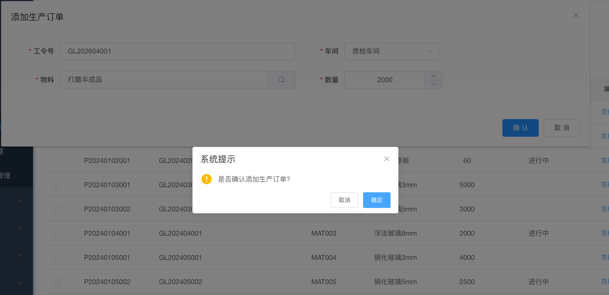
**【图6-19 领料出库列表页面】**
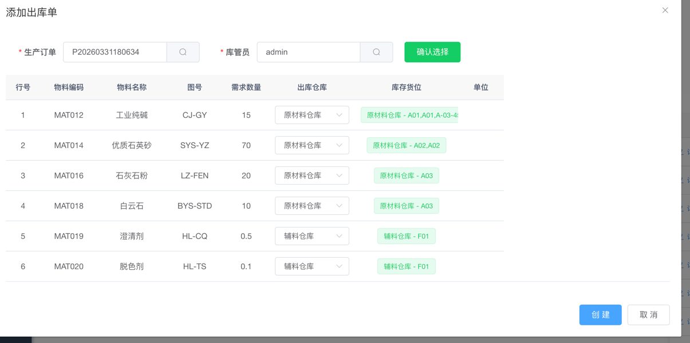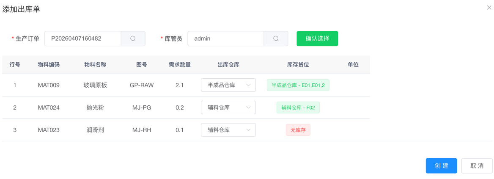
**【图6-20 BOM自动展开领料明细】**
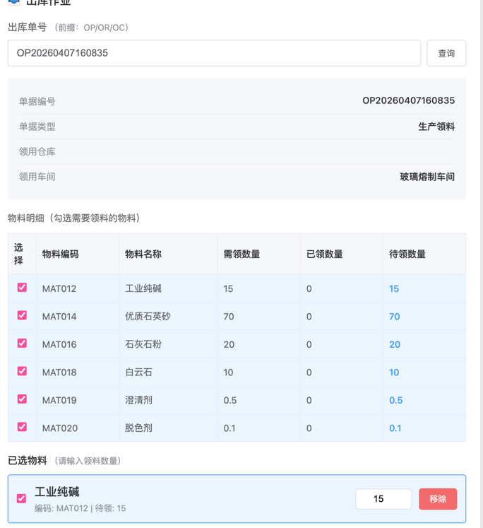
**【图6-21 确认出库成功】**

### 6.3.2 质检任务功能测试

质检员对入库物料或生产成品进行检验，录入各检验项的实测值后，系统按检验标准自动判定合格与否，并记录缺陷类型和等级。

| 操作步骤 | 操作描述 | 预期现象 | 测试结果 | 是否通过 |
|---------|---------|---------|---------|---------|
| 1 | 质检员点击质量管理-质检任务，查看待检验任务 | 列表显示由工单报工触发的质检任务，检验类型为"成品检验"，状态为"待检验" | 与预期一致 | 通过 |
| 2 | 点击检验按钮，录入各检验项实测值： 尺寸精度：实测1002mm（标准1000±5mm） 表面粗糙度：实测0.8μm（标准≤1.6μm） | 检验项自动判定为"合格"，判定标签显示绿色 | 与预期一致 | 通过 |
| 3 | 点击自动计算按钮，确认提交 | 系统根据实测值自动计算合格/不合格数量，任务状态变更为"合格" | 与预期一致 | 通过 |

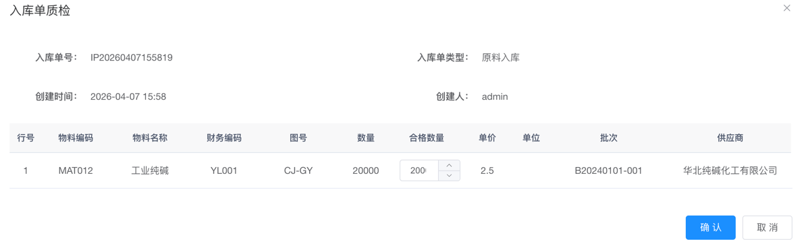
**【图6-22 质检任务列表页面】**

**【图6-23 录入检验结果并自动判定】**

### 6.3.3 不合格品处理功能测试

质检判定为不合格后，质检员在不合格品处理页面选择返工、报废或让步接收等处理方式。

| 操作步骤 | 操作描述 | 预期现象 | 测试结果 | 是否通过 |
|---------|---------|---------|---------|---------|
| 1 | 质检员点击质量管理-不合格品处理，点击新增 | 弹出不合格品处理表单，检验任务下拉仅显示"不合格"的任务 | 与预期一致 | 通过 |
| 2 | 选择不合格的检验任务，选择处理方式为"返工"，填写处理说明 | 系统自动填充物料信息和不合格数量，提示"保存成功" | 与预期一致 | 通过 |

**【图6-24 不合格品处理页面】**

**【图6-25 选择处理方式】**

### 6.3.4 质量追溯功能测试

质量追溯页面支持按工单号、入库单号、出库单号或批次号查询，以流程图展示从供应商到成品入库的追溯链路。

| 操作步骤 | 操作描述 | 预期现象 | 测试结果 | 是否通过 |
|---------|---------|---------|---------|---------|
| 1 | 质检员点击质量管理-质量追溯，输入生产工单号进行查询 | 系统展示完整追溯链路流程图：供应商→物料批次→领料出库→生产工单→质检→完工入库 | 与预期一致 | 通过 |
| 2 | 查看追溯详情和质量统计 | 系统展示质检结果详情、领料出库明细、各类检验合格率图表及缺陷等级分布 | 与预期一致 | 通过 |

**【图6-26 质量追溯链路图】**

**【图6-27 质量统计图表】**

## 6.4 仓储与库存管理模块测试

该模块负责库存信息查询、库存调拨和库存盘点，为生产过程提供物料保障。

### 6.4.1 库存信息查询功能测试

库存信息页面支持按物料编码、名称、仓库、货位等条件筛选，实时显示各物料的在库数量和所在货位。

| 操作步骤 | 操作描述 | 预期现象 | 测试结果 | 是否通过 |
|---------|---------|---------|---------|---------|
| 1 | 仓库管理员点击库存管理-库存信息，输入查询条件：物料编码MAT20240101 | 系统筛选显示该物料的库存记录，包含编码、名称、规格型号、仓库、货位、数量等信息 | 与预期一致 | 通过 |
| 2 | 按仓库筛选：仓库WH001 | 系统显示该仓库下所有物料的库存记录 | 与预期一致 | 通过 |
| 3 | 点击导出按钮 | 系统生成Excel文件并下载 | 与预期一致 | 通过 |
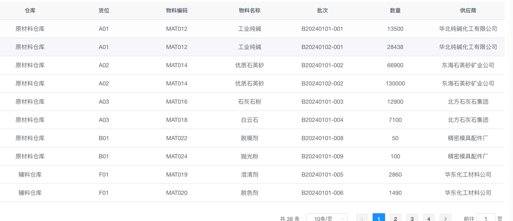
**【图6-28 库存信息查询页面】**
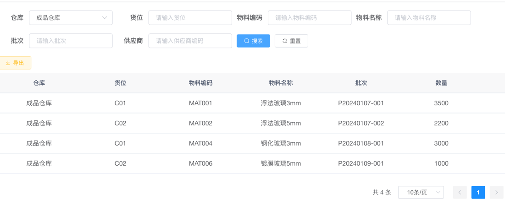
**【图6-29 按仓库筛选库存】**

### 6.4.2 库存调拨功能测试

调拨功能用于在不同仓库货位之间转移物料，确认调拨后系统自动更新两端库存，源货位库存不足时拦截操作。

| 操作步骤 | 操作描述 | 预期现象 | 测试结果 | 是否通过 |
|---------|---------|---------|---------|---------|
| 1 | 仓库管理员点击调拨管理-库存调拨，新增调拨单并填写： 调拨物料：MAT20240101 调拨数量：30 源仓库：WH001-A01-001 目标仓库：WH002-B01-001 | 系统检查源货位库存充足，提示"保存成功" | 与预期一致 | 通过 |
| 2 | 点击确认调拨按钮 | 系统提示"调拨成功"，源货位库存扣减30张，目标货位库存增加30张 | 与预期一致 | 通过 |
| 3 | 创建调拨单，调拨数量大于源货位库存 | 系统提示"源货位库存不足"，禁止调拨操作 | 与预期一致 | 通过 |
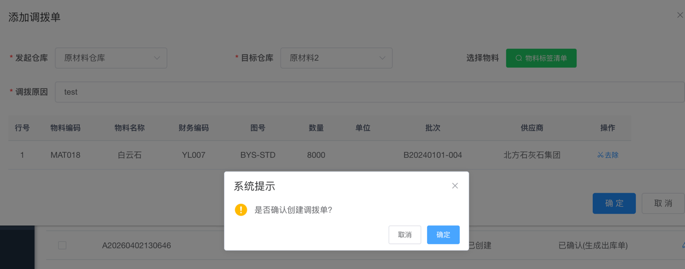
**【图6-30 新增库存调拨单】**
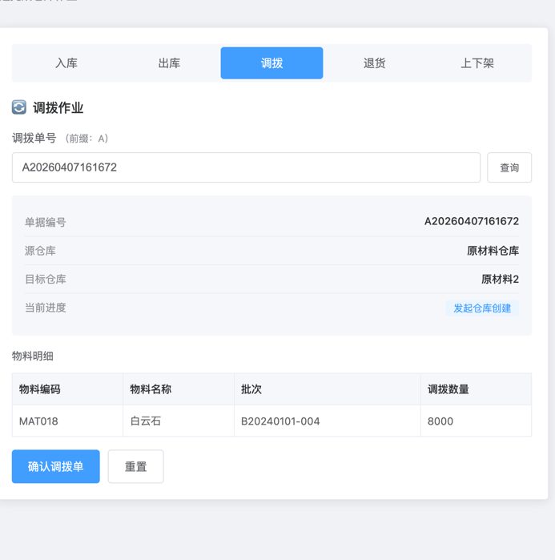
**【图6-31 确认调拨成功】**
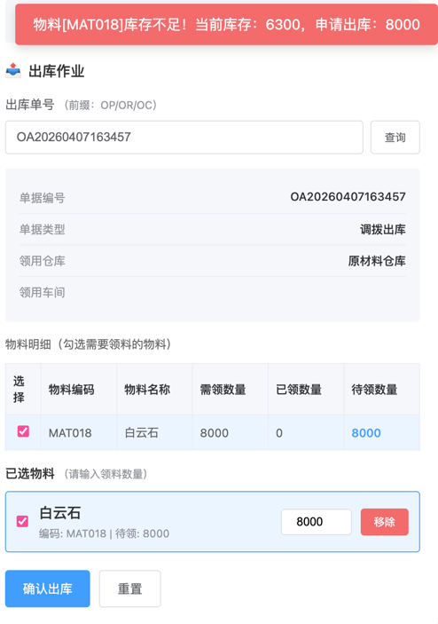
**【图6-32 库存不足调拨提示】**

### 6.4.3 安全库存预警功能测试

物料的安全库存在基础数据中设定，当实际库存低于安全库存时，系统在库存信息页面标红提示，同时向消息中心推送预警通知。

| 操作步骤 | 操作描述 | 预期现象 | 测试结果 | 是否通过 |
|---------|---------|---------|---------|---------|
| 1 | 查看物料的安全库存设置 | 系统在库存信息页面显示红色预警标识 | 与预期一致 | 通过 |
| 2 | 查看系统消息通知 | 系统消息中心显示库存预警通知，提醒管理员及时补充库存 | 与预期一致 | 通过 |

**【图6-33 库存预警标识】**

**【图6-34 系统消息通知】**

## 6.5 测试总结

本章对四个模块共13项功能点进行了测试，测试用例覆盖了正常操作和异常拦截两类场景，所有用例均通过。

从测试结果看，几个关键的业务联动逻辑运行正常：工单开工时BOM递归展开并自动生成领料出库单，报工时自动创建成品入库单并同步更新库存，调拨确认后两端仓库的库存数量即时变更，库存不足时系统能够拦截操作。BOM的循环依赖检查、质检的自动判定和不合格品处理流程也按预期工作。

整体来看，系统沿着"客户订单→生产计划→工单→领料→质检→入库"的业务链路贯通运行，数据在各环节之间传递一致，具备上线条件。

